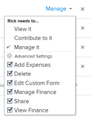

# Share a project in Adobe Workfront

<!-- Audited: 1/2024 -->

Your Adobe Workfront administrator can grant you access to view or edit projects when assigning your access level. For more information, see [Grant access to projects](../../administration-and-setup/add-users/configure-and-grant-access/grant-access-projects.md).

Along with the access level that users are granted, you can also grant them permissions to View, Contribute, or Manage specific projects that you have access to share.

Permissions are specific to one item in Workfront and define what actions one can take on that item.

## Considerations about sharing projects

In addition to the considerations below, also see [Overview of sharing permissions on objects](../../workfront-basics/grant-and-request-access-to-objects/sharing-permissions-on-objects-overview.md).

* By default, the creator of a project has permissions to manage the project and is also designated as the Project Owner. If the project is assigned to another owner, that user also has permissions to manage the project. When the project creator (or owner) shares the project with other users, they grant certain permissions to those users to control what they can do as they work on the project.

  However, if a project owner does not have a Planner license, they do not have full access to manage the project. Only a user with a Plan license can have permissions to manage a project. For more information, see [How access levels and permissions work together](../../administration-and-setup/add-users/access-levels-and-object-permissions/how-access-levels-permissions-work-together.md).

* You can share projects individually, or you can share several of them at a time. Sharing projects is identical to sharing other objects. For more information about sharing items in Workfront, see [Share an object](../../workfront-basics/grant-and-request-access-to-objects/share-an-object.md). 
* You can grant the following permissions to a project:

   * View
   * Manage
   * Contribute

       

* When you share a project, all the tasks, issues, and documents inherit the same permissions, unless otherwise specified.

  For information about managing the access to tasks and issues on the project based on a user's permissions to the project, see the  section in the article [Edit projects](../../manage-work/projects/manage-projects/edit-projects.md).

  The Workfront administrator can specify whether documents should inherit permissions from higher objects in the user's access level. For more information about restricting inherited permissions on documents, see [Create or modify custom access levels](../../administration-and-setup/add-users/configure-and-grant-access/create-modify-access-levels.md).

* You can remove inherited permissions from a project so that the children objects will not inherit them. For more information about removing inherited permissions from objects, see [Remove permissions from objects](../../workfront-basics/grant-and-request-access-to-objects/remove-permissions-from-objects.md).

## Ways to share a project {#ways-to-share-a-project}

You can share a project in the following ways:

* Manually by doing one of the following:

   * Adding users to the project team. When you add users to the project team, they automatically obtain View permissions to the project.   
     For more information about adding users to a project team, see the "Adding Users to a Project Team" section in [Project Team overview](../../manage-work/projects/planning-a-project/project-team-overview.md). 
   * Individually or bulk-sharing the projects when using the **Sharing** option.

     Sharing a project is similar to sharing all other objects in Adobe Workfront.

     For information about sharing objects in Workfront, see [Share an object](../../workfront-basics/grant-and-request-access-to-objects/share-an-object.md).

* Automatically, by doing one of the following:

   * Place a project in a **Portfolio** or **Program** that is already shared with others. Users gain the same permissions to the project that they have for the portfolio or program.   
     For information about adding a project to a **Portfolio**, see [Add projects to a portfolio](../../manage-work/portfolios/create-and-manage-portfolios/add-projects-to-portfolios.md).  
     For information about adding a project to a **Program**, see [Add a project to a program](../../manage-work/portfolios/create-and-manage-programs/add-project-to-program.md).

     For information about viewing inherited permissions on an object, see [View inherited permissions on objects](../../workfront-basics/grant-and-request-access-to-objects/view-inherited-permissions-on-objects.md).

   * Add entities to Project Sharing on a template used to create the project. For information about sharing projects from templates, see [Share a template](../../workfront-basics/grant-and-request-access-to-objects/share-a-template.md). 
   * Define the project access template.

     To define the project access template, see [Share an object](../../workfront-basics/grant-and-request-access-to-objects/share-an-object.md).

     >[!TIP]
     >
     >When attaching or saving a template, you can clear the Template Project Sharing rules.

   * Edit a project and defining the **When someone is given access to this project** setting.&nbsp;For more information, see [Edit projects](../../manage-work/projects/manage-projects/edit-projects.md).

<!--

(NOTE: drafted because I created new article and linked it above) 

To view what users have inherited the access on the project from a portfolio or a program, do the following:

<ol style="list-style-type: lower-alpha;">
<li value="1">Go to a project whose sharing permissions you want to view. </li>
<li value="2"> Click the <strong>More</strong> menu , then click <strong>Sharing</strong>. </li>
<li value="3"> 
Expand the <strong>Inherited Permissions</strong> list. 
 
This list displays the names of users that have access to either the portfolio or the program that the project belongs to and also have permissions to the project. 
 
  
 </li>
</ol>

-->

<!--
<ol data-mc-conditions="QuicksilverOrClassic.Draft mode">
<li value="1">Go to a project whose sharing permissions you want for all projects you create from scratch. (NOTE: drafted because linked above)&nbsp;</li>
<li value="2"> Click the More menu, then click <strong>Sharing</strong>. </li>
<li value="3"> 
In the Project Access box that displays, near the upper-right corner, click the gear icon , then click <strong>Set as my project access template</strong>.
 
The entities that are granted permissions on the selected project have the same permissions for all the projects you create from scratch in the future.
 
 The project access template overrides the sharing defaults granted to you by the Workfront administrator in your Access Level. For more information about specifying sharing defaults for projects in the Access Level, see <a href="../../administration-and-setup/add-users/configure-and-grant-access/grant-access-projects.md" class="MCXref xref">Grant access to projects</a>.
 </li>
<li value="4">Click <strong>Save</strong>.</li>
</ol>
-->

## Limitations for different license types

* Users with a Worker license don't have permissions to manage projects. For Workers, the highest sharing permission is Contribute. 
* Users with a Request license can view project information, but they have limited project access. 
* An exception to changing the status of a project occurs when a user with View or Contribute permissions is also included in an approval process. They can approve the project, which changes the status of the project, but the status is the predefined status for approval or for rejection. 
* To be able to copy a project, a user must also have access to create projects in their Access Level.

<!--

<h2>Configure default permissions for a project</h2>

(NOTE: drafted because I added one more way to automatically share the project above in the bullet list and linked it to Edit Projects) 

As a project owner, you can configure the default permissions for View, Manage, and Contribute access that are used when sharing&nbsp;the project with others. When users share a project, the default permissions are used. Users can then adjust the default permissions when sharing the project, as described in <a title="Project Permissions" href="#ways-to-share-a-project" class="MCXref xref">Ways to share a project</a>. 

To configure the default permissions that are included with each access level:

<ol>
<li value="1">Go to the project where you want to set the default permissions.</li>
<li value="2"> 
Click the More menu , then click <strong>Edit</strong>. 
 
  
 </li>
<li value="3">Click <strong>Access</strong> in the list on the left.</li>
<li value="4"> 
In the <strong>When someone is given access to this PROJECT</strong> section, select permissions that you want to be available when users are given access to the project via sharing.
 
Ensure that any permissions that you want to include in the selected access level are selected and deselect any permissions that you do not want to include in the selected permissions level.
 
To view which permissions are available for each level, see&nbsp;<a title="Project Permissions" href="#Understanding_Project_Permissions" class="MCXref xref">Share a project in Adobe Workfront</a>.
 <note type="note">
The
<strong>Delete</strong> access in the
<strong>Manage</strong> permission level determines whether users can&nbsp;delete the project itself. Users with
<strong>Manage</strong> access to the project can delete tasks and issues within the project regardless of whether this option is selected, if they have
<strong>Manage</strong> permissions to the tasks and issues.&nbsp;
</note> </li>
<li value="5">Click <strong>Save Changes</strong>.</li>
</ol>

-->

## Project permission options

The following table lists the permissions that users can grant when sharing a project. For more information about the access users get based on their license, see [Grant access to projects](../../administration-and-setup/add-users/configure-and-grant-access/grant-access-projects.md).

<table border="1" cellspacing="15" cellpadding="1"> 
 <col> 
 <col> 
 <col> 
 <col> 
 <thead> 
  <tr> 
   <th> 
<strong>Actions</strong> 
 </th> 
   <th> 
<strong>Manage</strong> 
 </th> 
   <th> 
<strong>Contribute</strong> 
 </th> 
   <th> 
<strong>View</strong> 
 </th> 
  </tr> 
 </thead> 
 <tbody> 
  <tr> 
   <td> 
Add Custom Form
 </td> 
   <td> 
✓
 </td> 
   <td> 
&nbsp;
 </td> 
   <td> 
&nbsp;
 </td> 
  </tr> 
  <tr> 
   <td> 
Update Custom Fields
 </td> 
   <td> 
✓
 </td> 
   <td> 
✓
 </td> 
   <td> 
&nbsp;
 </td> 
  </tr> 
  <tr> 
   <td> 
Add An Approval Process
 </td> 
   <td> 
✓
 </td> 
   <td> 
&nbsp;
 </td> 
   <td> 
&nbsp;
 </td> 
  </tr> 
  <tr> 
   <td> 
Approve a Project
 </td> 
   <td> 
✓
 </td> 
   <td> 
✓
 </td> 
   <td> 
✓
 </td> 
  </tr> 
  <tr> 
   <td> 
Approve hours
 </td> 
   <td> 
✓
 </td> 
   <td> 
✓&nbsp;
 </td> 
   <td> 
&nbsp;
 </td> 
  </tr> 
  <tr> 
   <td> 
Create A Project
 </td> 
   <td> 
✓
 </td> 
   <td> 
&nbsp;
 </td> 
   <td> 
&nbsp;
 </td> 
  </tr> 
  <tr> 
   <td> 
Add Document(s)
 </td> 
   <td> 
✓
 </td> 
   <td> 
✓
 </td> 
   <td> 
✓
 </td> 
  </tr> 
  <tr> 
   <td> 
Add Issue(s)
 </td> 
   <td> 
✓
 </td> 
   <td> 
✓
 </td> 
   <td> 
✓
 </td> 
  </tr> 
  <tr> 
   <td> 
Add Task(s)
 </td> 
   <td> 
✓
 </td> 
   <td> 
✓
 </td> 
   <td> 
&nbsp;
 </td> 
  </tr> 
  <tr> 
   <td> 
Copy Project
 </td> 
   <td> 
&nbsp;
 </td> 
   <td> 
✓
 </td> 
   <td> 
&nbsp;
 </td> 
  </tr> 
  <tr> 
   <td> 
Delete Project
 </td> 
   <td> 
✓
 </td> 
   <td> 
&nbsp;
 </td> 
   <td> 
&nbsp;
 </td> 
  </tr> 
  <tr> 
   <td> 
Modify Planned Dates
 </td> 
   <td> 
✓
 </td> 
   <td> 
&nbsp;
 </td> 
   <td> 
&nbsp;
 </td> 
  </tr> 
  <tr> 
   <td> 
Share Project
 </td> 
   <td> 
✓
 </td> 
   <td> 
✓
 </td> 
   <td> 
✓
 </td> 
  </tr> 
  <tr> 
   <td> 
Share System-wide
 </td> 
   <td> 
&nbsp;
 </td> 
   <td> 
&nbsp;
 </td> 
   <td> 
✓
 </td> 
  </tr> 
  <tr> 
   <td> 
View Project
 </td> 
   <td> 
✓
 </td> 
   <td> 
✓
 </td> 
   <td> 
✓
 </td> 
  </tr> 
  <tr> 
   <td> 
Updates/ comments
 </td> 
   <td> 
✓
 </td> 
   <td> 
✓
 </td> 
   <td> 
✓
 </td> 
  </tr> 
  <tr> 
   <td> 
Change Status
 </td> 
   <td> 
✓
 </td> 
   <td> 
&nbsp;
 </td> 
   <td> 
&nbsp;
 </td> 
  </tr> 
  <tr> 
   <td> 
Log Hours
 </td> 
   <td> 
✓
 </td> 
   <td> 
✓
 </td> 
   <td> 
&nbsp;
 </td> 
  </tr> 
  <tr> 
   <td> 
Edit Assignments
 </td> 
   <td> 
✓
 </td> 
   <td> 
✓
 </td> 
   <td> 
&nbsp;
 </td> 
  </tr> 
  <tr> 
   <td> 
Manage Baseline
 </td> 
   <td> 
✓
 </td> 
   <td> 
&nbsp;
 </td> 
   <td> 
&nbsp;
 </td> 
  </tr> 
  <tr> 
   <td> 
Manage Risks*
 </td> 
   <td> 
✓
 </td> 
   <td> 
&nbsp;
 </td> 
   <td> 
&nbsp;
 </td> 
  </tr> 
  <tr> 
   <td> 
Manage Finance*
 </td> 
   <td> 
✓
 </td> 
   <td> 
&nbsp;
 </td> 
   <td> 
&nbsp;
 </td> 
  </tr> 
  <tr> 
   <td> 
Add/ Edit Expenses*
 </td> 
   <td> 
✓
 </td> 
   <td> 
✓
 </td> 
   <td> 
&nbsp;
 </td> 
  </tr> 
  <tr> 
   <td> 
View Finance*
 </td> 
   <td> 
✓
 </td> 
   <td> 
✓
 </td> 
   <td> 
✓
 </td> 
  </tr> 
  <tr> 
   <td> 
Attach Template
 </td> 
   <td> 
✓
 </td> 
   <td> 
&nbsp;
 </td> 
   <td> 
&nbsp;
 </td> 
  </tr> 
  <tr> 
   <td> 
Save As Template
 </td> 
   <td> 
✓
 </td> 
   <td> 
✓
 </td> 
   <td> 
✓
 </td> 
  </tr> 
  <tr> 
   <td> 
Add/ Edit Business Case
 </td> 
   <td> 
✓
 </td> 
   <td> 
&nbsp;
 </td> 
   <td> 
&nbsp;
 </td> 
  </tr> 
  <tr> 
   <td> 
Edit Project Details
 </td> 
   <td> 
✓
 </td> 
   <td> 
&nbsp;
 </td> 
   <td> 
&nbsp;
 </td> 
  </tr> 
  <tr> 
   <td> 
Edit Staffing
 </td> 
   <td> 
✓
 </td> 
   <td> 
&nbsp;
 </td> 
   <td> 
&nbsp;
 </td> 
  </tr> 
  <tr> 
   <td> 
Export to MS Project
 </td> 
   <td> 
✓
 </td> 
   <td> 
✓
 </td> 
   <td> 
✓
 </td> 
  </tr> 
  <tr> 
   <td> 
Recalculate Finance/ Timeline*
 </td> 
   <td> 
✓
 </td> 
   <td> 
&nbsp;
 </td> 
   <td> 
&nbsp;
 </td> 
  </tr> 
  <tr> 
   <td> 
Set Queue Properties
 </td> 
   <td> 
✓
 </td> 
   <td> 
&nbsp;
 </td> 
   <td> 
&nbsp;&nbsp;
 </td> 
  </tr> 
  <tr> 
   <td> 
Edit Project in Bulk in a List
 </td> 
   <td> 
✓
 </td> 
   <td>&nbsp;</td> 
   <td>&nbsp;</td> 
  </tr> 
 </tbody> 
</table>

&#42;Users without access to financial data cannot manage risks and finances for projects, even if they have Edit access to projects. For information about access to financial data, see [Grant access to financial data](../../administration-and-setup/add-users/configure-and-grant-access/grant-access-financial.md).
