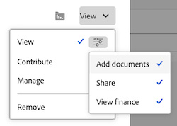
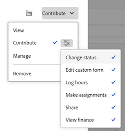

# Share an issue

Your Adobe Workfront administrator grants users access to view or edit issues when they assign access levels. For more information about granting access to issues, see [Grant access to issues](../../administration-and-setup/add-users/configure-and-grant-access/grant-access-issues.md).

Along with the access level that users are granted, you can also grant them permissions to View, Contribute, or Manage specific issues that you have access to share. For more information about access levels and permissions, see [How access levels and permissions work together](../../administration-and-setup/add-users/access-levels-and-object-permissions/how-access-levels-permissions-work-together.md).

Permissions are specific to one item in Workfront and define what actions one can take on that item.

## Considerations about sharing issues

In addition to the considerations below, also see [Overview of sharing permissions on objects](../../workfront-basics/grant-and-request-access-to-objects/sharing-permissions-on-objects-overview.md).

>[!NOTE]
>
>A Workfront administrator can add or remove permissions to any items in the system, for all users, without being the owner of those items.

* The creator of an issue has Manage permissions to it, by default.
* You can share issues individually, or you can share several of them at a time. Sharing issues is identical to sharing other items in Workfront. For more information about sharing items in Workfront, see [Share an object](../../workfront-basics/grant-and-request-access-to-objects/share-an-object.md). 
* You can grant the following permissions to an issue:&nbsp;

   * View

      

   * Manage

     

   * Contribute  
     
    

* When you share an issue, all the documents attached to the issue inherit the same permissions.

  The Workfront administrator can specify whether documents should inherit permissions from higher objects in the user's access level. For more information about restricting inherited permissions on documents, see [Create or modify custom access levels](../../administration-and-setup/add-users/configure-and-grant-access/create-modify-access-levels.md).

* You can remove inherited permissions from an issue. For more information, see [Remove permissions from objects](../../workfront-basics/grant-and-request-access-to-objects/remove-permissions-from-objects.md).

## Ways to share an issue

* Manually, which is similar to sharing any other object in Workfront.&nbsp;For more information about how to share objects in Workfront, see [Share an object](../../workfront-basics/grant-and-request-access-to-objects/share-an-object.md). 
* Automatically, by doing one of the following:

   * Specify the permissions on any of the parent objects of the issue: project, program, or portfolio. Issues inherit the permissions from their parent objects. For information about viewing inherited permissions on objects, see [View inherited permissions on objects](../../workfront-basics/grant-and-request-access-to-objects/view-inherited-permissions-on-objects.md). 
   * Add entities to Project Sharing on a template used to create the project the issue is on. For information about sharing projects from templates, see [Share a template](../../workfront-basics/grant-and-request-access-to-objects/share-a-template.md).

   * Specify the permissions on all issues in a project when you edit the project. For information about managing the access to issues or requests on the project based on a user's permissions to the project, see the  section in the article [Edit projects](../../manage-work/projects/manage-projects/edit-projects.md).

     >[!TIP]
     >
     >If you don't specify what issue permissions you want users to have when they are assigned to the issues on the project, they receive the same permissions they have on the project, by default.

   * Specify the permissions users receive on issues they submit in a request queue when creating a request queue. For information, see [Create a Request Queue](../../manage-work/requests/create-and-manage-request-queues/create-request-queue.md).

     >[!IMPORTANT]
     >
     >Permissions are granted differently depending on whether or not the project is published as a request queue:
     >
     >   
     >   
     >   * When a user submits a request to a project published as a request queue, the Primary Contact and Entered By users are granted the permission specified.
     >   * When a user submits a request to a project not published as a request queue, the Primary Contact (if different from Entered By user) is granted the permission specified, and the Entered By user is granted Manage permissions to the issue.
     >   
     >

<!--

<h2>Automatically share an issue at the project level</h2>

(NOTE: this info duplicates in Edit projects - linked there instead (above).)&nbsp;

As the Project Owner, you can grant permissions automatically to users as the issues are added to a project.

<ol>
<li value="1">Go to the project whose issues you want to share automatically.</li>
<li value="2"> Click the More menu , then click <strong>Edit</strong>. </li>
<li value="3">In the <strong>Edit Project</strong> box that displays, click <strong>Access</strong>.</li>
<li value="4">In the <strong>When someone is assigned to an ISSUE</strong> field, select from the following permissions levels:
<ul>
<li><strong>View</strong></li>
<li><strong>Contribute</strong></li>
<li><strong>Manage</strong> Now, when someone is assigned to an issue on the selected project, they are granted the specified permissions to the issue.&nbsp;</li>
</ul></li>
<li value="5">(Optional) Select the <strong>Also grant ... access to the project</strong> field to also grant View, Contribute, or Manage permissions to the projects to the user assigned to the issue</li>
<li value="6">In the <strong>When someone submits a REQUEST ...</strong> field, select from the following permissions levels:
<ul>
<li><strong>View</strong></li>
<li><strong>Contribute</strong></li>
<li>
<strong>Manage</strong>
<note type="important">

Permissions are granted differently depending on whether or not the project is published as a request queue:

<ul>
<li>When a user submits a request to a project published as a request queue, the Primary Contact and Entered By users are granted the permission specified.</li>
<li>When a user submits a request to a project not published as a request queue, the Primary Contact (if different from Entered By user) is granted the permission specified, and the Entered By user is granted Manage permissions to the issue.</li>
</ul>
</note></li>
</ul></li>
<li value="7"> 
(Optional) Select the <strong>People from the same company will inherit the same permissions for all requests</strong> field.
 
People from the same company as the user submitting the request are granted the same permissions on the requests as the user.&nbsp;
 </li>
<li value="8">Click <strong>Save Changes</strong>.</li>
</ol>

-->

<!--

<h2>Automatically share an issue in request queues</h2>

(NOTE: drafted because it's duplicated from Create a Request Queue which is linked above)&nbsp;

As the Project Owner, you can grant permissions automatically to users as the issues are submitted to a request queue.

<ol>
<li value="1">Go to the project whose issues you want to share automatically.</li>
<li value="2">Click <strong>Edit Project</strong>.</li>
<li value="3">Click <strong>More</strong> then click <strong>Queue Setup</strong>. </li>
<li value="4"> 
On the <strong>Queue Details</strong> sub-tab, in the drop-down menu under <strong>When someone makes a request, automatically grant</strong>, select from the following permissions levels:

<ul>
<li><strong>View Access</strong> </li>
<li><strong>Contribute Access</strong> </li>
<li> 
<strong>Manage Access</strong> 
 </li>
</ul> 
Now, when someone submits a request to the selected project, they are granted the specified permissions to the request.
 </li>
<li value="5"> 
(Optional) Select the <strong>People from the same company will inherit the same permissions for all requests</strong>.
 
People from the same company as the user submitting the request are granted the same permissions on the requests as the user.&nbsp;
 </li>
<li value="6">Click <strong>Save</strong>.</li>
</ol>

-->

## Issue permissions

The following table displays what permissions you can grant users when allowing them to View, Contribute, or Manage an issue:

<table style="table-layout:auto"> 
 <col> 
 <col> 
 <col> 
 <col> 
 <tbody> 
  <tr> 
   <td><strong>Actions</strong> </td> 
   <td><strong>Manage</strong> </td> 
   <td><strong>Contribute</strong> </td> 
   <td><strong>View</strong> </td> 
  </tr> 
  <tr> 
   <td> 
Add issues
 </td> 
   <td>✓</td> 
   <td>&nbsp;</td> 
   <td>&nbsp;</td> 
  </tr> 
  <tr> 
   <td>Delete&nbsp;</td> 
   <td>✓</td> 
   <td>&nbsp;</td> 
   <td>&nbsp;</td> 
  </tr> 
  <tr> 
   <td>Attach Custom Form</td> 
   <td>✓</td> 
   <td>&nbsp;</td> 
   <td>&nbsp;</td> 
  </tr> 
  <tr> 
   <td>Edit Custom Fields</td> 
   <td>✓</td> 
   <td>✓</td> 
   <td>&nbsp;</td> 
  </tr> 
  <tr> 
   <td>Approve Issue</td> 
   <td>✓</td> 
   <td>✓</td> 
   <td>✓</td> 
  </tr> 
  <tr> 
   <td>Add An Approval Process</td> 
   <td>✓</td> 
   <td>&nbsp;</td> 
   <td>&nbsp;</td> 
  </tr> 
  <tr> 
   <td>Add Documents</td> 
   <td>✓</td> 
   <td>✓</td> 
   <td>✓</td> 
  </tr> 
  <tr> 
   <td>Copy Issue*</td> 
   <td>✓</td> 
   <td>✓</td> 
   <td>✓</td> 
  </tr> 
  <tr> 
   <td>Move Issue</td> 
   <td>✓</td> 
   <td>&nbsp;</td> 
   <td>&nbsp;</td> 
  </tr> 
  <tr> 
   <td>Log Hours</td> 
   <td>✓</td> 
   <td>✓</td> 
   <td>&nbsp;</td> 
  </tr> 
  <tr> 
   <td>Convert to Project*</td> 
   <td>✓</td> 
   <td>&nbsp;</td> 
   <td>&nbsp;</td> 
  </tr> 
  <tr> 
   <td>Accept Assignment</td> 
   <td>✓</td> 
   <td>✓</td> 
   <td>&nbsp;</td> 
  </tr> 
  <tr> 
   <td>Updates/ comments</td> 
   <td>✓</td> 
   <td>✓</td> 
   <td>✓</td> 
  </tr> 
  <tr> 
   <td>Modify Planned Dates</td> 
   <td>✓</td> 
   <td>&nbsp;</td> 
   <td>&nbsp;</td> 
  </tr> 
  <tr> 
   <td>Make Assignments</td> 
   <td>✓</td> 
   <td>✓</td> 
   <td>&nbsp;</td> 
  </tr> 
  <tr> 
   <td>Share</td> 
   <td>✓</td> 
   <td>✓</td> 
   <td>✓</td> 
  </tr> 
  <tr> 
   <td>Share System-wide</td> 
   <td>&nbsp;</td> 
   <td>&nbsp;</td> 
   <td>✓</td> 
  </tr> 
 </tbody> 
</table>

&#42;Controlled by the access levels and the permissions on the project.
