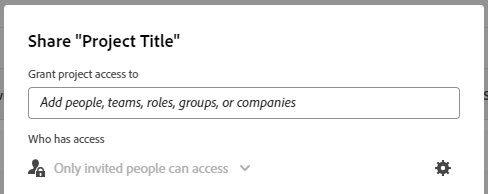
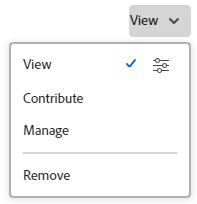
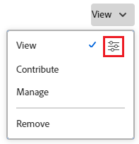
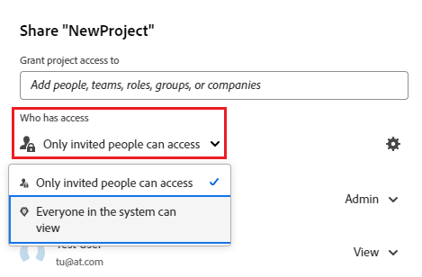
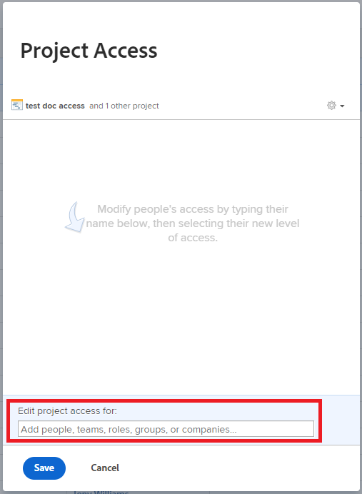
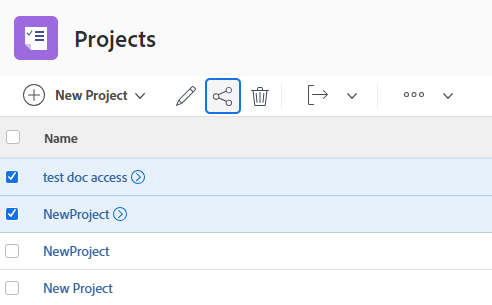

# Share an object

<!--Audited: 01/2024-->

Your Adobe Workfront administrator grants users access to view or edit objects when they assign access levels. For more information about granting access to objects, see [Create or modify custom access levels](../../administration-and-setup/add-users/configure-and-grant-access/create-modify-access-levels.md).

Along with the access level that users are granted, you can also grant them permissions to view or edit specific objects that you created or have access to share. For more information about access levels and permissions, see [How access levels and permissions work together](../../administration-and-setup/add-users/access-levels-and-object-permissions/how-access-levels-permissions-work-together.md).

Permissions are specific to one item in Workfront and define what actions one can take on that item.

For information about sharing permissions on objects, see [Overview of sharing permissions on objects](../../workfront-basics/grant-and-request-access-to-objects/sharing-permissions-on-objects-overview.md).

>[!NOTE]
>
>A Workfront administrator can add or remove permissions to any items in the system, for all users, without being the owner of those items.

This article describes how to share the following objects: 

* Projects, tasks, issues
* Portfolios, programs
* Documents

For information about how to share all other objects in Workfront, also see the following articles:

* For templates, see [Share project templates](../../manage-work/projects/create-and-manage-templates/share-project-template.md).
* For proofs, see [Share a Proof in Workfront Proof](../../workfront-proof/wp-work-proofsfiles/share-proofs-and-files/share-proof.md).
* For reports, dashboards, and calendars, see the following articles:

   * [Share a report in Adobe Workfront](../../reports-and-dashboards/reports/creating-and-managing-reports/share-report.md)
   * [Share a dashboard](../../reports-and-dashboards/dashboards/creating-and-managing-dashboards/share-dashboard.md)
   * [Share a calendar report](../../reports-and-dashboards/reports/calendars/share-a-calendar-report.md)

  Additionally, see [Share reports, dashboards, and calendars](../../workfront-basics/grant-and-request-access-to-objects/permissions-reports-dashboards-calendars.md) for general information about sharing reports, dashboards, and calendars. 

* For filters, views, and groupings, see [Share a filter, view, or grouping](../../reports-and-dashboards/reports/reporting-elements/share-filter-view-grouping.md).
* For document folders, see [Share a document folder](../../workfront-basics/grant-and-request-access-to-objects/share-a-document-folder.md).
* For plans, see [Share a plan in the Scenario Planner](../../scenario-planner/share-a-plan.md).

  This requires an additional license. 

* For goals, see [Share a goal in Workfront Goals](../../workfront-goals/workfront-goals-settings/share-a-goal.md). This requires an additional license.

## Access requirements

You must have the following to share objects:

<table style="table-layout:auto"> 
 <col> 
 <col> 
 <tbody> 
  <tr> 
   <td role="rowheader">Adobe Workfront plan</td> 
   <td> 
Any 
 </td> 
  </tr> 
  <tr> 
   <td role="rowheader">Adobe Workfront license*</td> 
   <td> 
New license: Standard
 
   Or
   
Current license: Work or higher

   </td> 
  </tr> 
  <tr> 
   <td role="rowheader">Access level configurations</td> 
   <td> 
View access or higher to the objects you want to share
 </td> 
  </tr> 
  <tr> 
   <td role="rowheader">Object permissions</td> 
   <td> 
View permissions or higher to the objects you want to share
</td> 
  </tr> 
 </tbody> 
</table>

*To find out what plan, license type, or access you have, contact your Workfront administrator. For more information, see [Access requirements in Workfront documentation](/help/quicksilver/administration-and-setup/add-users/access-levels-and-object-permissions/access-level-requirements-in-documentation.md). 

## Share a project, task, or issue from its page

1. Go to the project, task, or issue's page you want to share.

   For information about which objects can be shared, see [Overview of sharing permissions on objects](../../workfront-basics/grant-and-request-access-to-objects/sharing-permissions-on-objects-overview.md).

1. Click the **Share** button next to the object name.

   

1. In the **Grant < object name > access to** box, begin typing the name of the user, team, role, group, or company with whom you want to share the object, then click the name when it appears in the drop-down list.

   {width="350"}

   >[!TIP]
   >
   >You can share an object only with active users, teams, roles, or companies.

   >[!TIP]
   >
   >If you have multiple entities named similarly, they are all listed under their type. The names of the entities appear in alphabetical order. However, the order in which the entity types appear is random.
   >

1. (Optional) Repeat step 3 for each user, team, role, or group to whom you want to grant access to the object.

1. Specify the permissions for each user, team, role, group, or company that you added in Step 3 by clicking the drop-down menu to the right of their name, then selecting the permission level that you want to grant.

   

   For removing permissions from an object, see [Remove permissions from objects](/help/quicksilver/workfront-basics/grant-and-request-access-to-objects/remove-permissions-from-objects.md). 

   The following options are available:

   * **View:** Users can review and share the item. 
   * **Contribute**: Users can make updates, log information, make minor edits, and share, plus all View permissions.
   * **Manage:** Users have full access to the object without administrative rights (which are granted at the access level). In addition, they also have all the View and Contribute permissions.

     >[!NOTE]
     >
     >The Workfront administrator or the object creator has the ability to remove permissions from these entities.

1. (Optional) Click the advanced options icon next to the permission level you've granted to configure specific permissions on the object.

   

   View, Manage and Contribute have different advanced options depending on the selected object.  
   For more information about permission levels, see [Overview of sharing permissions on objects](../../workfront-basics/grant-and-request-access-to-objects/sharing-permissions-on-objects-overview.md).

1. (Optional) To make this object available to all users in the system, click the dropdown menu under **Who has access**, then in the drop-down menu click **Everyone in the system can view**.

   

   All users can see the object based on the permissions that you set.

1. (Optional and conditional) When sharing a project, click the **Gear** icon , then check the box next to **Set as my project access template** to set the permissions as a template.

   After you have defined permissions on one project, these same permissions are automatically applied the next time you create a project from scratch.

   >[!NOTE]
   >
   >The project access template overrides the sharing defaults granted to you by the Workfront administrator in your Access Level.   
   >For more information about specifying sharing defaults for projects in the Access Level, see [Grant access to projects](../../administration-and-setup/add-users/configure-and-grant-access/grant-access-projects.md)
   
   <!--
   >this note also appears in Understanding Project Permissions-->

   You can specify permissions on the projects that will be created from a template when you share the template. For more information, see [Share project templates](../../manage-work/projects/create-and-manage-templates/share-project-template.md).

1. (Conditional) To share the object with external users, click **Copy link**, then distribute the link to external users. 

   Any users with the link are able to view the object.

   >[!CAUTION]
   >
   >We recommend that you use caution when sharing an object containing confidential information with external users. This allows them to view information without being a Workfront user or part of your organization.

1. Click **Save**.

## Share a document, portfolio, or program from its page

1. Go to the document, portfolio, or program's page you want to share.

   For information about which objects can be shared, see [Overview of sharing permissions on objects](../../workfront-basics/grant-and-request-access-to-objects/sharing-permissions-on-objects-overview.md).

1. For portfolios and programs:

   Click the **Share** button next to the object name.

   

   Or

   For documents:

   Click the **More** icon  next to the object name, then click **Share**.

   

1. In the **Give < Object Name > access to** box, begin typing the name of the user, team, role, group, or company with whom you want to share the object, then click the name when it appears in the drop-down list.

   {width="350"}

   >[!TIP]
   >
   >You can share an object only with active users, teams, roles, or companies.

   >[!TIP]
   >
   >If you have multiple entities named similarly, they are all listed under their type. The names of the entities appear in alphabetical order. However, the order in which the entity types appear is random.
   >

1. (Optional) Repeat step 3 for each user, team, role, or group to whom you want to grant access to the object.

1. Specify the permissions for each user, team, role, group, or company that you added in Step 3 by clicking the drop-down menu, then selecting the permission level that you want to grant.

   For removing permissions from an object, see [Remove permissions from objects](/help/quicksilver/workfront-basics/grant-and-request-access-to-objects/remove-permissions-from-objects.md). 

   The following options are available:

   * **View:** Users can review and share the item. 
   * **Manage:** Users have full access to the object without administrative rights (which are granted at the access level). In addition, they also have all the View and Contribute permissions.

     >[!NOTE]
     >
     >The Workfront administrator or the object creator has the ability to remove permissions from these entities.

     

1. (Optional) Click **Advanced Settings** to configure specific permissions on the object.

   View, Manage and Contribute have different advanced options depending on the selected object.  
   For more information about the permissions levels, see [Overview of sharing permissions on objects](../../workfront-basics/grant-and-request-access-to-objects/sharing-permissions-on-objects-overview.md).

   

1. (Optional) To make this object available to all users in the system, click the **Gear** icon , then in the drop-down menu click **Make this visible system-wide**.

   All users can see the object based on the permissions that you set.

1. (Optional) To make the object public, click **Make this public to external users**.

   >[!TIP]
   >
   >This option is not available for all objects.

   {width="350"}

1. (Conditional) If you made the object public to external users, click **copy link**, then distribute the link to external users.

   Any users with the link are able to view the object.

   >[!CAUTION]
   >
   >We recommend that you use caution when sharing an object containing confidential information with external users. This allows them to view information without being a Workfront user or part of your organization.

1. Click **Save**.

## Share single or bulk objects from a list

1. Go to the list that contains the object(s) you want to share.

   For information about which objects can be shared, see [Overview of sharing permissions on objects](../../workfront-basics/grant-and-request-access-to-objects/sharing-permissions-on-objects-overview.md).

1. Click the checkbox next to the object(s) you would like to share, then click the **Share icon**  at the top of the page.

   {width="350"}

1. In the **< Object > Access** window appears, begin typing in the **Edit < Object Name > access for** box the name of the user, team, role, group, or company with whom you want to share the object(s), then click the name when it appears in the drop-down list.

   {width="350"}

   >[!TIP]
   >
   >You can share an object only with active users, teams, roles, or companies.

   >[!TIP]
   >
   >If you have multiple entities named similarly, they are all listed under their type. The names of the entities appear in alphabetical order. However, the order in which the entity types appear is random.
   >

1. (Optional) Repeat step 3 for each user, team, role, or group to whom you want to grant access to the object(s).

1. Specify the permissions for each user, team, role, group, or company that you added in Step 3 by clicking the drop-down menu to the right of their name, then selecting the permission level that you want to grant.

   For removing permissions from an object, see [Remove permissions from objects](/help/quicksilver/workfront-basics/grant-and-request-access-to-objects/remove-permissions-from-objects.md). 

   

   The following options are available:

   * **View:** Users can review and share the item. 
   * **Contribute**: Users can make updates, log information, make minor edits, and share, plus all View permissions.

     >[!TIP]
     >
     >You can grant Contribute permissions only to the following objects: 
     >
     >* Projects
     >* Tasks
     >* Issues
     >

   * **Manage:** Users have full access to the object without administrative rights (which are granted at the access level). In addition, they also have all the View and Contribute permissions.

     >[!NOTE]
     >
     >The Workfront administrator or the object creator has the ability to remove permissions from these entities.

1. (Optional) Click **Advanced Settings** to configure specific permissions on the object.

   View, Manage and Contribute have different advanced options depending on the selected object.  
   For more information about the permissions levels, see [Overview of sharing permissions on objects](../../workfront-basics/grant-and-request-access-to-objects/sharing-permissions-on-objects-overview.md).

   

1. (Optional) To make this object available to all users in the system, click the **Gear** icon  , then in the drop-down menu click **Make this visible system-wide**.

   All users can see the object(s) based on the permissions that you set.

1. (Optional and conditional) When sharing a project, click the **Gear** icon , then in the drop-down menu click **Set as my project access template** to set the permissions as a template.

   After you have defined permissions on one project, these same permissions are automatically applied the next time you create a project from scratch.

   >[!NOTE]
   >
   >The project access template overrides the sharing defaults granted to you by the Workfront administrator in your Access Level.   
   >For more information about specifying sharing defaults for projects in the Access Level, see [Grant access to projects](../../administration-and-setup/add-users/configure-and-grant-access/grant-access-projects.md)
   
   <!--
   >this note also appears in Understanding Project Permissions-->

   You can specify permissions on the projects that will be created from a template when you share the template. For more information, see [Share project templates](../../manage-work/projects/create-and-manage-templates/share-project-template.md).

1. (Optional) To make the object(s) public, click **Make this public to external users**.

   >[!TIP]
   >
   >This option is not available for all objects.

   {width="350"}

1. (Conditional) If you made the object(s) public to external users, click **copy link**, then distribute the link to external users.

   Any users with the link are able to view the object.

   >[!CAUTION]
   >
   >We recommend that you use caution when sharing an object containing confidential information with external users. This allows them to view information without being a Workfront user or part of your organization.

1. Click **Save**.
