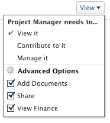
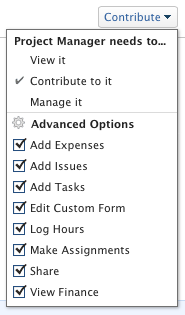

# Share financial permissions on an object

{{highlighted-preview}}

Your Adobe Workfront administrator can grant you access to view or edit financial data when assigning your access level. For more information, see [Grant access to financial data](../../administration-and-setup/add-users/configure-and-grant-access/grant-access-financial.md).

Along with the access level that users are granted, you can also grant them permissions to View or Manage finances for specific projects, tasks, or issues that you have access to share.

For information about what users in each access level can do with financial data, see the section [Financial data](../../administration-and-setup/add-users/access-levels-and-object-permissions/functionality-available-for-each-object-type.md#financia) in the article [Functionality available for each object type](../../administration-and-setup/add-users/access-levels-and-object-permissions/functionality-available-for-each-object-type.md).

## Access requirements

<!--drafted for P&P:

<table style="table-layout:auto"> 
 <col> 
 <col> 
 <tbody> 
  <tr> 
   <td role="rowheader">Adobe Workfront plan*</td> 
   <td> 
Any 
 </td> 
  </tr> 
  <tr> 
   <td role="rowheader">Adobe Workfront license*</td> 
   <td> 
Current license: Standard 
 
   Or
   
Legacy license: Plan 
</td> 
  </tr> 
  <tr> 
   <td role="rowheader">Access level configurations*</td> 
   <td> 
View or higher access to Projects, Tasks, Issues, and Financial&nbsp;Data
 
<b>NOTE</b>
   
   If you still don't have access, ask your Workfront administrator if they set additional restrictions in your access level. For information on how a Workfront administrator can modify your access level, see <a href="../../administration-and-setup/add-users/configure-and-grant-access/create-modify-access-levels.md" class="MCXref xref">Create or modify custom access levels</a>.
 </td> 
  </tr> 
  <tr> 
   <td role="rowheader">Object permissions</td> 
   <td> 
View permissions or higher to projects, tasks, and issues that include at least View Finance permissions
 
For information on requesting additional access, see <a href="../../workfront-basics/grant-and-request-access-to-objects/request-access.md" class="MCXref xref">Request access to objects </a>.
 </td> 
  </tr> 
 </tbody> 
</table>
-->
You must have the following to share financial data information on objects:

<table style="table-layout:auto"> 
 <col> 
 <col> 
 <tbody> 
  <tr> 
   <td role="rowheader">Adobe Workfront plan*</td> 
   <td> 
Any 
 </td> 
  </tr> 
  <tr> 
   <td role="rowheader">Adobe Workfront license*</td> 
   <td> 
Plan 
 </td> 
  </tr> 
  <tr> 
   <td role="rowheader">Access level configurations*</td> 
   <td> 
View or higher access to Projects, Tasks, Issues, and Financial&nbsp;Data
 
Note: If you still don't have access, ask your Workfront administrator if they set additional restrictions in your access level. For information on how a Workfront administrator can modify your access level, see <a href="../../administration-and-setup/add-users/configure-and-grant-access/create-modify-access-levels.md" class="MCXref xref">Create or modify custom access levels</a>.
 </td> 
  </tr> 
  <tr> 
   <td role="rowheader">Object permissions</td> 
   <td> 
View permissions or higher to projects, tasks, and issues that include at least View Finance permissions
 
For information on requesting additional access, see <a href="../../workfront-basics/grant-and-request-access-to-objects/request-access.md" class="MCXref xref">Request access to objects </a>.
 </td> 
  </tr> 
 </tbody> 
</table>

&#42;To find out what plan, license type, or access you have, contact your Workfront administrator.

## Share an object and grant financial permissions

Consider the following when granting financial permissions to objects:

* You can grant financial permissions to projects, tasks, issues, and rate cards.
* Permissions can be inherited: if you have View Finance permissions to a project, you automatically inherit View Finance permissions to the tasks and issues on the project.

To grant financial permissions to an object:

1. Go to a task, project, or issue that you want to share with others.
1. Near the name of the object, click the More menu , then click **Sharing**. 

1. In the **Give `<Object name>` access to** field start typing the name of a user, team, role, group or a company that you want to share the object with.

   >[!TIP]
   >
   >You can share an object only with active users, teams, roles, or companies.

1. If a drop-down menu appears to the right of the name you selected, click one of the following options that is available:

   * **View it**
   * **Contribute to it**
   * **Manage it**

     &nbsp; &nbsp; &nbsp;  

1. In the same drop-down menu, click **Advanced Settings**, then do one of the following:

   * If you selected one of the three options in the previous step, make sure **View Finance** is selected.
   * If you selected **Manage Finance** in the previous step, make sure **Manage Finance** is selected.

1. Click **Save**.

## Financial permission for all sharing levels

The following table displays what financial permissions users gain when you grant them View, Contribute, or Manage permissions on objects:&nbsp;

<table style="table-layout:auto"> 
 <col> 
 <col> 
 <col> 
 <col> 
 <thead> 
  <tr> 
   <th><strong>Actions</strong> </th> 
   <th><strong>Manage</strong> </th> 
   <th><strong>Contribute</strong> </th> 
   <th><strong>View</strong> </th> 
  </tr> 
 </thead> 
 <tbody> 
  <tr> 
   <td>Manage Billing Records</td> 
   <td>✓</td> 
   <td> 
&nbsp;
 </td> 
   <td>&nbsp;</td> 
  </tr> 
  <tr> 
   <td>Manage/ View Role Billing and Cost Rates</td> 
   <td>✓</td> 
   <td>&nbsp;</td> 
   <td>&nbsp;</td> 
  </tr> 
  <tr> 
   <td>Manage/ View User Billing and Cost Rates</td> 
   <td>✓</td> 
   <td>&nbsp;</td> 
   <td>&nbsp;</td> 
  </tr> 
  <tr> 
   <td>View Finance</td> 
   <td>✓</td> 
   <td>✓</td> 
   <td>&nbsp;✓</td> 
  </tr> 
  <tr> 
   <td>Manage rate cards</td> 
   <td>✓</td> 
   <td> 
&nbsp;
 </td> 
   <td>&nbsp;</td> 
  </tr> 
  <tr> 
   <td>View rate cards</td> 
   <td>✓</td> 
   <td>✓</td> 
   <td>&nbsp;✓</td> 
  </tr>
  <tr> 
   <td>View information by Cost in the Resource Planning tools</td> 
   <td>✓</td> 
   <td>✓</td> 
   <td>✓</td> 
  </tr> 
  <tr> 
   <td>Budget resources in the Resource Planning tools*</td> 
   <td>✓</td> 
   <td>&nbsp;</td> 
   <td>&nbsp;</td> 
  </tr> 
  <tr> 
   <td>View resources in the Resource Planning tools*</td> 
   <td>✓</td> 
   <td>✓</td> 
   <td> 
✓
 </td> 
  </tr> 
 </tbody> 
</table>

&#42;Requires additional Resource Management access.

For information about Resource Management access, see [Grant access to Resource Management](../../administration-and-setup/add-users/configure-and-grant-access/grant-access-resource-management.md).
