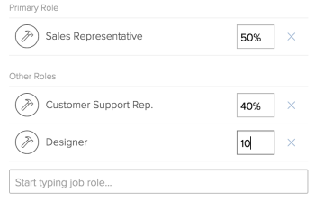

# Configure My Settings

<!-- Audited: 01/2024 -->

<!--

Edit the job role FTE percentage allocation blurbs when more functionality is released: now, it says that the % is that of the user's schedule, but it will be either the user's schedule or the system schedule.

-->

Your [!DNL Adobe Workfront] profile contains information about yourself (for example, your name, email address, address, phone number, title, etc). It also contains information about your interactions with [!DNL Workfront] and other users in your company (for example, your notifications settings, the tabs you want to display in [!DNL Workfront], or your job role, manager and group and team memberships).

Most of this information has already been set by your [!DNL Workfront] administrator when your [!DNL Workfront] account was created.

Depending on what access level you have in [!DNL Workfront], you can edit some of this information by configuring your [!UICONTROL My Settings] area.

## How access levels affect editing the [!UICONTROL My Settings] area

Depending on what access level you have, you may or may not be able to edit sections in your [!UICONTROL My Settings] area.

Some fields contained in editable sections cannot be edited, depending on other settings that might or might not be configured in your access level. For more information on additional access needed for editing some of the fields you find in [!UICONTROL My Settings], see the sections in [Configuring the [!UICONTROL My Settings] area](#configuring-the-my-settings-area).

To find out what access level you have, contact your [!DNL Workfront] administrator.

The following grid shows what sections in the [!UICONTROL My Settings] area are visible or editable depending on your access level:

<table style="table-layout:auto"> 
 <col> 
 <col> 
 <col> 
 <col> 
 <col> 
 <col> 
 <col> 
 <thead> 
  <tr> 
   <th><strong>[!UICONTROL My Settings] Areas</strong> </th> 
   <th><strong>Visible or Editable</strong> </th> 
   <th><strong>[!UICONTROL System Administrator]</strong> </th> 
   <th><strong>[!UICONTROL Standard] or [!UICONTROL Planner]</strong> </th> 
   <th><strong>[!UICONTROL Worker]</strong> </th> 
   <th><strong>[!UICONTROL Light] or [!UICONTROL Reviewer]</strong> </th> 
   <th><strong>[!UICONTROL Contributor] or [!UICONTROL Requestor]</strong> </th> 
  </tr> 
 </thead> 
 <tbody> 
  <tr> 
   <td rowspan="2">[!UICONTROL Personal Info]</td> 
   <td> 
Visible
 </td> 
   <td> 
✔
 </td> 
   <td> ✔</td> 
   <td>✔ </td> 
   <td>✔ </td> 
   <td> ✔</td> 
  </tr> 
  <tr> 
   <td> 
Editable
 </td> 
   <td> 
✔
 </td> 
   <td> ✔</td> 
   <td> ✔</td> 
   <td>✔ </td> 
   <td>✔ </td> 
  </tr> 
  <tr> 
   <td rowspan="2">[!UICONTROL Preferences]</td> 
   <td> 
Visible
 </td> 
   <td> 
✔
 </td> 
   <td> ✔</td> 
   <td>✔ </td> 
   <td>✔ </td> 
   <td>✔ </td> 
  </tr> 
  <tr> 
   <td> 
Editable
 </td> 
   <td> 
✔
 </td> 
   <td>✔ </td> 
   <td>✔ </td> 
   <td>✔ </td> 
   <td>✔ </td> 
  </tr> 
  <tr> 
   <td rowspan="2">[!UICONTROL Notifications]</td> 
   <td> 
Visible
 </td> 
   <td> 
✔
 </td> 
   <td>✔ </td> 
   <td>✔ </td> 
   <td> ✔</td> 
   <td>✔ </td> 
  </tr> 
  <tr> 
   <td> 
Editable
 </td> 
   <td> 
✔
 </td> 
   <td>✔ </td> 
   <td>✔ </td> 
   <td> ✔</td> 
   <td> ✔</td> 
  </tr> 
  <tr> 
   <td rowspan="2">[!UICONTROL Access]</td> 
   <td>Visible</td> 
   <td> ✔</td> 
   <td>✔ </td> 
   <td> </td> 
   <td> </td> 
   <td> </td> 
  </tr> 
  <tr> 
   <td>Editable</td> 
   <td> ✔</td> 
   <td> </td> 
   <td> </td> 
   <td> </td> 
   <td> </td> 
  </tr> 
  <tr> 
   <td rowspan="2">[!UICONTROL Organization]</td> 
   <td>Visible</td> 
   <td>✔</td> 
   <td>✔ </td> 
   <td> </td> 
   <td> </td> 
   <td> </td> 
  </tr> 
  <tr> 
   <td>Editable</td> 
   <td>✔</td> 
   <td>✔ </td> 
   <td> </td> 
   <td> </td> 
   <td> </td> 
  </tr> 
  <tr> 
   <td rowspan="2">[!UICONTROL Resource Planning]</td> 
   <td>Visible</td> 
   <td>✔</td> 
   <td>✔ </td> 
   <td> </td> 
   <td> </td> 
   <td> </td> 
  </tr> 
  <tr> 
   <td>Editable</td> 
   <td>✔</td> 
   <td>✔ </td> 
   <td> </td> 
   <td> </td> 
   <td> </td> 
  </tr> 
  <tr> 
   <td rowspan="2">[!UICONTROL Custom Forms]</td> 
   <td>Visible</td> 
   <td>✔</td> 
   <td>✔ </td> 
   <td>✔</td> 
   <td>✔ </td> 
   <td>✔ </td> 
  </tr> 
  <tr> 
   <td>Editable</td> 
   <td>✔ </td> 
   <td>✔ </td> 
   <td> </td> 
   <td> </td> 
   <td> </td> 
  </tr> 
  <tr> 
   <td rowspan="2">[!UICONTROL Comment]</td> 
   <td>Visible</td> 
   <td>✔</td> 
   <td>✔ </td> 
   <td>✔ </td> 
   <td>✔ </td> 
   <td>✔ </td> 
  </tr> 
  <tr> 
   <td>Editable</td> 
   <td>✔ </td> 
   <td>✔ </td> 
   <td>✔ </td> 
   <td>✔ </td> 
   <td>✔ </td> 
  </tr> 
 </tbody> 
</table>

## Configuring the [!UICONTROL My Settings] area 

{{step1-click-profile-pic}}

1. Click the **[!UICONTROL More]** menu next to your name , then click **[!UICONTROL Edit]**.

1. Depending on your access level, you can update the following sections:

   * [Personal Info](#personal-info)
   * [Preferences](#preferences)
   * [Notifications](#notifications)
   * [Access](#access)
   * [Organization](#organization)
   * [Resource Planning](#resource-planning)
   * [Custom Forms](#custom-form)
   * [Comment](#comment)

1. Click **[!UICONTROL Save]**.

### [!UICONTROL Personal Info]

This section includes the following sub-sections:

* [Basic info](#basic-info)
* [Job info](#job-info)
* [Contact info](#contact-info)

#### [!UICONTROL Basic info] 

This information should already be configured by your [!DNL Workfront] administrator. All the fields in this sub-section are required fields.

You can change any of the following in this sub-section:

<table style="table-layout:auto"> 
 <col> 
 <col> 
 <tbody> 
  <tr> 
   <td role="rowheader"><strong>[!UICONTROL First Name]</strong></td> 
   <td>Update your first name. This is a required field.</td> 
  </tr> 
  <tr> 
   <td role="rowheader"><strong>[!UICONTROL Last Name]</strong></td> 
   <td>Update your last name. This is a required field.</td> 
  </tr> 
  <tr> 
   <td role="rowheader"><strong>[!UICONTROL Email Address]</strong></td> 
   <td> Update your email address. This is a required field. Keep in mind that your email address is also your username for [!DNL Workfront].</td> 
  </tr> 
  <tr> 
   <td role="rowheader"><strong>[!UICONTROL Reset password]</strong></td> 
   <td>Reset your password in this section. For more information about resetting your password, see <a href="../../../workfront-basics/manage-your-account-and-profile/managing-your-workfront-account/reset-your-password.md" class="MCXref xref">Reset your password</a>.</td> 
  </tr> 
  <tr> 
   <td role="rowheader"><strong>(Conditional) &lt;SSO Configuration> [!UICONTROL Username]</strong></td> 
   <td> If your [!DNL Workfront] administrator enabled an SSO integration with [!DNL Workfront], your SSO Username displays in this field. The type of SSO configuration enabled for your [!DNL Workfront] instance is visible in this field.</td> 
  </tr> 
  <tr> 
   <td role="rowheader"><strong>(Conditional) [!UICONTROL Only Allow &lt;SSO Configuration> Authentication]</strong></td> 
   <td> 
 If your [!DNL Workfront] administrator enabled an SSO integration with [!DNL Workfront] and has updated users for SSO, this field is selected by default. The type of SSO configuration enabled for your [!DNL Workfront] instance is visible in this field.
 
When this field is selected, you are required you to log into [!DNL Workfront] with your SSO credentials. Unchecking it will allow you to log in to [!DNL Workfront] with your [!DNL Workfront] credentials.
 
For more information about configuring [!DNL Workfront] with an SSO solution, see <a href="../../../administration-and-setup/add-users/single-sign-on/single-sign-on.md" class="MCXref xref">Single sign-on in [!DNL Adobe Workfront]</a>. For more information about updating users for SSO, see <a href="../../../administration-and-setup/add-users/single-sign-on/update-users-sso.md" class="MCXref xref">Update users for single sign-on</a>.
 </td> 
  </tr> 
 </tbody> 
</table>

#### [!UICONTROL Job info] 

You can change any of the following in this sub-section:

<table style="table-layout:auto">
    <tr>
        <td><strong>[!UICONTROL Title]</strong></td>
        <td>Specify your title. This is not the same as your job role. Your title is not part of resource scheduling, whereas your job role is. Your title displays in the [!DNL Workfront] interface everywhere your name and your avatar display. It is visible to everyone who has access to see your user profile.</td>
    </tr>
    <tr>
        <td><strong>[!UICONTROL Talk to Me About]</strong></td>
        <td>Specify your professional interests in this field.</td>
    </tr>
</table>

#### [!UICONTROL Contact info] 

You can change any of the following in this sub-section:

<table style="table-layout:auto">
    <tr>
        <td><strong>[!UICONTROL Phone Number]</strong></td>
        <td> </td>
    </tr>
    <tr>
        <td><strong>[!UICONTROL Extension]</strong></td>
        <td> </td>
    </tr>
    <tr>
        <td><strong>[!UICONTROL Mobile Number]</strong></td>
        <td> </td>
    </tr>
    <tr>
        <td><strong>[!UICONTROL Address]</strong></td>
        <td> </td>
    </tr>
    <tr>
        <td><strong>[!UICONTROL City]</strong></td>
        <td> </td>
    </tr>
    <tr>
        <td><strong>[!UICONTROL State]</strong></td>
        <td> </td>
    </tr>
    <tr>
        <td><strong>[!UICONTROL Postal Code]</strong></td>
        <td> </td>
    </tr>
    <tr>
        <td><strong>[!UICONTROL Country]</strong></td>
        <td> </td>
    </tr>
    <tr>
        <td><strong>[!UICONTROL Profile Picture]</strong></td>
        <td>Your profile picture becomes your avatar and it is visible throughout the [!DNL Workfront] system, wherever your name is displayed.</td>
    </tr>
</table>

### [!UICONTROL Preferences] 

Specify what you want to display in your [!DNL Workfront] interface in this section.

>[!NOTE]
>
>Users with a [!UICONTROL Contributor] or [!UICONTROL Requestor] license do not have any other left panel items available to add to their [!UICONTROL Main Menu], outside of the [!UICONTROL Requests] area. A [!DNL Workfront] administrator can assign users with a [!UICONTROL Contributor] or [!UICONTROL Requestor] license to a layout template that includes all the other areas in the [!UICONTROL Main Menu]. After that, they can select the areas to display in their [!UICONTROL Main Menu] by editing their user profile.

You can change any of the following in this sub-section:

<table style="table-layout:auto"> 
 <col> 
 <col> 
 <tbody>
  <tr> 
   <td role="rowheader"><strong>[!UICONTROL Time Zone]</strong> </td> 
   <td>
Specify your time zone. This controls the time shown in your outgoing email messages.

       
The time zone also affects what displays in a PTO calendar report.
</td>
  </tr> 
  <tr> 
   <td role="rowheader"><strong>[!UICONTROL Email Locale]</strong> </td> 
   <td>Specify your preferred language here. This controls the language, date, and number format used in outgoing email messages.</td> 
  </tr> 
  
  <tr> 
   <td role="rowheader"><strong>[!UICONTROL Send work assigned to myself to my Working On tab]</strong> </td> 
   <td>Select this field to display work you are assigning to yourself directly on your [!UICONTROL Working On] tab instead of the [!UICONTROL Work Requests] tab.</td> 
  </tr> 
  <tr> 
   <td role="rowheader"><strong>(Conditional) Automatically generate proofs when uploading documents</strong></td> 
   <td>Select this field to start generating a proof immediately after the document is loaded into [!DNL Workfront]. This field is disabled by default and can be updated only by a Workfront administrator. This field is available only if your company has purchased the Workfront Proof component for Workfront and if you are enabled as a proof user. For more information about Workfront Proof, see <a href="../../../review-and-approve-work/proofing/managing-proofs-within-workfront/manage-proofs-in-wf.md" class="MCXref xref">Manage proofs within Adobe Workfront</a>.
   
<b>Note:</b> Documents uploaded to a request do not autogenerate a proof. 
</td> 
  </tr> 
 </tbody> 
</table>

### [!UICONTROL Notifications]

Specify which notifications you would like to receive from [!DNL Workfront]. For more information about configuring notifications, see [Modify your own email notifications](../../../workfront-basics/using-notifications/activate-or-deactivate-your-own-event-notifications.md).

### [!UICONTROL Access]

Your access and other components associated with it are configured by your [!DNL Workfront] administrator, when your account is set up.

Only a [!DNL Workfront] administrator can see and edit all of the fields in this section.

You can change any of the following in this sub-section:

<table style="table-layout:auto"> 
 <col> 
 <col> 
 <tbody> 
  <tr> 
   <td role="rowheader"><strong>[!UICONTROL Is Active]</strong> </td> 
   <td>This field is visible only to a user who is also a [!DNL Workfront] administrator, and it should be checked by default. This signifies that the user is active and can log in to [!DNL Workfront]</td> 
  </tr> 
  <tr> 
   <td role="rowheader"><strong>[!UICONTROL Access Level]</strong> </td> 
   <td>This field is visible to users with a [!UICONTROL Standard], [!UICONTROL Plan], or [!UICONTROL Workfront administrator] access level, and it is only editable for [!DNL Workfront] administrators. If you are a [!DNL Workfront] administrator, be mindful to not change your access level to something lower when you modify this field. </td> 
  </tr> 
  <tr> 
   <td role="rowheader"><strong>[!UICONTROL Layout Template]</strong> </td> 
   <td>This field is visible to users with a [!UICONTROL Standard], [!UICONTROL Plan], or [!UICONTROL [!DNL Workfront] administrator] access level, and it is only editable for [!UICONTROL [!DNL Workfront] administrators] or users with a [!UICONTROL Standard] or [!UICONTROL Plan] license who also have administrative user access. Select a layout template here, to update the look and field of your Workfront interface. For more information about setting up users with administrative user access, see <a href="../../../administration-and-setup/add-users/configure-and-grant-access/grant-access-other-users.md#configure-users-access-to-edit-users-using-a-custom-access-level" class="MCXref xref">Configure users' access to edit users using a custom access level</a> in <a href="../../../administration-and-setup/add-users/configure-and-grant-access/grant-access-other-users.md" class="MCXref xref">Grant access to users</a>. For more information about layout templates and how they affect your interface, see <a href="../../../administration-and-setup/customize-workfront/use-layout-templates/create-and-manage-layout-templates.md" class="MCXref xref">Create and manage layout templates</a></td> 
  </tr> <!--
   <tr data-mc-conditions="QuicksilverOrClassic.Draft mode"> 
    <td role="rowheader"><strong>Log in as</strong> </td> 
    <td> 
<strong>Add access</strong> for a Workfront administrator or group administrator (associated with a group you are in) to log in as you. Select an <strong>Access expiration date</strong> for the login. 
 
You can repeat this to grant login access to multiple administrators.
 
The settings you choose in this section are visible only to you.
       <MadCap:conditionalText data-mc-conditions="QuicksilverOrClassic.Draft mode"> 
        Add a note about this being only for the Enterprise package if they decide to do it that way. Functionality that may come in a later sprint: If you want to be notified when the administrator logs in as you, select Receive an email when this user logs in. 
       </MadCap:conditionalText>
      
 </td> 
   </tr>
  --> 
  <tr> 
   <td role="rowheader"><strong>(Conditional) [!UICONTROL User can generate proofs (... out of ... proof licenses left)]</strong></td> 
   <td>This field is available only if your company uses a legacy [!DNL Workfront] plan and has purchased the [!DNL Workfront Proof] component. When it is selected, you are enabled as a proofing user. It also displays the number of proof licenses used in your system out of the total number of proof licenses purchased. This field is visible and editable only to users who are also [!DNL Workfront] administrators. For more information about the plan options for proofing in [!DNL Workfront], see <a href="/help/quicksilver/administration-and-setup/manage-workfront/configure-proofing/access-to-proofing-functionality.md">Access to proofing functionality in [!DNL Workfront]</a>.</td>
  </tr> 
  <tr> 
   <td role="rowheader"><strong>(Conditional) [!UICONTROL Permission Profile]</strong></td> 
   <td> 
This field displays the level of access you have in [!DNL Workfront Proof]. It is available only if:
 
    <ul> 
     <li>Your company uses a legacy [!DNL Workfront] plan and has purchased the [!DNL Workfront Proof] component, or you have a [!UICONTROL Standard], [!UICONTROL Work], or [!UICONTROL Plan] license on a newer [!DNL Workfront] plan.</li> 
     <li>You are enabled as a proof user.</li> 
    </ul> 
[!DNL Workfront] administrators can edit the field for all users except themselves, so all users see the field as view-only on their own profiles. For more information about the permission profile, see <a href="../../../review-and-approve-work/proofing/proofing-overview/permission-profiles.md" class="MCXref xref">Proof Permission Profile overview</a>.
 </td> 
  </tr> 
 </tbody> 
</table>

### [!UICONTROL Organization] 

This information is usually configured by your [!DNL Workfront] administrator, when they create your [!DNL Workfront] account. You can also update information about your organization or organization structure in this section. Only users with a [!UICONTROL Standard], [!UICONTROL Plan], or [!UICONTROL System Administrator] access level can edit this section.

You can change any of the following in this sub-section:

<table style="table-layout:auto"> 
 <col> 
 <col> 
 <tbody> 
  <tr> 
   <td role="rowheader"><strong>[!UICONTROL Company]</strong></td> 
   <td>Select the name of the company you belong to from the drop-down list.</td> 
  </tr> 
  <tr> 
   <td role="rowheader"><strong>(Conditional) [!UICONTROL Reports To]</strong></td> 
   <td>After you select a <strong>[!UICONTROL Company]</strong> for your profile, you can also specify the name of your manager in this field. You can only specify one name here, and we recommend that you specify the name of your immediate manager. Start typing their name, and click to select it when it displays in the list.</td> 
  </tr> 
  <tr> 
   <td role="rowheader"><strong>(Conditional) [!UICONTROL Direct Reports]</strong></td> 
   <td>After you select a <strong>[!UICONTROL Company]</strong> for your profile, you can also specify the name of your direct reports in this field. You can specify as many direct reports as needed here. Start typing their names, and click to select them when they appear in the list.</td> 
  </tr> 
  <tr> 
   <td role="rowheader"><strong>[!UICONTROL Home Team]</strong> </td> 
   <td> 
Select a <strong>[!UICONTROL Home Team]</strong> from the drop-down menu. This field is visible to users with a [!UICONTROL Standard], [!UICONTROL Plan], or [!UICONTROL System Administrator] access level, and it is only editable for [!DNL Workfront] administrators or users with a [!UICONTROL Standard] or [!UICONTROL Plan] license who also have administrative user access. For more information about setting up users with administrative user access, see <a href="../../../administration-and-setup/add-users/configure-and-grant-access/grant-access-other-users.md#configure-users-access-to-edit-users-using-a-custom-access-level" class="MCXref xref">Configure users' access to edit users using a custom access level</a> in <a href="../../../administration-and-setup/add-users/configure-and-grant-access/grant-access-other-users.md" class="MCXref xref">Grant access to users</a>. 
 
Your <strong>Home Team</strong> can affect the look and feel of your [!DNL Workfront] interface, if a layout template is associated with the team. 
 
For more information about teams, see <a href="../../../people-teams-and-groups/create-and-manage-teams/teams-overview.md" class="MCXref xref">Teams overview</a>.
 </td>
  </tr> 
  <tr> 
   <td role="rowheader"><strong>[!UICONTROL Other Teams]</strong> </td> 
   <td> 
You can belong to more than one team. Specify additional teams that you belong to in this field by starting to type the name of a team, then click to select it when it displays in the list. Belonging to too many teams may create confusion about work that is assigned to the teams. For more information about teams, see <a href="../../../people-teams-and-groups/create-and-manage-teams/teams-overview.md" class="MCXref xref">Teams overview</a>.
 
This field is visible to users with a [!UICONTROL Standard], [!UICONTROL Plan], or [!UICONTROL System Administrator] license, and it is only editable for [!DNL Workfront] administrators or users with a [!UICONTROL Standard] or [!UICONTROL Plan] license who also have administrative user access. For more information about setting up users with administrative user access, see <a href="../../../administration-and-setup/add-users/configure-and-grant-access/grant-access-other-users.md#configure-users-access-to-edit-users-using-a-custom-access-level" class="MCXref xref">Configure users' access to edit users using a custom access level</a> in <a href="../../../administration-and-setup/add-users/configure-and-grant-access/grant-access-other-users.md" class="MCXref xref">Grant access to users</a>.
 </td>
  </tr> 
  <tr> 
   <td role="rowheader"><strong>[!UICONTROL Home Group]</strong> </td> 
   <td> 
Select a <strong>[!UICONTROL Home Group]</strong> from the drop-down menu.
 
Note:  This is a required field. You cannot have a user not associated with a group. 
 
This field is visible to users with a [!UICONTROL Standard], [!UICONTROL Plan], or [!UICONTROL System Administrator] level. For more information about who can edit the <strong>[!UICONTROL Home Group]</strong> field, see <a href="/help/quicksilver/administration-and-setup/add-users/create-and-manage-users/edit-a-users-profile.md"class="MCXref xref">Edit a user's profile</a>. Your <strong>[!UICONTROL Home Group]</strong> is the default group for all the projects and the default <strong>[!UICONTROL Home Group]</strong> for all new users you create. Any custom forms you create are shared with your <strong>[!UICONTROL Home Group]</strong> by default.
 
For more information about groups, see <a href="../../../administration-and-setup/manage-groups/groups-overview/groups.md" class="MCXref xref">Groups overview</a>.
 </td> 
  </tr> 
  <tr> 
   <td role="rowheader"><strong>[!UICONTROL Other Groups]</strong> </td> 
   <td> 
You can belong to multiple groups. Specify additional groups that you belong to in this field, by starting to type the name of a group. Click to select it when it displays in the list. This field is visible to users with a [!UICONTROL Standard], [!UICONTROL Plan], or [!UICONTROL System Administrator] access level. For more information about who can edit the <strong>[!UICONTROL Other Groups]</strong> field, see <a href="/help/quicksilver/administration-and-setup/add-users/create-and-manage-users/edit-a-users-profile.md"class="MCXref xref">Edit a user's profile</a>.
 
For more information about groups, see <a href="../../../administration-and-setup/manage-groups/groups-overview/groups.md" class="MCXref xref">Groups overview</a>.
 </td> 
  </tr> 
 </tbody> 
</table>

### [!UICONTROL Resource Planning] 

Your resource planning information affects the timeline of work assignments, the time you log, cost, and revenue of the projects you are on. Usually, this area is updated by the [!DNL Workfront] administrator, a project or resource manager, or by your direct manager.

Use any of the following in this section:

<table style="table-layout:auto"> 
 <col> 
 <col> 
 <tbody> 
  <tr> 
   <td role="rowheader"><strong>[!UICONTROL Schedule Deactivation]</strong></td> 
   <td>Check this box if you want to schedule that your account should be deactivated after a period of time. In the 
<strong>[!UICONTROL Scheduled Deactivation Date]</strong> that appears, specify the date after which your account becomes deactivated. For information about deactivating users, see <a href="../../../administration-and-setup/add-users/create-and-manage-users/deactivate-a-user.md#schedule-users-for-deactivation" class="MCXref xref">Schedule users for deactivation</a> in <a href="../../../administration-and-setup/add-users/create-and-manage-users/deactivate-a-user.md" class="MCXref xref">Deactivate or reactivate a user</a>. 

You can edit the deactivation fields of your account if you have a [!UICONTROL Standard] or [!UICONTROL Plan] license or you are the [!DNL Workfront] administrator. 
</td> 
  </tr> 
  <tr> 
   <td role="rowheader"><strong>[!UICONTROL Primary Role]</strong></td> 
   <td> 
This is the primary job role that you can fulfill in Workfront. Every task and issue that you are assigned to is also assigned to this job role, by default. Job roles are essential in resource management. For more information about job roles, see <a href="../../../administration-and-setup/set-up-workfront/organizational-setup/create-manage-job-roles.md" class="MCXref xref">Create and manage job roles</a>.
 
You can update this field only if you have a [!UICONTROL Standard] or [!UICONTROL Plan] license with administrative user access, or if you are a [!DNL Workfront] administrator. For more information about setting up users with administrative user access, see <a href="../../../administration-and-setup/add-users/configure-and-grant-access/grant-access-other-users.md#configure-users-access-to-edit-users-using-a-custom-access-level" class="MCXref xref">Configure users' access to edit users using a custom access level</a> in <a href="../../../administration-and-setup/add-users/configure-and-grant-access/grant-access-other-users.md" class="MCXref xref">Grant access to users</a>.
 </td> 
  </tr> 
  <tr> 
   <td role="rowheader"><strong>(Conditional) If you selected a [!UICONTROL Primary Role], the [!UICONTROL Percentage of FTE Availability] field displays.</strong></td> 
   <td>Specify what percentage of your scheduled time is allocated to this job role. The default value for the [!UICONTROL Percentage of FTE Availability] for the Primary Role is 100%.</td> 
  </tr> 
  <tr> 
   <td role="rowheader"><strong>[!UICONTROL Other Roles]</strong> </td> 
   <td> 
You can have multiple job roles in [!DNL Workfront]. Job roles are essential in resource management. For more information about job roles, see <a href="../../../administration-and-setup/set-up-workfront/organizational-setup/create-manage-job-roles.md" class="MCXref xref">Create and manage job roles</a>.
 
You can update this field only if you have a [!UICONTROL Standard] or [!UICONTROL Plan] license with administrative user access, or if you are a [!DNL Workfront] administrator. For more information about setting up users with administrative user access, see <a href="../../../administration-and-setup/add-users/configure-and-grant-access/grant-access-other-users.md#access-to-edit" class="MCXref xref">Configure users' access to edit users using a custom access level</a> in <a href="../../../administration-and-setup/add-users/configure-and-grant-access/grant-access-other-users.md" class="MCXref xref">Grant access to users</a>.
 </td> 
  </tr> 
  <tr> 
   <td role="rowheader"><strong>(Conditional) If you selected one or multiple Other Roles, the [!UICONTROL Percentage of FTE Availability] field displays for each role.</strong></td> 
   <td> 
Specify what percentage of your scheduled time is allocated to each job role. The default value for the [!UICONTROL Percentage of FTE Availability] for the [!UICONTROL Other Roles] is 0%.
 
  
 
Note:  
     <ul> 
      <li>If [!UICONTROL Other Roles] have a 0% FTE Availability, they do not display in the [!UICONTROL Resource Planner], unless the users are assigned to tasks in these roles.</li> 
      <li> 
The sum of all <strong>[!UICONTROL Percentages of FTE Availability]</strong> for all roles must equal 100%. Each [!UICONTROL Percentage of FTE Availability] calculates the [!UICONTROL Available Hours] for each role per user in the [!UICONTROL Resource Planner]. 
 
The [!UICONTROL Available Hours] for each role per user depends on the available time for the user. The available time for the user is calculated by [!DNL Workfront] depending on the method that has been selected by the [!DNL Workfront] administrator to calculate the FTE in the [!UICONTROL Resource Management Preferences]. For more information about calculating availability for the user, see <a href="../../../resource-mgmt/resource-planning/calculate-hours-fte-for-users-roles-resource-planner.md" class="MCXref xref">Overview of calculating hours and FTE for users and roles in the Resource Planner</a>. For more information about configuring Resource Management preferences, see <a href="../../../administration-and-setup/set-up-workfront/configure-system-defaults/configure-resource-mgmt-preferences.md" class="MCXref xref">Configure Resource Management preferences</a>.
 </li> 
     </ul> 
 </td> 
  </tr> 
  <tr> 
   <td role="rowheader"><strong>Schedule</strong></td> 
   <td> 
Only [!DNL Workfront] administrators or users with a [!UICONTROL Standard] or [!UICONTROL Plan] license who also have administrative access for timesheets and hours can update this field. For more information about administrative access for timesheets and hours, see the "Timesheets and Hours" section in <a href="../../../administration-and-setup/add-users/configure-and-grant-access/grant-users-admin-access-certain-areas.md" class="MCXref xref">Grant users administrative access to certain areas</a>.
 
Select the correct timesheet for you from the drop-down menu. This ensures that your timesheets are generated automatically, according to the specifications set by your [!DNL Workfront] administrator. 
 </td> 
  </tr> 
  <tr> 
   <td role="rowheader"><strong>[!UICONTROL Default Hour Type]</strong> </td> 
   <td>Select your default hour type. This is the hour type that the system uses by default whenever you log time in Workfront.</td> 
  </tr> 
  <tr> 
   <td role="rowheader"><strong>[!UICONTROL Available Hour Types]</strong> </td> 
   <td>Select the hour types that should be available for you to select from, when you log time. The hour types in this drop-down menu are made available by your [!DNL Workfront] administrator.</td> 
  </tr> 
  <tr> 
   <td role="rowheader"><strong>[!UICONTROL Resource Pool]</strong> </td> 
   <td>Select a resource pool that you belong to. This field is for reporting and informational purposes only. Tt does not affect resource scheduling or planning.</td> 
  </tr> 
  <tr> 
   <td role="rowheader"><strong>[!UICONTROL FTE]</strong> </td> 
   <td> 
The number you specify here is taken into account to calculate your availability based on the Default Schedule only when the [!UICONTROL Resource Management Preferences] at the system level are set to <strong>[!UICONTROL The Default Schedule]</strong>.
 
For example, if the FTE value is 0.5 and the [!UICONTROL Default Schedule] is 40 hours, you are available to work for 20 hours a week.
 
If the [!UICONTROL Resource Management Preferences] at the system level are set to <strong>[!UICONTROL The User's Schedule]</strong>, the value you specify here is ignored and you are available to work according to what is specified in your schedule. In this case, your FTE for the [!UICONTROL Resource Planner] is calculated by the following formula: 
 
<code style="font-style: normal;">[!UICONTROL User Available FTE] = [!UICONTROL Hours from the Schedule of the User/ Default Schedule Hours]</code> 
 
For more information about calculating user FTE, see <a href="../../../resource-mgmt/resource-planning/calculate-hours-fte-for-users-roles-resource-planner.md" class="MCXref xref">Overview of calculating hours and FTE for users and roles in the Resource Planner</a>.
 
For more information about creating schedules in [!DNL Workfront], see <a href="../../../administration-and-setup/set-up-workfront/configure-timesheets-schedules/create-schedules.md" class="MCXref xref">Create a schedule</a>.
 
For more information about configuring Resource Management Preferences, see <a href="../../../administration-and-setup/set-up-workfront/configure-system-defaults/configure-resource-mgmt-preferences.md" class="MCXref xref">Configure Resource Management preferences</a>.
 </td> 
  </tr> 
  <tr> 
   <td role="rowheader"><strong>[!UICONTROL Cost per Hour]</strong> </td> 
   <td>Specify the amount of cost per hour for your user. For more information about tracking costs in [!DNL Workfront], see <a href="../../../manage-work/projects/project-finances/track-costs.md" class="MCXref xref">Track costs</a>. You cannot update this information unless you have access to financial data from your access level or if you are a [!DNL Workfront] administrator. For more information about financial access, see <a href="../../../administration-and-setup/add-users/configure-and-grant-access/grant-access-financial.md" class="MCXref xref">Grant access to financial data</a>.</td> 
  </tr> 
  <tr> 
   <td role="rowheader"><strong>[!UICONTROL Billing per Hour]</strong> </td> 
   <td>Specify the amount of billing per hour for your user. For more information bout tracking billing and revenue, see <a href="../../../manage-work/projects/project-finances/billing-and-revenue-overview.md" class="MCXref xref">Overview of Billing and Revenue</a>. You cannot update this information unless you have access to financial data from your access level, or if you are a [!DNL Workfront] administrator. For more information about financial access, see <a href="../../../administration-and-setup/add-users/configure-and-grant-access/grant-access-financial.md" class="MCXref xref">Grant access to financial data</a>.</td> 
  </tr> 
 </tbody> 
</table>

### [!UICONTROL Custom Forms]

You can associate a custom form with your user profile. This allows you to store additional information for your user that otherwise cannot be stored in the [!DNL Workfront] native fields described above.

You must have either of the following access or permissions in order to attach a custom form to your user profile:

* You are a [!DNL Workfront] administrator.
* You are a [!UICONTROL Standard] or [!UICONTROL Plan] license user and the user custom form is shared with one of your groups.

All users can see custom forms that have been associated with their profiles.

Your [!DNL Workfront] administrator must configure custom forms for the user object in order for you to be able to attach a custom form to your user profile. For more information about creating custom forms, see [Create or edit a custom form](../../../administration-and-setup/customize-workfront/create-manage-custom-forms/create-or-edit-a-custom-form.md).

### [!UICONTROL Comment]

You can record a comment on your user profile, which is stored on the profile's [!UICONTROL Updates] tab.

You can click the [!UICONTROL people] icon to include others in the update.

You can click the [!UICONTROL lock] icon to make this update private to users who are in the same company as you.
