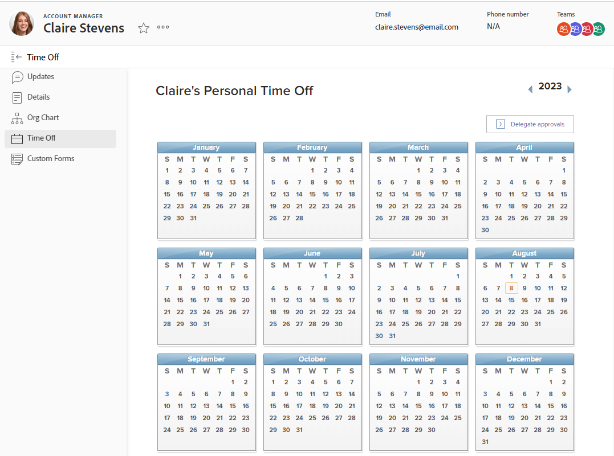

# Configure personal time off

<!-- Audited: 12/2023 -->

[!DNL Adobe Workfront] is not designed to replicate or replace your existing systems for managing, accruing, and tracking personal time off.

However, it is important to indicate when approved time off happens, because this affects both your schedule and the [!UICONTROL Planned Completion Dates] of the tasks you are assigned to.

For example, if you are assigned to a task that is scheduled to take two weeks, and you plan to take three days off during that time, [!DNL Workfront] adds three days to the task timeline to account for the time off.

Resource Management tools also use your personal time off to indicate when you are available to be scheduled for work.

>[!NOTE]
>
>To ensure that no inconsistencies occur with the dates that you schedule your time off for, we recommend that your user profile's time zone matches that of your schedule. For more information, see the following articles:
>
>* [Create a schedule](../../../administration-and-setup/set-up-workfront/configure-timesheets-schedules/create-schedules.md)
>* [Edit a user's profile](../../../administration-and-setup/add-users/create-and-manage-users/edit-a-users-profile.md)
>

## Access requirements

+++ Expand to view access requirements for the functionality in this article.

<table style="table-layout:auto"> 
 <col> 
 </col>
 <tbody> 
  <tr> 
   <td> Adobe Workfront package</td> 
   <td>
Any
</td> 
  </tr> 
  <tr> 
   <td>Adobe Workfront license</td> 
   <td> 
To configure your personal time off, you must have:

        
Standard (to configure your personal time off)

        
Work or higher (to configure your personal time off)
 </td>
  </tr> 
  <tr> 
   <td>Access level configurations</td> 
   <td>
To make changes to the time off calendar of another user, you must be that user's manager and have Edit User access.

   
<strong>NOTE:</strong> If a manager edits another user's personal time off calendar, all entries are shown in the user's time zone and not the manager's time zone.
</td> 
  </tr> 
 </tbody> 
</table>

For information, see [Access requirements in Workfront documentation](/help/quicksilver/administration-and-setup/add-users/access-levels-and-object-permissions/access-level-requirements-in-documentation.md).

+++

## Configure personal time off in [!DNL Workfront]

{{step1-click-profile-pic}}

>[!NOTE]
>
>If you are on the Adobe Unified Experience, you can access your Workfront profile by clicking the Adobe account menu (your profile picture) in the top navigation area, then choosing Workfront Profile.
>
>

1. In the left panel, click **[!UICONTROL Time Off]**.
1. Select the desired date for your personal time off.

   

1. Select **[!UICONTROL All day]**, if you are taking a full day off.

   Leave the check box cleared if you are taking less than a full day off and indicate the start and end times of your time off.

1. Click **[!UICONTROL Save]**.

   Your time off is now visible across the [!DNL Workfront] system in the resource management tools like the Resource Planner and the Workload Balancer. When you are assigned work during this time, a tool tip informs the user that you have scheduled time off.
