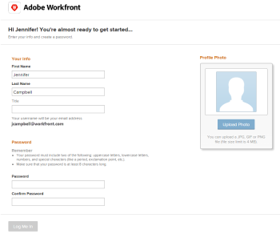

# Receive email invitations and create a password for [!DNL Adobe Workfront]

## Access requirements

You must have the following access to perform the steps in this article:

<table style="table-layout:auto"> 
 <col> 
 </col> 
 <col> 
 </col> 
 <tbody> 
  <tr> 
   <td role="rowheader"><strong>[!DNL Adobe Workfront] plan*</strong></td> 
   <td> 
Any
 </td> 
  </tr> 
  <tr> 
   <td role="rowheader"><strong>[!DNL Adobe Workfront] license*</strong></td> 
   <td> 
[!UICONTROL Request] or higher
 </td> 
  </tr> 
 </tbody> 
</table>

To find out what plan or license type you have, contact your [!DNL Workfront] administrator.

## Receive email invitations

When a [!DNL Workfront] administrator creates a new user, the new user may receive an invitation email based on several factors:

* Whether the user's organization has been onboarded to the [!DNL Adobe Admin Console]
* Whether the user was added in [!DNL Workfront] or the [!DNL Admin Console]
* Whether the user has access to other [!DNL Adobe] products or is a new [!DNL Adobe] user
* Whether the administrator chose to send the user an email invitation (only applies to organizations not yet on the [!DNL Admin Console])

For more information about how a [!DNL Workfront] administrator sends email invitations while creating new users, see [Manage email invitations to new users](../../../administration-and-setup/manage-workfront/emails/manage-email-invitations.md).

For more information about how a Workfront administrator adds new users to [!DNL Adobe Workfront], see [Add users](../../../administration-and-setup/add-users/create-and-manage-users/add-users.md).

## Create a password for [!DNL Workfront]

As a new user, after you receive the invitation email, you can follow the link in the email invitation and finish creating your [!DNL Workfront] account by choosing a password.

>[!NOTE]
>
>The link in the email is valid only the amount of days specified in the [!UICONTROL general options] area of the [!UICONTROL Invitations] page by your [!DNL Workfront] administrator.

To create a password for [!DNL Workfront] using the invitation email:

1. Click **[!UICONTROL Get Started]** in the invitation email from Workfront.

   

1. Specify the following information:\
   **[!UICONTROL First Name]**: Your first name (it should be prefilled).\
   **[!UICONTROL Last Name]**: Your last name (it should be prefilled).\
   **[!UICONTROL Title]**: Your title in your organization.\
   **[!UICONTROL Password]**: Choose a password to log in to Workfront.\
   **[!UICONTROL Confirm Password]**: Confirm your [!DNL Workfront] password.

1. Select **[!UICONTROL I accept the Terms and Conditions]**.
1. Click **[!UICONTROL Log Me In]**.\
   This completes the creation of your user account in Workfront.
