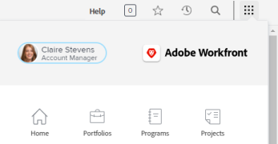
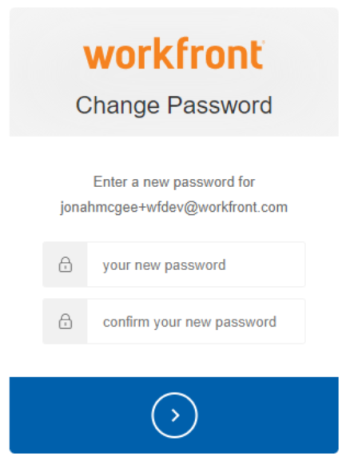

# Reset a user's password with Enhanced Authentication

<!--This article has been hidden by request-->

When Enhanced Authentication (eAuth) is enabled for your [!DNL Workfront] Environment, a [!DNL Workfront] administrator can't reset login credentials for another user. This differs from [!DNL Workfront] environments without eAuth or those environments for which Single Sign On (SSO) is enabled.

## Access requirements

You must have the following access to perform the steps in this article:

<table style="table-layout:auto"> 
 <col> 
 <col> 
 <tbody> 
  <tr> 
   <td role="rowheader"><strong>[!DNL Adobe Workfront] plan*</strong></td> 
   <td> 
 Any
 </td> 
  </tr> 
  <tr> 
   <td role="rowheader"><strong>[!DNL Adobe Workfront] license*</strong></td> 
   <td> 
[!UICONTROL Plan]
 </td> 
  </tr> 
  <tr> 
   <td role="rowheader"><strong>Access level configurations*</strong></td> 
   <td> 
System administrator 
 </td> 
  </tr> 
 </tbody> 
</table>

To find out what plan, license type, or access you have, contact your [!DNL Workfront] administrator.

## Reset a user's password in an eAuth enabled environment

1. Click the **[!UICONTROL Main Menu]** icon  in the upper-right corner of [!DNL Workfront], then click **[!UICONTROL Users]** .

   

1. Select the **[!UICONTROL User]** that requires a password reset.
   

1. Click the **[!UICONTROL More] button** that appears after you've chosen the desired **[!UICONTROL User]** and select the **[!UICONTROL Send Forgot Password Email]** option from the drop-down menu.

   

After selecting the **[!UICONTROL Send Forgot Password Email]** option, an email is sent to the selected user that contains instructions for them to change their own password.

