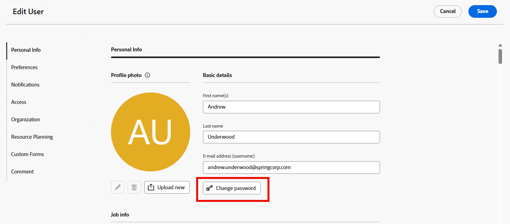

# Reset your password

{{important-not-on-aec}}

You can reset your [!DNL Adobe Workfront] password. As an important security measure, we recommend that you do this regularly.

>[!NOTE]
>
>A [!DNL Workfront] administrator can configure custom password restrictions, as explained in [Configure system security preferences](../../../administration-and-setup/manage-workfront/security/configure-security-preferences.md) and [Configure password policies for authentication](../../../administration-and-setup/manage-workfront/security/configure-password-policies-authentication.md).
>
><!-- [!DNL Workfront] administrator can also reset your password in an Enhanced Authentication enabled environment. For more information, see [Reset a user's password with Enhanced Authentication](../../../workfront-basics/manage-your-account-and-profile/managing-your-workfront-account/reset-user-password-eauth.md).-->

## Access requirements

+++ Expand to view access requirements for the functionality in this article.

<table style="table-layout:auto"> 
 <col> 
 </col>
 <tbody> 
  <tr> 
   <td>Adobe Workfront package</td> 
   <td> 
Any
 </td> 
  </tr> 
  <tr> 
   <td>Adobe Workfront license</td> 
   <td> 
   
Contributor or higher

   
Request or higher
 </td> 
  </tr> 
 </tbody> 
</table>

For information, see [Access requirements in Workfront documentation](/help/quicksilver/administration-and-setup/add-users/access-levels-and-object-permissions/access-level-requirements-in-documentation.md).

+++

## Reset your password in [!DNL Adobe Workfront]

{{step1-click-profile-pic}}

   

1. Click the **[!UICONTROL More menu]** , then click **[!UICONTROL Edit]**.

1. In the **[!UICONTROL Edit Person]** box that displays, under **[!UICONTROL Personal Info]**, click **[!UICONTROL Change password]**.

   

   If your organization has integrated [!DNL Workfront] with an SSO solution, you may be routed to reset your passwords through your SSO system when you click **[!UICONTROL Change password]**. This resets your SSO password which affects logging in to all your other applications inside your organization.

1. Type your old password, then type the new password you want twice.

   Your password must be at least 8 characters and contain two of the following types of characters:

   * Uppercase letters
   * Lowercase letters
   * Numbers
   * Special characters (such as ! @ # $ %)

   Password rules might be more strict than this, depending on configuration settings set by your [!DNL Workfront] administrator.

1. Click **[!UICONTROL Save]**.
