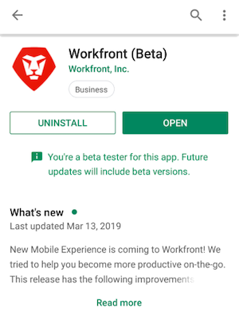
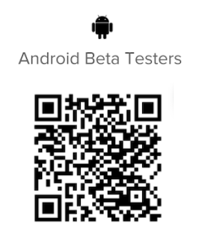

# Be an [!DNL Android] beta tester

## Download the beta app

There are a couple of ways to become a beta tester for the [!DNL Adobe Workfront] app:

### [!DNL Google Play] Store

You can use the [!DNL Google Play Store] to find and download the app:

1. Access the [!DNL Play Store] app on your device.
1. Search for [!DNL Workfront], then tap it when it appears in the list.
You need to install the [!DNL Workfront] app before you join the beta.
1. Install and open the [!DNL Workfront] app if you haven't done so already.
1. Scroll towards the middle of the page, then tap **[!UICONTROL Join now]** in the **[!UICONTROL Become a beta tester]** section.

1. Tap **[!UICONTROL Join]** to confirm that you want to be a beta tester.\
   It takes a few minutes to be acknowledged as a beta user. You may have to reopen the [!DNL Play Store] to see the changes.

1. After the progress completes, you receive a confirmation that you are now a beta user.\
   The word "[!UICONTROL Beta]" appears after the name of your app in the [!DNL Play Store] indicating that you are using the beta version of the app.\
   

### QR code

You can also scan the QR Code below to sign up for the beta and download the app:

## Let us know how we're doing

To provide feedback about the beta app or to report a problem:

1. Tap **[!UICONTROL More]** in the bottom Navigation bar.
1. Tap your name, then **[!UICONTROL Submit Feedback]**.
1. Choose **[!UICONTROL Start Survey]** to provide general feedback about the app.\
   or\
   Choose **[!UICONTROL Report a Problem]** to submit a ticket to the [!DNL Workfront] Customer Care Team.

## Opt out of beta testing

To stop beta testing the [!DNL Workfront] app:

1. Access the [!DNL Play Store] app on your device.
1. Search for [!DNL Workfront], then tap it when it appears in the list.
1. Scroll down to the **[!UICONTROL You're a beta tester]** section, then tap **[!UICONTROL Leave]**.\
   It takes a few minutes to be removed as a beta tester. You may have to reopen the [!DNL Play Store] to see the changes.
