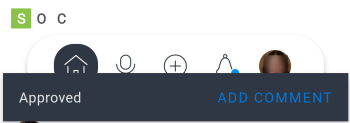

# Approvals in the [!DNL Adobe Workfront] mobile app

You can manage approvals assigned or delegated to you from the [!UICONTROL Approvals] area in the [!DNL Adobe Workfront] mobile app. From the [!UICONTROL approvals] area, you can approve:

<table style="table-layout:auto"> 
 <col> 
 <col> 
 <tbody> 
  <tr> 
   <td> 
    <ul> 
     <li>Work (Tasks and Issues)</li> 
     <li>Documents</li> 
     <li>Proofs </li> 
    </ul> </td> 
   <td> 
    <ul> 
     <li>Timesheets</li> 
     <li>Access Requests</li> 
    </ul> </td> 
  </tr> 
 </tbody> 
</table>

Proofs follow a separate approval process. You cannot approve a proof from a work item or document approval. For information on reviewing and approving proofs, see [Review and make decisions on proofs in the [!DNL Adobe Workfront] mobile app](../../../workfront-basics/mobile-apps/using-the-workfront-mobile-app/work-with-proofs-in-mobile-app.md).

## Review an approval

1. Select **[!UICONTROL Show all approvals]** in the [!UICONTROL Approvals] area of [!UICONTROL My Work].

   For information about [!UICONTROL My Work] in the mobile app, see [[!UICONTROL My Work] section in the mobile app](../../../workfront-basics/mobile-apps/using-the-workfront-mobile-app/my-work-section-mobile.md).

1. Select an approval in the list.

   

1. Review the information associated with the approval, such as updates, documents, and details.

   This example shows a task approval. Other approval types might contain different information.

   

## Make a decision on an approval

1. Open the approval.
1. Select a decision. The list of decision options depends on the type of approval you are viewing.

   | Icon | Decision |
   |---|---|
   |  | [!UICONTROL Approve] |
   |  | [!UICONTROL Approve with changes] (only available for documents) |
   |  | [!UICONTROL Reject] |

   {style="table-layout:auto"}

1. (Optional) Select **[!UICONTROL Add comment]** on the confirmation message at the bottom of the screen to add comments to the decision. These comments appear in the updates for the approval.\
   \
   Or\
   Select the arrow on the top left of the approval to go back to the [!UICONTROL Approvals] page.
