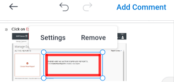

# Comment on proofs in [!DNL Android]

You can review and resolve existing comments on a proof, and add new comments and annotations to the proof document.

Your access to comment on proofs is the same as in [!DNL Adobe Workfront]. For information about proofing capabilities, see [Proof Permissions Profiles in [!DNL Workfront Proof]](../../../workfront-proof/wp-acct-admin/account-settings/proof-perm-profiles-in-wp.md).

>[!NOTE]
>
>If the proof owner has locked the proof, you cannot comment on it. For more information, see [Lock and unlock a proof](../../../workfront-basics/mobile-apps/using-the-workfront-mobile-app/work-with-proofs-in-mobile-app.md#lock) in the article [Review and make decisions on proofs in the [!DNL Adobe Workfront] mobile app](../../../workfront-basics/mobile-apps/using-the-workfront-mobile-app/work-with-proofs-in-mobile-app.md).

## Review existing comments in a proof

You can review comments that are made on a proof document. Comments often have associated drawings to call out the area of the document the comment refers to. Drawings can include arrows, lines, rectangles, highlighting, and freehand drawings.

1. Open the document proof. For information, see [Review and make decisions on proofs in the [!DNL Adobe Workfront] mobile app](../../../workfront-basics/mobile-apps/using-the-workfront-mobile-app/work-with-proofs-in-mobile-app.md).
1. Select a comment icon on the document page  to open the comment and any associated drawings and attachments.

   If the comment has more than one reply, you can select **[!UICONTROL View Replies]** to show all replies, or swipe the comment sheet up and down to display more content.

1. To view an attachment on the comment, select the comment thumbnail. Follow the prompts to download the attachment file to your device.
1. To reply to the comment, type your response in the text box underneath the comment and select the **[!UICONTROL Send]** icon .

### Use the comment list

1. To see a list of all comments in order by page number, select the comment icon  on the top right.

   The number of unread comments is indicated on the comment icon.  Unread comments in the list are marked with a blue dot. Comments with attachments have a paper clip icon ![[!UICONTROL Attachment] icon](assets/mobile-paper-clip-icon.png).

1. In the list, select an individual comment to see the comment and its associated drawings on the document page.
1. Select the X to close the comment list and return to the proof.

### Take action on comments in the selection view

>[!NOTE]
>
>The options you have in the selection view **[!UICONTROL More]** menu might be different depending on what your [!DNL Workfront] administrator or [!DNL Workfront Proof] administrator has set up.

1. To see more comment options, select ![[!UICONTROL List of comments] icon](assets/mobile-listofcommentsicon-30x27.png) on the top right of the comment list.

   A check box appears next to each comment.

   >[!NOTE]
   >
   >In the selection view, you cannot access the comments in the document. Select the arrow on the top left to return to the comment list.

1. To select an individual comment, tap the check box.

   To select all comments, select the **[!UICONTROL More]** menu on the top right  and choose **[!UICONTROL Select All]**.

1. To resolve the selected comment, select ![[!UICONTROL Resolve comment] icon](assets/mobile-resolvecomment-icon-30x30.png) on the top right.

   You can only resolve one comment at a time. The comment is marked with a green icon to show it was resolved.

   The original comment remains on the document. A comment resolution appears as a reply to the original comment: "[!UICONTROL This thread was resolved by [name].]"

   You can undo the resolution by selecting the resolved comment and selecting the **[!UICONTROL Undo]** icon on the top right.

1. To mark the selected comments as read, select the **[!UICONTROL Mark as read]** icon .

   This option is only available when you have unread comments selected.

1. To delete the selected comments, select the **[!UICONTROL More]** menu on the top right  and choose **[!UICONTROL Delete]**. Then, select **[!UICONTROL Delete]** on the confirmation message to permanently delete the comment.
1. Select the arrow on the top left to exit the selection view and return to the comment list.

## Comment on a proof

You can associate your proof comments to a specific area on the document. Use the drawing tools to select an area to comment on.

1. Open the document proof. For information, see [Review and make decisions on proofs in the [!DNL Adobe Workfront] mobile app](../../../workfront-basics/mobile-apps/using-the-workfront-mobile-app/work-with-proofs-in-mobile-app.md).
1. Select a drawing tool from the toolbar at the bottom of the proof screen.

   

   If you do not see the tool you need, scroll the toolbar to the right.

1. Select **[!UICONTROL Settings]** next to the tool name to define the color, opacity, and thickness. Select the star icon to make these choices the default settings for the tool.

   

1. Draw the shape on the proof document. Select the **[!UICONTROL Undo]** icon  to undo the drawing.
1. (Conditional)&nbsp;Select the shape and choose **[!UICONTROL Settings]** to edit the shape settings, or **[!UICONTROL Remove]** to delete the shape.

   

1. Select **[!UICONTROL Add Comment]**.
1. Type the comment in the text box.
1. To tag a contact on the comment, type the @ symbol or select ![[!UICONTROL Tag contact]](assets/mobile-tag-user-icon.png) to add the @ symbol, begin typing the name of the contact you want to include, then click the name when it appears in the drop-down list.

   The contact will receive an email notification when the comment is added to the proof.

1. To add an attachment to the comment, select ![[!UICONTROL Attachment] icon](assets/mobile-paper-clip-icon.png). Choose **[!UICONTROL Select a Document]** or **[!UICONTROL Take a Photo]**, and follow the prompts to attach the file or photo to the comment.

   Click the X on the thumbnail image to remove the attachment.

1. Select the **[!UICONTROL Send]** icon  to add the comment and drawing to the proof.
