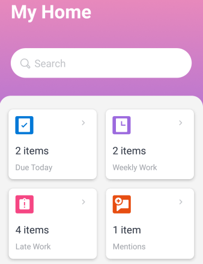

# Home area widgets

The home area widgets for both iOS&nbsp;and Android help you find your work items quickly.

`Due Today:` Shows the number of work items due today. Select the widget to see the list of items.

`Weekly Work:` Shows the number of work items due this week. Select the widget to see the list of items.

`Late Work:` Shows the number of work items that are late (past the planned completion date). Select the widget to see the list of items.

`Mentions:` Shows the number of unread mentions. A mention is a notification in which you are tagged or notified in the Updates tab for an object in Adobe Workfront. Select the widget to see the list of mentions.
