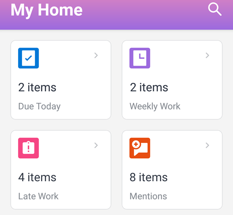

# [!UICONTROL Home] area widgets

The home area widgets for both [!DNL iOS] and [!DNL Android] help you find your work items quickly.

**[!UICONTROL Due Today]:** Shows the number of work items due today. Select the widget to see the list of items.

**[!UICONTROL Weekly Work]:** Shows the number of work items due this week. Select the widget to see the list of items.

**[!UICONTROL Late Work]:** Shows the number of work items that are late (past the planned completion date). Select the widget to see the list of items.

**[!UICONTROL Mentions]:** Shows the number of unread mentions. A mention is a notification in which you are tagged or notified in the [!UICONTROL Updates] tab for an object in [!DNL Adobe Workfront]. Select the widget to see the list of mentions.
