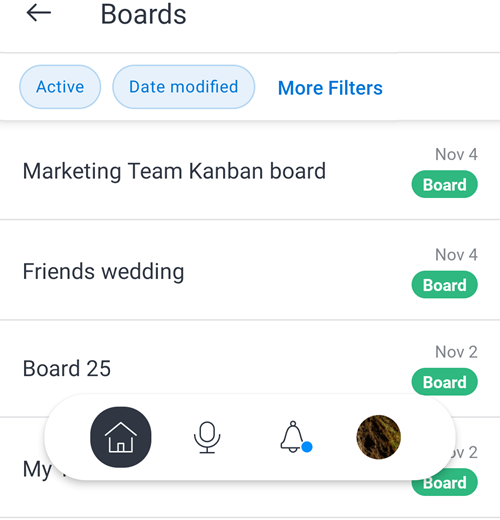
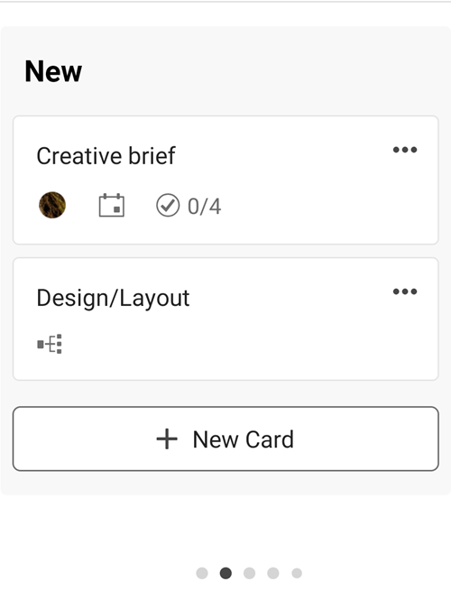
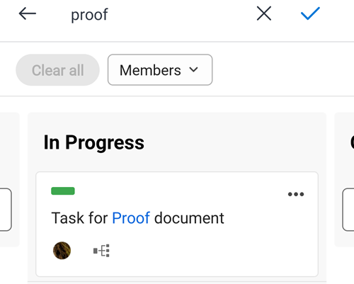

# [!DNL Adobe Workfront] [!UICONTROL Boards] for mobile

[!DNL Adobe Workfront] [!UICONTROL Boards] are flexible tools that allow team collaboration by providing access to a shared board that contains columns and cards. For additional information about boards, see [Boards overview](/help/quicksilver/agile/boards-overview.md).

In the [!DNL Workfront] mobile app, you can see all of the boards you created or have been added to in the desktop version of [!DNL Workfront]. You can't create a new board in the mobile app.

Any changes you make to board columns and cards in the app are also reflected in the desktop version of the board.

To provide feedback on mobile boards, select the **[!UICONTROL Send]**  icon at the top of any board and follow the prompts.

>[!NOTE]
>
>At this time, the mobile app supports all types of boards **except** Iteration Process boards.

## View and filter the list of boards

1. Select [!UICONTROL **Boards**] on the home page to view a list of all boards you created or have been added to in the desktop version of [!DNL Workfront].

   

1. To sort or filter the list of boards, select [!UICONTROL **More Filters**].
1. Select from these options:

   * In the Filter section, select [!UICONTROL **Archived**] to display archived boards in the list. Only active boards are displayed by default.
   * In the Sort section, select [!UICONTROL **Date modified**] or [!UICONTROL **Name**].
   * In the Order section, select [!UICONTROL **Ascending**] or [!UICONTROL **Descending**] to define the sort order.

1. Select [!UICONTROL **Apply**] or  to apply the filters and return to the list of boards.

   You can access these options at any time to change them or return to the default settings.

1. To open a board, select it from the list.

>[!NOTE]
>
>At this time, you can only archive or delete a board from the desktop version of [!DNL Workfront] [!UICONTROL Boards], not from the mobile app.

## View board contents

When you open a board, its columns and cards appear. Scroll horizontally to view all of the columns, and scroll vertically to view all of the cards in a column.

Select and hold a card to move it to another column.

If the board contains an intake column, it appears as the left-most column. Cards in the intake column are not editable until you move them into other board columns. You can select a card to open the task or issue. The intake column filters are controlled in the desktop version of the board. For more information, see [Add an intake column to a board](/help/quicksilver/agile/use-boards-agile-planning-tools/add-intake-column-to-board.md).

## Work with connected cards

A connected card is connected to an existing task or issue in [!DNL Workfront]. In the mobile app, a connected card is designated with the  icon. In the image below, the second card is a connected card.

When any one of the following details is updated for the card in one location, it is automatically updated in the other location:

* [!UICONTROL Name]
* [!UICONTROL Description]
* [!UICONTROL Assignees]
* [!UICONTROL Status]

For example, if you update the name of a connected card on a board in the mobile app, it is also updated on the task or issue.

1. Select a card to see its name, description, column, assignees, connection, status, due date, estimation, tags, and checklist items. When you edit any of these details they are saved automatically. Select the X to close the card and return to the board.

   >[!NOTE]
   >
   >You can select a different tag on the card but you can't create new tags in the mobile app.

1. (Optional) To delete a card, select the [!UICONTROL **More**] menu  on the card and choose [!UICONTROL **Delete**]. Then, select [!UICONTROL **Delete**] on the confirmation message.

## Work with ad hoc cards

An ad hoc card is not connected to a Workfront task or issue. In the image below, the first card is an ad hoc card.

1. Select a card to see its name, description, column, assignees, status, due date, estimation, tags, and checklist items. When you edit any of these details they are saved automatically. Select the X to close the card and return to the board.

   >[!NOTE]
   >
   >You can select a different tag on the card but you can't create new tags in the mobile app.

1. (Optional) To add a new ad hoc card, select [!UICONTROL **New Card**] in the column where you want to add the card, and enter the card name. To add details, select the newly added card.

1. (Optional) To copy a card, select the [!UICONTROL **More**] menu  on the card and choose [!UICONTROL **Copy**].

1. (Optional) To delete a card, select the [!UICONTROL **More**] menu  on the card and choose [!UICONTROL **Delete**]. Then, select [!UICONTROL **Delete**] on the confirmation message.

## Manage checklist items on cards

Checklist items are available on both ad hoc and connected cards.

1. To add a checklist item, open the card and select [!UICONTROL **New Checklist Item**]. Enter the checklist item name. The counter on the card is updated.
1. (Optional) To copy a checklist item, open the card, select the [!UICONTROL **More**] menu  on the item, and choose [!UICONTROL **Copy**]. A copy of the item is added at the bottom of the list.
1. (Optional) To delete a checklist item, open the card, select the [!UICONTROL **More**] menu  on the item, and choose [!UICONTROL **Delete**].
1. To complete a checklist item, open the card and select the check box next to the item name.
The item is marked complete, the counter on the card updates to show how many checklist items are complete.

## Filter and search in a board

You can filter a board to display cards assigned to certain people, or you can search to locate a specific card on the board.

When filters are applied, an indicator is displayed on the board . Select the filter icon and choose [!UICONTROL **Clear all**] to remove all filters from the board.

### Filter a board by assignees

1. Select the filter and search icon .
1. Select [!UICONTROL **Members**] and choose the person or people whose cards you want to see. You can also display unassigned cards.
1. Select [!UICONTROL **Done**] or .

### Filter a board by tags ([!DNL iOS] only)

1. Select the filter and search icon .
1. Select [!UICONTROL **Tags**] and choose the tags you want to see.
1. Select [!UICONTROL **Done**].

### Search in a board

1. Select the filter and search icon .
1. Type a search term in the box and select [!UICONTROL **Done**] or .

   All cards that contain the search term in the title are displayed.
   Select the X to clear the search.

   
