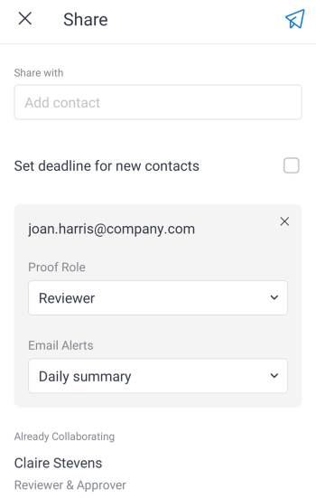

# Share and download proofs in the [!DNL Adobe Workfront] mobile app

You can share a proof document with internal and external recipients directly from the mobile app. You can also download a proof document to your mobile device.

>[!NOTE]
>
>All recipients must have access in [!DNL Workfront] to review proofs. For information about licenses and access levels, see [Proof Permissions Profiles in [!DNL Workfront Proof]](../../../workfront-proof/wp-acct-admin/account-settings/proof-perm-profiles-in-wp.md).

## Share the proof

This option sends an email with a unique proof link to a contact from [!DNL Workfront Proof]. You can also add a new contact, which is saved to your proof contacts.

1. Open the document proof and select the **[!UICONTROL More]** menu  on the upper right of the document. Then, select **[!UICONTROL More]**.
1. Select **[!UICONTROL Share]**.
1. Begin typing the contact name in the **[!UICONTROL Share with]** box, and select the contact from the list.

   Or

   If the person is not listed, type their email address in the **[!UICONTROL Share with]** box and select **[!UICONTROL Add Recipient]** to add them.

1. Select the **[!UICONTROL Proof Role]** for the recipient.\
   For information on proof roles, see [Proof Roles overview](../../../review-and-approve-work/proofing/proofing-overview/proof-roles.md).
1. Select the **[!UICONTROL Email Alerts]** the recipient should receive.\
   For information on email alerts for proofs, see [Change email alert settings for a proof in [!DNL Workfront Proof]](../../../workfront-proof/wp-emailsntfctns/email-alerts/change-email-alert-settings-wp.md) and [Configure email notification settings in [!DNL Workfront Proof]](../../../workfront-proof/wp-emailsntfctns/email-alerts/config-email-notification-settings-wp.md).

   

1. To add another recipient, repeat steps 3-5.
1. To choose a due date for all of the recipients to review the proof, select **[!UICONTROL Set deadline for new contacts]**. Then, select a date on the calendar.
1. Select the **[!UICONTROL Send]** icon  to send the email to the recipients.

## Send a link to the proof

This option copies a link to your clipboard that you can paste into an email. Then, you can send the email with the proof link to an internal or external recipient.

1. Open the document proof and select the **[!UICONTROL More]** menu  on the upper right of the document. Then, select **[!UICONTROL More]**.
1. Select **[!UICONTROL Send Copy]**.
1. Select **[!UICONTROL Copy to clipboard]**.
1. Open your email program and paste the proof link in the body of the email.
1. Send the email to the recipients you want to share the proof with.

## Share the proof with a public URL

This option sends an email with a public proof link to a contact from [!DNL Workfront Proof]. You can add a new contact if needed. You can choose to send a public URL, a downloadable link, or both.

1. Open the document proof and select the **[!UICONTROL More]** menu  on the upper right of the document. Then, select **[!UICONTROL More]**.
1. Select **[!UICONTROL Share with Public URL]**.
1. Begin typing the contact name in the **[!UICONTROL Share with]** box, and select the contact from the list.

   Or

   If the person is not listed, type their email address in the **[!UICONTROL Share with]** box and select **[!UICONTROL Add Recipient]** to add them.

   Repeat this step to add another recipient.

1. Select **[!UICONTROL Send Public Link]** to allow recipients to open the proof document in [!DNL Workfront Proof].
1. Select **[!UICONTROL Send Downloadable Link]** to allow recipients to download the proof document.

   ![[!UICONTROL Share with Public URL screen]](assets/mobile-sharepublicurl-proof-350x296.png)

1. Select the **[!UICONTROL Send]** icon  to send the email to the recipients.

## Download the proof

You can download a copy of the proof document to your mobile device.

1. Open the document proof and select the **[!UICONTROL More]** menu  on the upper right of the document. Then, select **[!UICONTROL More]**.
1. Select **[!UICONTROL Download]**.
1. Follow your device prompts to complete the download and open the document file.
