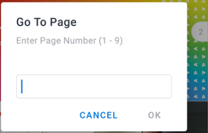

# Review and make decisions on proofs in the [!DNL Adobe Workfront] mobile app

When a proof is assigned to you for approval, it appears in your list of approvals in the mobile app. You can review the proof directly in the app and make a decision on it. For information about reviewing and approving proofs in [!DNL Adobe Workfront], see [Review proofs within [!DNL Adobe Workfront]](../../../review-and-approve-work/proofing/reviewing-proofs-within-workfront/review-proofs-in-wf.md).

You can add comments to the proof and go through a revision process before making a final decision. For information about comments, see [Comment on proofs in [!DNL iOS]](../../../workfront-basics/mobile-apps/using-the-workfront-mobile-app/comment-on-proofs-ios.md) or [Comment on proofs in [!DNL Android]](../../../workfront-basics/mobile-apps/using-the-workfront-mobile-app/comment-on-proofs-android.md).

Your access to review and approve proofs is the same as in [!DNL Adobe Workfront]. For information about proofing capabilities, see [Proof Permissions Profiles in [!DNL Workfront Proof]](../../../workfront-proof/wp-acct-admin/account-settings/proof-perm-profiles-in-wp.md).

## Open and review a proof

1. Open the proof approval task:

   * Select the proof approval task in the [!UICONTROL Approvals] area of [!UICONTROL My Work].

      \
      Or

   * Select **[!UICONTROL Show all Approvals]** in the [!UICONTROL Approvals] area of [!UICONTROL My Work]. Then select the proof approval task in the list of all approvals.

      For information about [!UICONTROL My Work] in the mobile app, see [[!UICONTROL My Work] section in the mobile app](../../../workfront-basics/mobile-apps/using-the-workfront-mobile-app/my-work-section-mobile.md).

1. On the Details page, select **[!UICONTROL Go to Proof]**.

   

1. Review the document proof.
1. (Optional) Select ![[!UICONTROL Single Page icon]](assets/mobile-proofpagingicon1-25x36.png) on the top right of the document to change from the single page view to the continuous view. Select ![[!UICONTROL Continuous Page icon]](assets/mobile-proofpagingicon2-25x25.png) to change back to the single page view.

   In the single page view, you scroll right and left to move through the document pages. In the continuous view, you scroll up and down to move through the pages.

1. (Optional) Go to a specific page using the scroll indicator on the right:

   1. Tap the scroll indicator.
   1. Type the page number in the [!UICONTROL Go To Page] box and select **[!UICONTROL OK]**.
   1. 

1. Select the arrow on the top left of the document to go back to the [!UICONTROL Details] page.
1. (Optional) On the [!UICONTROL Details] page, select **[!UICONTROL Updates]** to see all updates for the proof, such as when it was created and when it was sent for approval.

## Lock and unlock a proof

Any user assigned as a proof owner, author, or moderator can lock a proof to prevent others from commenting or making decisions on it.

### Lock a proof

1. Open the document proof and select the **[!UICONTROL More]** menu  on the upper right of the document. Then, select **[!UICONTROL More]**.
1. Select **[!UICONTROL Lock Document]**.\
   A "[!UICONTROL Locked]" indicator appears at the top of the document.

### Unlock a proof

1. Open the document proof and select the **[!UICONTROL More]** menu  on the upper right of the document. Then, select **[!UICONTROL More]**.
1. Select **[!UICONTROL Unlock Document]**.
1. Select **[!UICONTROL Unlock]** on the confirmation message.

## Make decisions on a proof

After you have reviewed the document proof, you can make a decision in the proof itself. If the proof owner has locked the proof, you will not be able to make a decision.

### Make a decision in the proof

1. Open the document proof.
1. Select the decision icon ![[!UICONTROL Decision] icon](assets/mobile-proofcheckmarkdecisionicon-30x30.png) on the top right of the document.
1. Select a decision in the [!UICONTROL Make a Decision] box.

   Some common decision options are shown below. The [!DNL Adobe Workfront] administrator or [!UICONTROL Workfront Proof] administrator can configure the list of decision options. For more information about how administrators can configure decisions, see [Configure approval decision options in Workfront Proof](../../../workfront-proof/wp-acct-admin/account-settings/configure-approval-decision-in-wp.md).

   <table style="table-layout:auto"> 
    <col> 
    <col> 
    <tbody> 
     <tr> 
      <td role="rowheader"><strong>[!UICONTROL Approved]</strong></td> 
      <td>The proof is ready to move to the next stage of the workflow.</td> 
     </tr> 
     <tr> 
      <td role="rowheader"><strong>[!UICONTROL Approved with changes]</strong></td> 
      <td> 
The proof requires some changes, but you do not need to see the revision before it moves to the next stage of the workflow.
 </td> 
     </tr> 
     <tr> 
      <td role="rowheader"><strong>[!UICONTROL Rejected]</strong></td> 
      <td>The proof is rejected and will not move forward in the workflow.</td> 
     </tr> 
    </tbody> 
   </table>

1. (Conditional) If the [!DNL Adobe Workfront] administrator or [!DNL Workfront Proof] administrator has added a list of [!UICONTROL Reasons], select any applicable reasons for your decision.

   Some reasons might also require comments to explain why you chose the reason.

   For more information about how administrators can configure reasons, see  [Configure approval decision options in [!DNL Workfront Proof]](../../../workfront-proof/wp-acct-admin/account-settings/configure-approval-decision-in-wp.md).

1. Select **[!UICONTROL Submit]**.

### Change your decision in the proof

1. Open the document proof.
1. Select the decision icon ![[!UICONTROL Decision] icon](assets/mobile-proofcheckmarkdecisionicon-30x30.png) on the top right of the document.

   The [!UICONTROL Make a Decision] box shows your current decision.

1. Select a different decision, or choose **[!UICONTROL Clear Selection]** to remove the decision.

   For decisions with reasons, you can choose a different reason or remove the reason.

1. Select **[!UICONTROL Submit]**.
