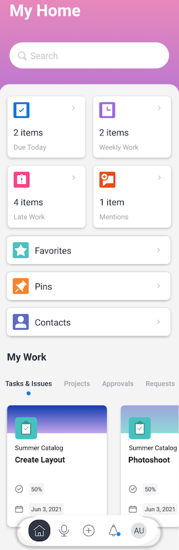
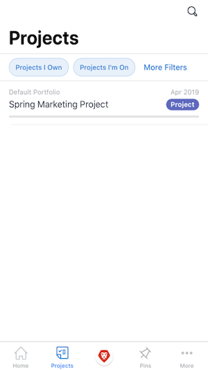
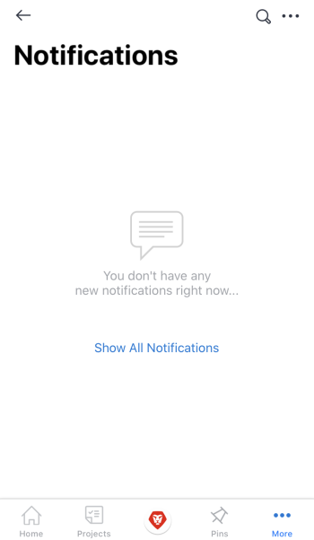
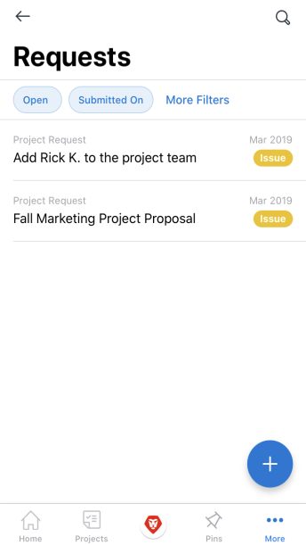
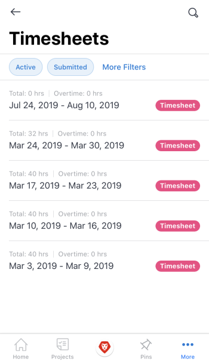
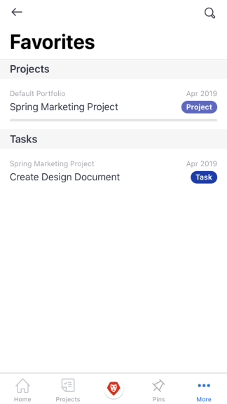
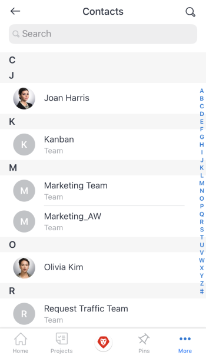
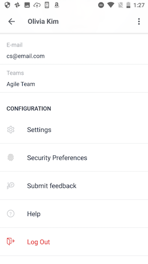
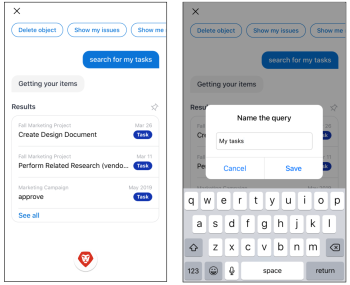

# Adobe Workfront for Android

The Adobe Workfront app allows you to access your work on any Android device. You can install and use the Workfront mobile app on phones and tablets running Android 5.0 or later.

For information about logging in to the mobile app, see the section [Log in to the Workfront mobile app](../../../workfront-basics/manage-your-account-and-profile/managing-your-workfront-account/log-in-to-workfront.md#log) in the article [Log in to Adobe Workfront](../../../workfront-basics/manage-your-account-and-profile/managing-your-workfront-account/log-in-to-workfront.md).

## Home

The Home area allows you to work directly on tasks, issues, and approvals assigned to you. From the Home area of the app, you can:

<table style="table-layout:auto"> 
 <col> 
 <col> 
 <tbody> 
  <tr> 
   <td> 
    <ul> 
     <li>Start working on tasks and issues</li> 
     <li>Mark tasks and issues as Done</li> 
     <li>Reassign tasks and issues</li> 
     <li>Change the Commit Date</li> 
    </ul> </td> 
   <td> 
    <ul> 
     <li>Update task and issue statuses</li> 
     <li>Post in the Updates area</li> 
     <li>View documents</li> 
     <li>Attach photos</li> 
     <li> 
Create a request or a quick task
 
Note: Quick tasks created in home are personal tasks, unless you choose to assign a project.
 </li> 
    </ul> </td> 
  </tr> 
 </tbody> 
</table>

For more information, see [Home area widgets](../../../workfront-basics/mobile-apps/using-the-workfront-mobile-app/home-area-widgets-mobile.md) and [My Work section in the mobile app](../../../workfront-basics/mobile-apps/using-the-workfront-mobile-app/my-work-section-mobile.md).

## Projects

The Projects area allows you to interact with and manage projects you own and projects you're on. From the projects area of the app, you can:

<table style="table-layout:auto"> 
 <col> 
 <col> 
 <tbody> 
  <tr> 
   <td> 
    <ul> 
     <li>Update project status</li> 
     <li>View important project details</li> 
     <li>Post in the Updates area</li> 
     <li>Convert tasks, issues, and requests to projects</li> 
    </ul> </td> 
   <td> 
    <ul> 
     <li>Interact with project tasks and issues</li> 
     <li>View documents</li> 
     <li>Attach photos</li> 
     <li> 
Create a quick task
 
Note: Tasks created in a project are automatically assigned to the project you're in. 
 </li> 
    </ul> </td> 
  </tr> 
 </tbody> 
</table>

## Approvals

The Approvals area allows you to view and approve approvals assigned or delegated to you. From the approvals area, you can approve:

<table style="table-layout:auto"> 
 <col> 
 <col> 
 <tbody> 
  <tr> 
   <td> 
    <ul> 
     <li>Work (Tasks and Issues)</li> 
     <li>Documents</li> 
     <li>Proofs </li> 
    </ul> </td> 
   <td> 
    <ul> 
     <li>Timesheets</li> 
     <li>Access Requests</li> 
    </ul> </td> 
  </tr> 
 </tbody> 
</table>

For more information on approvals, see [Approvals in the Adobe Workfront mobile app](../../../workfront-basics/mobile-apps/using-the-workfront-mobile-app/approvals-in-mobile-app.md).

For information on reviewing and approving proofs, see [Review and make decisions on proofs in the Adobe Workfront mobile app](../../../workfront-basics/mobile-apps/using-the-workfront-mobile-app/work-with-proofs-in-mobile-app.md).

## Notifications

The Notifications area allows you to view and respond to in-app notifications for your work.

## Requests

The Requests area allows you to view details about requests. From the Requests area of the app, you can:

<table style="table-layout:auto"> 
 <col> 
 <col> 
 <tbody> 
  <tr> 
   <td> 
    <ul> 
     <li>Reassign the request</li> 
     <li>Update the status</li> 
     <li>Adjust the priority</li> 
    </ul> </td> 
   <td> 
    <ul> 
     <li>Post in the Updates area</li> 
     <li>View documents</li> 
     <li>Attach photos</li> 
     <li>Save a request as a draft</li> 
    </ul> </td> 
  </tr> 
 </tbody> 
</table>

## Timesheets

The timesheets area allows you to view details about your timesheets. In the Timesheets area of the app, you can:

* Post in the Updates area
* Adjust hour types
* Change the time you've logged
* Enter comments on your timesheet
* Close your timesheet

## Favorites

You can access existing items from the Favorites menu and add new items to the Favorites menu.

## Contacts

The Contacts area allows you to view the contact information for all users in your company.

## Configuration

The Configuration area allows you to:

* Manage your settings
* View assigned teams
* Set up security preferences
* Submit Feedback
* Access Help content
* Log out

## Virtual Assistant

The virtual assistant allows you to perform the following tasks via voice command:

* Show me
* Delete
* Search for 
* Help me with commands

For more information on the Virtual assistant, see [Adobe Workfront mobile app virtual assistant](../../../workfront-basics/mobile-apps/using-the-workfront-mobile-app/wf-mobile-virtual-assistant.md).

## Pins

The Pin area allows you to access saved virtual assistant commands as well as pins from your web browser. 

For more information on the Virtual assistant, see [Adobe Workfront mobile app virtual assistant](../../../workfront-basics/mobile-apps/using-the-workfront-mobile-app/wf-mobile-virtual-assistant.md).
