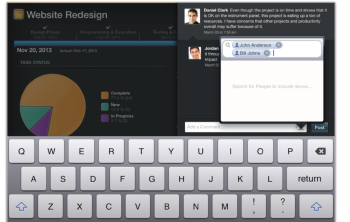

# Add updates in [!DNL Adobe Workfront View]

You can review and add updates to projects you are reviewing in the [!DNL Adobe Workfront View] app.

You cannot add updates to tasks or issues in [!DNL Workfront View].

## Access requirements

You must have the following access in [!DNL Workfront] to perform the steps in this article:

<table style="table-layout:auto"> 
 <col> 
 </col> 
 <col> 
 </col> 
 <tbody> 
  <tr> 
   <td role="rowheader"><strong>[!DNL Adobe Workfront] plan*</strong></td> 
   <td> 
Any
 </td> 
  </tr> 
  <tr> 
   <td role="rowheader"><strong>[!DNL Adobe Workfront] license*</strong></td> 
   <td> 
[!UICONTROL Review] or higher
 </td> 
  </tr> 
 </tbody> 
</table>

&#42;To find out what plan, license type, or access you have, contact your [!DNL Workfront] administrator.

## Add updates to a project in [!DNL Workfront View]

1. From the home page of [!UICONTROL Workfront View], tap a project to access it.
1. (Optional) Add the **[!UICONTROL Updates]** widget to your view.\
   For more information about adding widgets to your project view, see [Update widgets in the [!UICONTROL Project Details] view](../../../workfront-basics/mobile-apps/using-workfront-view/update-widgets-in-workfront-view.md).

1. Tap the **[!UICONTROL Updates]** icon (bottom right) or (conditional) the **[+]** icon on an update in the **[!UICONTROL Updates]** widget.\
   ![[!DNL workfront_view_updates_icon].png](assets/workfront-view-updates-icon-315x196.png)

1. Type in an update.
1. (Optional) Include others in the update by tapping the [!UICONTROL people] icon and specifying the name of another user.\
   

1. Tap **[!UICONTROL Post]**.\
   The update appears on the project, in the **[!UICONTROL Updates]** widget.
