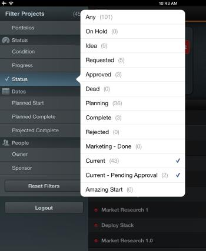

# Filter project lists in [!DNL Adobe Workfront View]

By default, [!DNL Adobe Workfront View] displays the [!UICONTROL All Projects] list in [!DNL Workfront], so all the projects you have access to view are listed, regardless of their status.

You can filter the list of projects in [!DNL Workfront View] to only display projects that are relevant to you. After applying the filters, the project list remains filtered until the next time you login or until they are changed.

## Access requirements

You must have the following access in [!DNL Workfront] to perform the steps in this article:

<table style="table-layout:auto"> 
 <col> 
 </col> 
 <col> 
 </col> 
 <tbody> 
  <tr> 
   <td role="rowheader"><strong>[!DNL Adobe Workfront] plan*</strong>/td> 
   <td> 
Any
 </td> 
  </tr> 
  <tr> 
   <td role="rowheader"><strong>[!DNL Adobe Workfront] license*</strong></td> 
   <td> 
[!UICONTROL Review] or higher
 </td> 
  </tr> 
 </tbody> 
</table>

&#42;To find out what plan, license type, or access you have, contact your [!DNL Workfront] administrator.

## Filter the [!UICONTROL projects] list in [!UICONTROL Workfront View]

1. Go to the list of projects in the [!DNL Workfront] View mobile app.
1. Tap the list icon in the upper left of the list.\
   The list of available filters is displayed.\
   

1. Select from the following filters:

   * [!UICONTROL Portfolios]: Select specific portfolios whose projects you want to display.
   * [!UICONTROL Condition]: Select to display only projects with a specific [!UICONTROL Condition].
   * [!UICONTROL Progress]: Select to display only projects in a specific [!UICONTROL Progress Status].
   * Status: Select to display only projects in specific [!UICONTROL Statuses].
   * [!UICONTROL Planned Start]: Select to display only projects with the [!UICONTROL Planned Start Date] in the following time frames:

      * Past 3 Months
      * Past 2 Months
      * Past Month
      * Past Two Weeks
   * [!UICONTROL Planned Complete]: Select to display only projects with the [!UICONTROL Planned Completion Date] in the following upcoming time frames:

      * Two Weeks
      * One Month
      * Two Months
      * Three Months
   * [!UICONTROL Projected Complete]: Select to display only projects with the [!UICONTROL Projected Completion Date] in the following upcoming time frames:

      * Two Weeks
      * One Month
      * Two Months
      * Three Months
   * [!UICONTROL Owner]: Select to display projects that are assigned to specific Owners.
   * [!UICONTROL Sponsor]: Select to display projects that are assigned to a specific [!UICONTROL Sponsor].

1. Tap anywhere on the list of projects to close the list icon.
