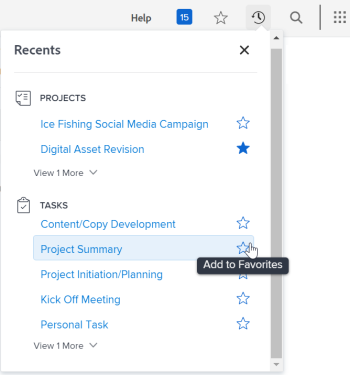
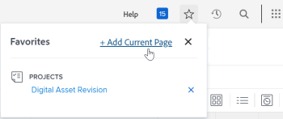

# View and manage favorites

The Favorites menu allows you to access items quickly. Items remain on the Favorites menu until you remove them. You can have up to 40 items on the Favorites menu.

## Access requirements

You must have the following access to perform the steps in this article:

<table style="table-layout:auto"> 
 <col> 
 </col> 
 <col> 
 </col> 
 <tbody> 
  <tr> 
   <td role="rowheader">Adobe Workfront plan*</td> 
   <td> 
Any
 </td> 
  </tr> 
  <tr> 
   <td role="rowheader">Adobe Workfront license*</td> 
   <td> 
Request or higher
 </td> 
  </tr> 
 </tbody> 
</table>

&#42;To find out what plan or license type you have, contact your Workfront administrator.

## View a favorite

To view an item that you have previously added as a favorite:

1. Click the **Favorites** icon  in the upper-right corner of any Adobe Workfront page.  

1. In the Favorites list, click the item you want to view.

## Add an item as a favorite

You can add recent items or the current page to the Favorites menu.

* [Add recent items as a favorite](#add-recent-items-as-a-favorite) 
* [Add the current item as a favorite](#add-the-current-item-as-a-favorite)

### Add recent items as a favorite {#add-recent-items-as-a-favorite}

1. Click the **Recents** icon  in the upper-right corner of any page in the new Adobe Workfront experience. 
1. Hover over the recent item that you want to save as a favorite, then click the star.

   The recent item displays in the Favorites menu.

   Click the X on the top right to close the list.

   

### Add the current item as a favorite {#add-the-current-item-as-a-favorite}

1. Go to the page that you want to add as a favorite.
1. Click the **Favorites** icon  in the upper-right corner of any Workfront page, then click **Add Current Page**.

   

   Click the X on the top right to close the list.

   Or

   Click the **Favorites** icon  to the right of the object name.

   >[!NOTE]
   >
   >If you click the **Favorites** icon on an object that you have already added as a favorite, the object will be removed from the Favorites menu.  
   >

## Remove an item from the Favorites menu

1. Click the **Favorites** icon  in the upper-right corner of any Workfront page.  

1. Hover over the item that you want to remove as a favorite, then click the **X** next to it.

   Or

   If you are on the page that you want to remove as a favorite, click the **Favorites** icon  next to the object name to remove it from the Favorites menu.

