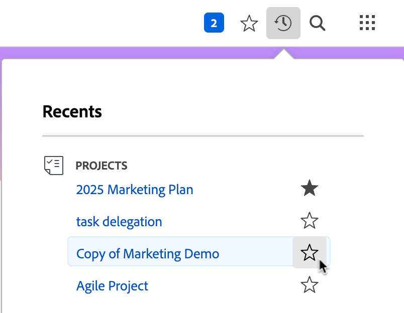
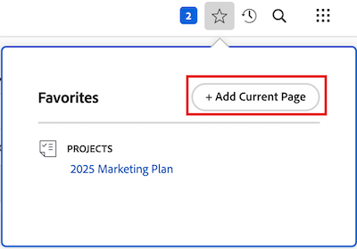
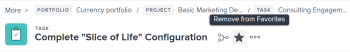

# View and manage favorites

<!-- Audited: 5/2025 -->

The [!UICONTROL Favorites] menu allows you to access items quickly. Items remain on the [!UICONTROL Favorites] menu until you remove them. You can have up to 40 items on the Favorites menu.

## Access requirements

+++ Expand to view access requirements for the functionality in this article.

<table style="table-layout:auto"> 
 <col> 
 </col> 
 <col> 
 </col> 
 <tbody> 
  <tr> 
   <td role="rowheader">Adobe Workfront package</td> 
   <td> 
Any
 </td> 
  </tr> 
  <tr> 
   <td role="rowheader">Adobe Workfront license</td> 
   <td> 

      
Contributor or higher

      
Request or higher</td> 
  </tr> 
 </tbody> 
</table>

For more detail about the information in this table, see [Access requirements in Workfront documentation](/help/quicksilver/administration-and-setup/add-users/access-levels-and-object-permissions/access-level-requirements-in-documentation.md).

 +++

## View a favorite

To view an item that you have previously added as a favorite:

1. Click the **[!UICONTROL Favorites]** icon  in the upper-right corner of any [!DNL Adobe Workfront] page.

1. In the **Favorites** list, click the item you want to view.

## Add an item as a favorite

You can add recent items or the current page to the [!UICONTROL Favorites] menu.

* [Add recent items as a favorite](#add-recent-items-as-a-favorite)
* [Add the current item as a favorite](#add-the-current-item-as-a-favorite)

### Add recent items as a favorite

1. Click the **[!UICONTROL Recents]** icon  in the upper-right corner of any page in the new [!DNL Adobe Workfront] experience.
1. Click the star in-line with the item you want to save as a favorite. The recent item displays in the **Favorites** menu.

   

### Add the current item as a favorite 

1. Go to the page that you want to add as a favorite.
1. Click the **[!DNL Favorites]** icon  in the upper-right corner of the page, then click **[!UICONTROL Add Current Page]**.

   

   >[!NOTE]
   >
   >If you click the **[!UICONTROL Favorites]** icon on an object that you have already added as a favorite, the object will be removed from the [!UICONTROL Favorites] menu.\
   >

## Remove an item from the [!UICONTROL Favorites] menu

1. Click the **[!UICONTROL Favorites]** icon  in the upper-right corner of any [!DNL Workfront] page.

1. Hover over the item that you want to remove as a favorite, then click the **X** next to it.

   Or

   If you are on the page that you want to remove as a favorite, click the **[!UICONTROL Favorites]** icon  next to the object name to remove it from the **Favorites** menu.
