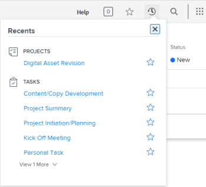

# View recent items

The [!UICONTROL Recents] menu is located on the top navigation bar. This menu shows recently viewed projects, reports, dashboards, tasks, issues, etc. Only objects viewed within the past two weeks are included, up to twenty per object type, and are listed in order of most recent viewing.

## Access requirements

You must have the following access to perform the steps in this article:

<table style="table-layout:auto"> 
 <col> 
 </col> 
 <col> 
 </col> 
 <tbody> 
  <tr> 
   <td role="rowheader"><strong>[!DNL Adobe Workfront] plan*</strong></td> 
   <td> 
Any
 </td> 
  </tr> 
  <tr> 
   <td role="rowheader"><strong>[!DNL Adobe Workfront] license*</strong></td> 
   <td> 
[!UICONTROL Request] or higher
 </td> 
  </tr> 
 </tbody> 
</table>

&#42;To find out what plan or license type you have, contact your [!DNL Workfront] administrator.

## View recent items

1. Click the **[!UICONTROL Recents]** icon ![[!UICONTROL Recents]](assets/recents-icon-40x43.png) in the upper-right corner of any page.

   

   Under each object type, you can see up to 5 of the last items that you recently viewed.

1. (Optional) To expand the list of recent items, click **[!UICONTROL View More]** just below the last item under an object type to display the previous 10 items viewed. You can expand the list to display up to 20 items per object type.
1. Click the X on the top right to close the list.

For information about how to mark recent items as favorites, see [View and manage favorites](../../../workfront-basics/navigate-workfront/recent-and-favorites/view-and-manage-favorites.md).
