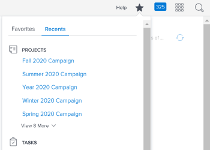

# View recent items

The highlighted information on this page refers to functionality not yet generally available. It is available only in the Preview Sandbox environment.

The Recents menu is located on the top navigation bar. This menu shows recently viewed projects, reports, dashboards, tasks, issues, etc.

## Access requirements

You must have the following access to perform the steps in this article:

<table cellspacing="0"> 
 <col> 
 </col> 
 <col> 
 </col> 
 <tbody> 
  <tr> 
   <td role="rowheader">Adobe Workfront plan*</td> 
   <td> 
Any
 </td> 
  </tr> 
  <tr> 
   <td role="rowheader">Adobe Workfront license*</td> 
   <td> 
Request or higher
 </td> 
  </tr> 
 </tbody> 
</table>

&#42;To find out what plan or license type you have, contact your Workfront administrator.

## View recent items

1. Click the **Favorites** icon in the upper-right corner of any page in the new Adobe Workfront experience, then select **Recents**.

   

   <!--
   
Click the <strong>Recents</strong> icon in the upper-right corner of any page in the new Adobe Workfront experience. 

   -->

   <!--
   
  

   -->

   Under each object type, you can see up to 5 of the last items that you recently viewed.

1. (Optional) To expand the list of recent items, click **View More** just below the last item under an object type to display the previous 10 items viewed. You can expand the list to display up to 20 items per object type.

   <!--
   <li class="preview" value="3" data-mc-conditions="QuicksilverOrClassic.Draft mode"> 
Click the X on the top right to close the list.
 </li>
   -->

For information about how to mark recent items as favorites, see [View and manage favorites](../../../workfront-basics/navigate-workfront/recent-and-favorites/view-and-manage-favorites.md).
