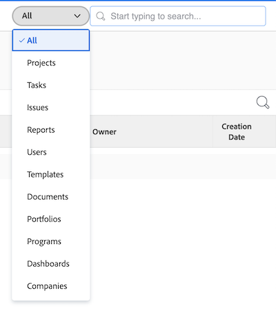
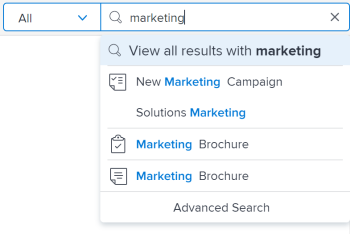
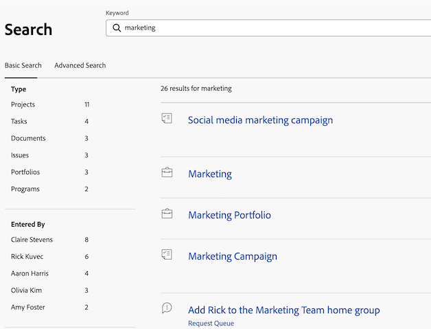
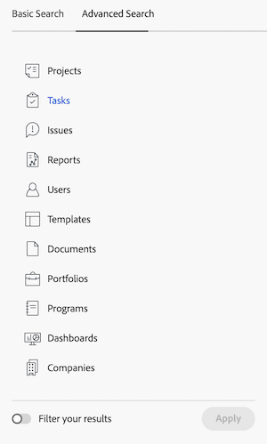

# Search [!DNL Adobe Workfront]

You can easily locate items in [!DNL Adobe Workfront] by searching for them when you cannot remember their exact location.

You can see the [!UICONTROL Search] box in the upper-right corner of any page within [!DNL Workfront].

You must have permissions to View an object before you can find it in a search. For this reason, search results vary from user to user.

## Access requirements

+++ Expand this section to view the access needed to perform the steps in this article.

<table style="table-layout:auto"> 
 <col> 
 <col> 
 <tbody> 
  <tr> 
   <td role="rowheader"><strong>[!DNL Adobe Workfront] plan*</strong></td> 
   <td> 
Any
 </td> 
  </tr> 
  <tr> 
   <td role="rowheader"><strong>[!DNL Adobe Workfront] license*</strong></td> 
   <td> 
Request or higher
 </td> 
  </tr> 
  <tr> 
   <td role="rowheader"><strong>Access level configurations*</strong></td> 
   <td> 
[!UICONTROL View] access to the type of object 
 
Note: If you still don't have access, ask your [!DNL Workfront] administrator if they set additional restrictions in your access level. For information on how a [!DNL Workfront] administrator can modify your access level, see <a href="../../../administration-and-setup/add-users/configure-and-grant-access/create-modify-access-levels.md" class="MCXref xref">Create or modify custom access levels</a>.
</td> 
  </tr> 
  <tr> 
   <td role="rowheader"><strong>Object permissions</strong></td> 
   <td> 
You must have permissions to View an object before you can find it in a search.
 
For information on requesting additional access, see <a href="../../../workfront-basics/grant-and-request-access-to-objects/request-access.md" class="MCXref xref">Request access to objects </a>.
 </td> 
  </tr> 
 </tbody> 
</table>

&#42;To find out what plan, license type, or access you have, contact your [!DNL Workfront] administrator.

+++

## Understand Search

* [[!UICONTROL Objects available for search]](#objects-available-for-search)
* [[!UICONTROL Fields available for search]](#fields-available-for-search)

### Objects available for search 

You can search for the following objects in Workfront:

* Projects
* Tasks
* Issues
* Reports
* Users
* Templates
* Documents
* Portfolios
* Programs
* Dashboards
* Companies
* Notes

### Fields available for search 

The fields available for search are based on the type of search: Basic or [!UICONTROL Advanced Search].

* **Basic Search**: When searching for objects in a Basic Search, [!DNL Workfront] looks for text that might contain your keywords in the following fields:

    * Object names
    * Descriptions
    * Custom data fields
    * Updates
    * Document names (in specific document searches and in a Basic Search)

   For more information about Basic Searching in [!DNL Workfront], see [Basic Search](#basic-search) in this article.

* **[!UICONTROL Advanced Search]**: In an [!UICONTROL Advanced Search], you can set up filters to search fields not available in Basic Search. Therefore, [!UICONTROL Advanced Search] allows you to search any field in the object.

   For more information about [!UICONTROL Advanced Search], see [Advanced Search](#advanced-search) in this article.

>[!NOTE]
>
>To perform an [!UICONTROL Advanced Search], you must select the [!UICONTROL Advanced Search] option when beginning your search. You cannot refine a Basic Search into an [!UICONTROL Advanced Search].

## Understand limitations of [!DNL Workfront] searches

Consider the following limitations when using [!UICONTROL Search] in [!DNL Workfront]:

* Searches are not case-sensitive
* [!DNL Workfront] does not correct or understand typos
* Searching in [!DNL Workfront] does not support Wildcards
* Searching in [!DNL Workfront] supports partial word searches, but does not support substring searches.\
   For example, the search keyword "stand" would return results including the word "standard" but would not return results including the word "understand."

## Search for multiple words

When you include multiple words in a search and you want to find only objects that match all of the words in the Search box, you can type the words in any order.

For example, searching for "Marketing Demo" (without quotation marks) finds objects with the following names:

* Marketing Demo
* Demo Marketing
* January Market Analysis Demo

It also finds objects that might have "Marketing" in the name and "Demo" in the description.

However, you can do the following in the [!UICONTROL Search] box to adjust the search results that appear:

<table style="table-layout:auto"> 
 <col> 
 <col> 
 <tbody> 
  <tr> 
   <td>Include quotation marks</td> 
   <td> 
Entering words in the correct order inside of double quotation marks allows you to find only objects that are an exact match. For example, searching for "Marketing Demo" (with quotation marks) finds objects with the following names:
 
    <ul> 
     <li> Marketing Demo</li> 
     <li> January Marketing Demo</li> 
     <li>Marketing Demo Plan</li> 
    </ul> 
However, this search would not find an object with the name "Demo Marketing."
 </td> 
  </tr> 
  <tr> 
   <td>Include OR</td> 
   <td> 
Connecting words by "OR" (without quotation marks) allows you to find only objects that match at least one of the words in the [!UICONTROL Search] box. These words can be entered in any order. For example, searching for "Marketing OR Demo" (without quotation marks) finds objects with the following names:
 
    <ul> 
     <li> Market Analysis Demo</li> 
     <li>January Market Analysis Demo</li> 
     <li>Demo</li> 
     <li>Market Analysis</li> 
    </ul> 
Note:  "OR" must be in all caps. Otherwise, it is interpreted as another word in the phrase you are searching for.
 </td> 
  </tr> 
  <tr> 
   <td>Include AND</td> 
   <td> 
Connecting words by "AND" (without quotation marks) allows you to find only objects that match all words in the [!UICONTROL Search] box. These words can be entered in any order. For example, searching for "Marketing AND Demo" (without quotation marks) finds objects with the following names:
 
    <ul> 
     <li>Marketing Demo</li> 
     <li>Demo Marketing</li> 
     <li>January Market Analysis Demo</li> 
    </ul> 
Note:  "AND" must be in all caps. Otherwise, it is interpreted as another word in the phrase you are searching for. Likewise, including "&amp;" (without quotation marks) searches only for objects that include the ampersand character.
 </td> 
  </tr> 
 </tbody> 
</table>

## Use Search in [!DNL Workfront]

[!DNL Workfront] features two types of searches: Basic and advanced. Use Basic Search if you want to find keywords in common object fields such as name or description. Use [!UICONTROL Advanced Search] if you want to use filters to search other object fields.

* [Basic Search](#basic-search)
* [Advanced Search](#advanced-search)

### Basic Search 

A Basic Search allows you to search for keywords across all objects in the system or on just one object at a time (such as projects). [!DNL Workfront] then searches for those keywords in a few specific fields. You can then refine your search results based on other object-specific fields selected by [!DNL Workfront].

For a list of the specific fields searched in Basic Search, see [Fields available for search](#fields-available-for-search) in this article.

>[!NOTE]
>
>To perform an [!UICONTROL Advanced Search], you must select the [!UICONTROL Advanced Search] option when beginning your search. You cannot refine a Basic Search into an [!UICONTROL Advanced Search].

* [Perform a Basic Search](#perform-a-basic-search)
* [Refine a Basic Search](#refine-a-basic-search)

#### Perform a Basic Search 

You can do a Basic Search in either of the following ways:

* Across all objects in the system (general search).
* On just one object at a time (object-specific search).

To perform a Basic Search:

1. Click the magnifying glass  in the upper-right corner of the page. You can also type **[!UICONTROL ALT + /]** or **[!UICONTROL Option + /]** to open the [!UICONTROL Search] menu.

1. (Optional) To search for a specific object, click the **[!UICONTROL All]** drop-down menu and select the object you want to search for.

   

1. In the **[!UICONTROL Search]** box, start typing the information you are searching for.
   For information about what fields are searched in [!DNL Workfront], see [Understand Search](#understand-search).
   

   As you begin typing in the search bar, [!DNL Workfront] makes recommendations based on your viewing history and it highlights the keyword you are searching for in blue.

1. If the item you are looking for displays in the [!UICONTROL typeahead] menu, click it.

   Or

   Press **[!UICONTROL Enter]** to perform a comprehensive search. This search queries the entire database instead of your most recently viewed items.

   The [!UICONTROL Search Results] page slides open from the left and covers most of the previous page.

   If you performed a general search, [!DNL Workfront] returns results for any object that matches the search term in any of the fields searched, as described in [Understand Search](#understand-search). The objects that match your search display in a list.

   >[!NOTE]
   >
   >Sometimes, variations of a word display in the list of found items.\
   >For example, searching for "marketing" displays objects that contain either "marketing" or "market" in the name.

1. (Optional) If your search generated too many results, refine your search as described in [Refine a Basic Search](#refine-a-basic-search).
1. (Optional) To return to the page you were on prior to the search, click **[!UICONTROL Close]** in the top-right corner.

>[!NOTE]
>
>The [!UICONTROL Search Results] page stays open only when it is in focus. Clicking away from the page or opening another page closes the [!UICONTROL Search Results] page.

#### Refine a Basic Search 

After performing a Basic Search—as described in [[!UICONTROL Perform a Basic Search]](#perform-a-basic-search)—you can refine the search.

Use the toolbar to the left of your search results to narrow down the information you are looking for.

To refine a search:

1. (Conditional) If you performed a general search, select the object you were searching for in the list of objects to the upper left of your results.
1. Locate the fields available for the objects displayed in the search in the toolbar to the left of your results.
   The values of each field display, sorted by count, up to 10 values for each field.
1. Click inside any of the fields available to shorten the list of results.
   The selections you make are highlighted in blue and the field values that you do not select are hidden.
   After you select each new value, the results to the right update dynamically.
  
   

1. (Optional) Click the selected values to deselect them and display all values for each field again.

### [!UICONTROL Advanced Search] 

[!UICONTROL Advanced Search] allows you to search using fields and filters not available to Basic Search. For example, you could search for projects with a specific Priority or Document Owner Name.

>[!NOTE]
>
>To perform an [!UICONTROL Advanced Search], you must select the [!UICONTROL Advanced Search] option when beginning your search. You cannot refine a Basic Search into an [!UICONTROL Advanced Search].

* [Use [!UICONTROL Advanced Search]](#use-advanced-search)

#### Use [!UICONTROL Advanced Search] 

You can use [!UICONTROL Advanced Search] to filter your search based on specific criteria.\
This type of search is helpful when you cannot remember a keyword associated with an object but you know some specific information about that object (example: Project Priority, Document Owner Name, etc).

To perform an advanced search:

1. In the upper-right corner of any page in [!DNL Workfront], click the **[!UICONTROL Search]** icon . The [!DNL Search] menu displays.

1. At the bottom of the [!UICONTROL Search] menu, click **[!UICONTROL Advanced Search]**.\
   \
   The [!UICONTROL Advanced Search] page slides open from the right and covers most of the previous page.

1. Select the type of object you are searching for.\
   **[!UICONTROL Tasks]** is selected by default.

   

1. (Optional) Type a keyword in the field at the top of the list.
1. (Optional) Toggle **[!UICONTROL Filter your results]** On to build a filter to refine your search. Click **Apply** when finished.

1. Click **[!UICONTROL Search]**.\
   A list of items that match your search displays to the right of the [!UICONTROL Advanced Search] toolbar.

1. (Optional) To return to the page you were on prior to the search, click **[!UICONTROL Close]** in the the top-right corner.

>[!NOTE]
>
>The [!UICONTROL Search Results] page stays open only when it is in focus. Clicking away from the page or opening another page closes the [!UICONTROL Search Results] page.
