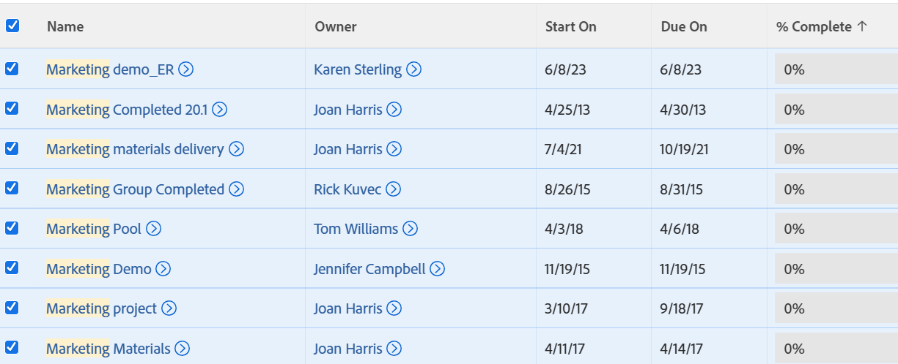

# Apply the quick filter to a list

<!--
{{highlighted-preview}}
-->

You can use the quick filter in a list of objects to help you locate only items that are important to you, so you can quickly review, update, or share them with others.

>[!IMPORTANT]
>
>You can find items that contain a search word using quick filters, whether that item has been physically displayed on your screen or will display after you have scrolled to the bottom of the page. When you use your browser's search capabilities, you can only find items that are physically displayed on the screen. If your list has multiple pages, quick filters do not find items that are on pages that do not display.

If you want to save a quick filter, we recommend that you build a permanent filter for your list instead.\
For information about how to build filters in [!DNL Adobe Workfront], see the article [Filters overview](../../../reports-and-dashboards/reports/reporting-elements/filters-overview.md).

The quick filter is currently available in the following areas

You can use temporary quick filters in all lists, except the following:

* The [!UICONTROL Reports] area
* Document lists and reports
* Several [!UICONTROL Setup] areas
   >[!NOTE]
   >
   >Quick filters are available in the following setup areas: [!UICONTROL Groups], [!UICONTROL Teams], [!UICONTROL Companies], [!UICONTROL Schedules], [!UICONTROL Layout Templates], and [!UICONTROL Custom Forms].

Consider the following when applying quick filters to a list:

* You can use keywords to filter for any field that displays in the view of the list. This includes custom fields, or complex fields like [!UICONTROL Predecessors], [!UICONTROL Assignments], [!UICONTROL Assignment] and [!UICONTROL Status], [!UICONTROL Approver] and [!UICONTROL Status], etc.
* If your list has collapsed groupings, they are automatically expanded when you use quick filters. When you remove the quick filter, groupings are collapsed again.
* Groupings retain the aggregated information of the original list regardless of the quick filters applied or any changes made to the objects on the list.
* Quick filters are temporary. Changing the grouping, view, filter, or sort of the list removes the quick filter criteria.
* You cannot save a quick filter. If you want to save a filter to use it again, consider building a permanent filter for the list.
* If you have more than one grouping in the list and the quick filter finds items in just one grouping, only that grouping displays with the found items. All other groupings are hidden.
* In a task or subtask list, the task hierarchy is removed when the results of the quick filter display.

## Access requirements

You must have the following access to perform the steps in this article:

<table style="table-layout:auto"> 
 <col> 
 <col> 
 <tbody> 
  <tr> 
   <td role="rowheader"><b>[!DNL Adobe Workfront] plan*</b></td> 
   <td> 
Any
 </td> 
  </tr> 
  <tr> 
   <td role="rowheader"><b>[!DNL Adobe Workfront] license*</b></td> 
   <td> 
[!UICONTROL Request] or higher
 </td> 
  </tr> 
  <tr> 
   <td role="rowheader"><b>Access level configurations*</b></td> 
   <td> 
View access to the area the list is in
 
For example, to apply a quick filter to a project, you need [!UICONTROL View] access to Projects.
 
Note: If you still don't have access, ask your [!DNL Workfront] administrator if they set additional restrictions in your access level. For information on how a [!DNL Workfront] administrator can change your access level, see <a href="../../../administration-and-setup/add-users/configure-and-grant-access/create-modify-access-levels.md" class="MCXref xref">Create or modify custom access levels</a>.
 </td> 
  </tr> 
  <tr> 
   <td role="rowheader"><b>Object permissions</b></td> 
   <td> 
[!UICONTROL View]
 
For information on requesting additional access, see <a href="../../../workfront-basics/grant-and-request-access-to-objects/request-access.md" class="MCXref xref">Request access to objects </a>.
 </td> 
  </tr> 
 </tbody> 
</table>

&#42;To find out what plan, license type, or access you have, contact your [!DNL Workfront] administrator.

## Apply a quick filter to a list

1. Go to a list or report that supports quick filters, then click the **[!UICONTROL Quick Filter] icon**  in the toolbar.

   Or

   Depending on your operating system or browser and when using a standard QWERTY keyboard, press the following set of commands to launch the quick filter:

   * ALT+F for [!DNL Windows] computers
   * ALT/ Option+F for [!DNL Mac] computers

      >[!TIP]
      >
      >If you press CTRL+F or CMD+F, a tooltip displays next to the quick filter to remind you about these commands. The commands also display inside the quick filter search box.

1. In the **[!UICONTROL Filter page]** box, enter the keyword that you want to filter by.

   You can use any word that currently displays in the view of the list.

   >[!NOTE]
   >
   >If you use a word that might display on another page of the list, the quick filter does not find any results.

   A list of items that match the search criteria display in the list dynamically as you type and all other items are hidden. The keyword you used in your search is highlighted in yellow in all standalone and complex fields. Some examples of complex fields are shared columns, or any of the following: [!UICONTROL Assignments], [!UICONTROL Assignments] and [!UICONTROL Status], [!UICONTROL Percent Complete], [!UICONTROL Predecessors], [!UICONTROL Approvers and Status], [!UICONTROL Resource Managers], [!UICONTROL Categories], [!UICONTROL Condition], [!UICONTROL Condition Update], etc.

1. (Optional) To bulk edit the items found by the quick filter:

   1. Select all or several of the items in the list, then click **[!UICONTROL Edit]** to bulk edit the items.
   1. After you complete your edits, click **[!UICONTROL Save Changes]**.

1. (Optional) To export the items found by the quick filter, select all or several of the items in the list, then click **[!UICONTROL Export]**.

   

   >[!NOTE]
   >
   >Only the items you found in the quick filter search export to the file you selected. If you don't select any items before exporting the list, the complete, unfiltered list is exported.\
   >For more information, see [Export a list](../../../workfront-basics/navigate-workfront/use-lists/export-lists.md).

1. (Optional) To clear the filtered results, click the **[!UICONTROL Quick Filter]** icon in the top right corner of the window.\
   Or\
   Refresh the page.
