# Use enhanced lists

Enhanced lists are available on some screens in Adobe Workfront. These lists use a table format for displaying the list items, and they have a different look and feel than the standard lists. 

For information about the standard lists, see [Get started with lists in Adobe Workfront](/help/quicksilver/workfront-basics/navigate-workfront/use-lists/view-items-in-a-list.md).

>[!NOTE]
>
>Each enhanced list may be configured differently to help you display the data that you need. Every list will not use every feature described in this article, and some lists may have specialized features that only apply to that list.

## Access requirements

+++ Expand to view access requirements for the functionality in this article.

<table style="table-layout:auto">
 <col> 
 <col>
 <tbody> 
  <tr> 
   <td>Adobe Workfront package</td> 
   <td>
Any
</td> 
  </tr> 
  <tr> 
   <td>Adobe Workfront license</td> 
   <td>
   
Contributor or higher

   
Request or higher
</td>
  </tr>
 </tbody> 
</table>

For information, see [Access requirements in Workfront documentation](/help/quicksilver/administration-and-setup/add-users/access-levels-and-object-permissions/access-level-requirements-in-documentation.md).

+++

## Objects that use enhanced lists

Below are some types of Workfront object lists that use the enhanced list format and some of the areas where they display by default when you have rights to view the object.

>[!NOTE]
>
>This list is not comprehensive. Each of these object lists can also appear on a report or a dashboard. For example, a Project report or a dashboard that contains a Project report also displays a list of projects.

| Workfront list | Location of object list |
|--- |--- |
| Priorities | <ul><li>Home &gt; select the Priorities icon in the left menu</li><li>Main Menu &gt; Priorities</li></ul> |
| List of requests | <ul><li>Requests (new experience only)</li><li>My Requests widget on Home</li></ul> |
| List of exchange rates | <ul><li>Setup &gt; Project Preferences &gt; Exchange Rates</li></ul> |

## Add and edit items in an enhanced list

Depending on the configuration of the enhanced list, there could be two ways to add an item to the list:

* Click a button above the list. This option opens a dialog where you enter information and save it.
* Click **New row** at the bottom of the list. This option adds a new row to the table, and you enter information in each cell. If a cell is limited to a specific data set (such as a currency name), you may be prompted to choose from a list or search for the name.

To edit an item in the list, double-click in the cell you want to edit and type the information. Some cells may be read-only.

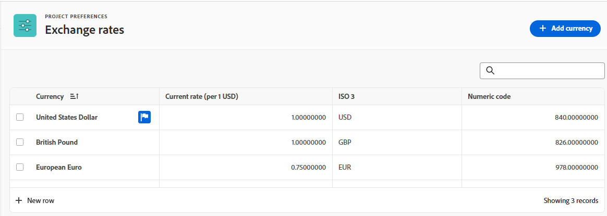

## Use the action bar and More menu in an enhanced list

When you select the check box next to an item in the enhanced list, the action bar appears at the bottom of the screen and shows actions you can take on the item. Some actions might be specific to that list and do not appear on any other lists.

Click a button on the action bar to take that action, such as viewing the list item, deleting the item, or making it the default item.

If no actions are available for the selected item, the action bar states "No available actions."

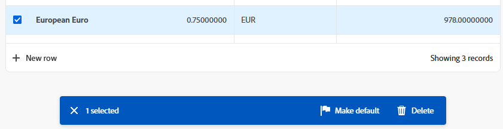

The **More** menu is the three-dot menu that appears next to a list item when you hover over it. Click the menu to see additional actions for the item. Some actions might be specific to that list and do not appear on any other lists.

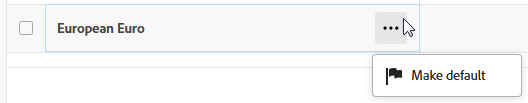

## Customize columns in an enhanced list

Some enhanced lists allow you to hide and display columns, and reorder the columns.

1. Click **Columns** above the list.

   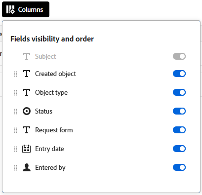

1. Use the toggles to display or hide columns in the list.
1. To reorder the columns, click the **Drag** icon and move a column to your desired location. Moving columns changes the list automatically.

   >[!NOTE]
   >
   >A field might be always displayed or fixed in the first position, and you cannot change its column.

   An indicator appears on the **Columns** button when columns are hidden. The indicator does not appear when you reorder columns.

   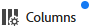

## Filter and group items in an enhanced list

Filters help you reduce the amount of information you display in the list. Groupings separate the objects on the list in areas based on specific criteria.

### Use filters

1. Click **Filter** above the list.
1. In the Filter box, click **Add condition**.
1. Select a field to filter by.
1. Select a filter modifier, such as "Has any of," "Has none of," "Is before," or "Is after." The modifier options are different depending on the type of field you are filtering by.
1. Select the field value or values. Depending on the field type you are filtering by, you might be prompted to select the item from a list, search for it, or use a calendar to select a date range.
    
   

   The filter is applied to the list automatically.

1. Click **Add condition** to add another condition to the filter as an OR statement.
1. When the filter is applied, you can open the **Filter** options again to change the filter options or clear all of the filters.

   An indicator appears on the **Filter** button when a filter is applied to the list.

   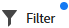

### Use groupings

1. Click **Group** above the list.
1. Select a grouping to organize your list.

   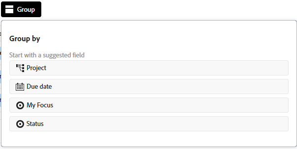

1. When the grouping is applied, you can open the Group options again to collapse or expand all of the groupings at once, change the grouping to group by a different field, or clear all of the groupings.

   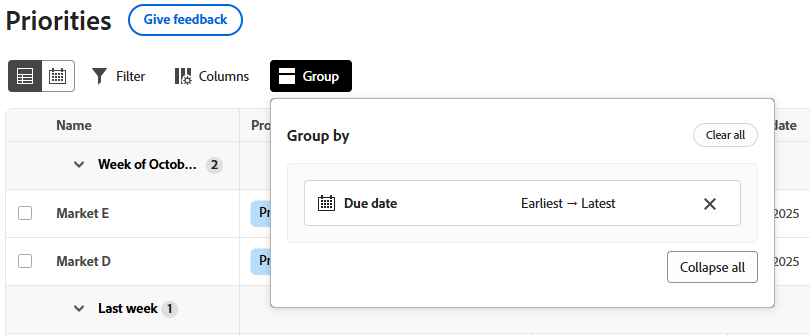

   An indicator appears on the **Group** button when a grouping is applied to the list.

   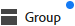

## Sort and search in an enhanced list

To sort individual columns, go to the column and click the down arrow. An icon next to a column name indicates that the list is sorted by the values in that column, and the direction of the sort.

>[!NOTE]
>
>If the list has a default item, that item will always be first in the list, regardless of how the list is sorted.

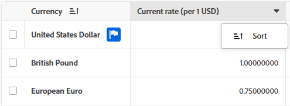

To sort your work within a grouping, open **Group** and select if you want to sort in ascending or descending order.

To search, type your search term in the search field above the list. The results are highlighted in the list as you type.

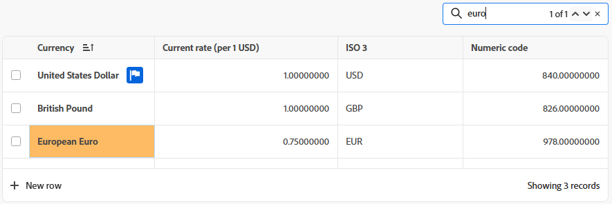
