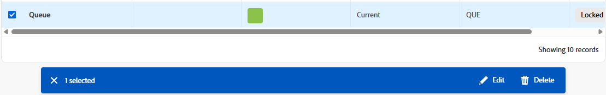
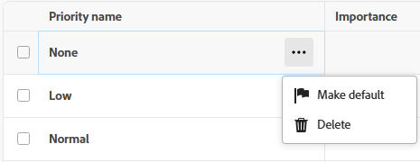
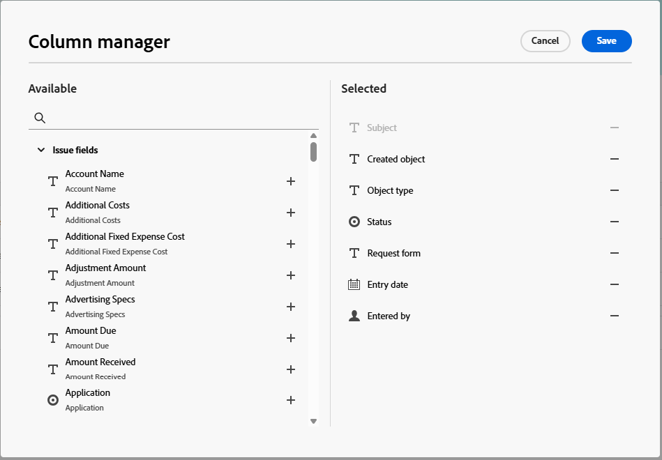

# Use enhanced lists

Enhanced lists are available in some areas of Adobe Workfront. These lists use a table format for displaying the list items, and they have a different look and feel than the standard lists. The management of views is also enhanced, including filtering, grouping, managing columns, and searching.

For information about the standard lists, see [Get started with lists in Adobe Workfront](/help/quicksilver/workfront-basics/navigate-workfront/use-lists/view-items-in-a-list.md).

>[!NOTE]
>
>Each enhanced list may be configured differently to help you display the data that you need. Every list will not use every feature described in this article, and some lists may have specialized features that only apply to that list.

## Access requirements

+++ Expand to view access requirements for the functionality in this article.

<table style="table-layout:auto">
 <col> 
 <col>
 <tbody> 
  <tr> 
   <td>Adobe Workfront package</td> 
   <td>
Any
</td> 
  </tr> 
  <tr> 
   <td>Adobe Workfront license</td> 
   <td>
   
Contributor or higher

   
Request or higher
</td>
  </tr>
 </tbody> 
</table>

For information, see [Access requirements in Workfront documentation](/help/quicksilver/administration-and-setup/add-users/access-levels-and-object-permissions/access-level-requirements-in-documentation.md).

+++

## Objects that use enhanced lists

Below are some types of Workfront object lists that use the enhanced list format and some of the areas where they display by default when you have rights to view the object.

>[!NOTE]
>
>This list is not comprehensive. Each of these object lists can also appear on a report or a dashboard. For example, a Request report or a dashboard that contains a Request report also displays a list of requests.

| Workfront list | Location of object list |
|--- |--- |
| Priorities | <ul><li>Home &gt; select the Priorities icon in the left menu</li><li>Main Menu &gt; Priorities</li></ul> |
| List of requests | <ul><li>Requests (new experience only)</li><li>My Requests widget on Home</li></ul> |
| Lists of statuses, priorities, severities, and exchange rates in Setup | <ul><li>Setup &gt; Project Preferences &gt; Statuses</li><li>Setup &gt; Project Preferences &gt; Priorities</li><li>Setup &gt; Project Preferences &gt; Severities</li><li>Setup &gt; Project Preferences &gt; Exchange Rates</li></ul> |

## Add items to an enhanced list

Depending on which enhanced list you are viewing, do one of the following:

1. Click the blue button on the upper right of the list. This option opens a dialog where you can enter information. The data is saved as a new row in the table.

   OR

1. Click **New row** at the bottom of the list. This option adds a new row to the table. Double-click in a cell to enter information in it. Each cell represents a field for the list item. Fields must exist before you see them in the list.

   Enhanced lists support these field types:

   * Text
   * Number
   * Currency
   * Date
   * Date and time
   * Single/multi select dropdowns
   * Typeahead
   * Paragraph
   * Assignee (one or multiple)
   * Color picker

   >[!NOTE]
   >
   >Each field type has its own editing options. Some fields might be read-only.

## Edit items using the action bar

You can use the action bar in an enhanced list to edit items in the list. Not all action bars include the same options.

1. Select the check box next to an item in an enhanced list.

   The action bar appears at the bottom of the screen.

   >[!NOTE]
   >
   >Different enhanced lists might allow selecting a single item, bulk editing (selecting more than one item), or no item selection.

1. Click a button on the action bar to take that action, such as viewing the list item, deleting the item, or editing the item.

   If no actions are available for the selected item, the action bar displays "No available actions."

   

1. Hover over a primary field on a list item to see the **More** menu. (The primary field is the left-most column in the table.)

1. Click the menu to see additional actions for the item. Some actions might be specific to that list and do not appear on any other lists.

   

## Customize columns

Some enhanced lists allow you to hide and display columns, and reorder the columns.

1. Click **Columns** above the list.

   

1. Use the toggles to display or hide columns in the list.
1. To reorder the columns, click the **Drag** icon and move a column to your desired location. Moving columns changes the list automatically.

   >[!NOTE]
   >
   >The primary field is the left-most column in the table. It is fixed in the first position, and you cannot change its column. If the number of columns is large, then the primary field is frozen to the left, and when you scroll horizontally you will always see it.
   >
   >The icon next to a field name shows the field type, such as text or date field.

   An indicator appears on the **Columns** button when columns are hidden. The indicator does not appear when you reorder columns.

   

## Add and remove columns with the Column manager

Some enhanced lists offer the **Column manager**, which allows you to easily add columns to the list and remove columns. Native and custom fields are both available to select as columns. Custom fields must exist in the system before you can add them as list columns.

To add and remove columns:

1. Click the + icon on the top right of the table to open the **Column manager** box.
1. Search for an existing object field in the **Available** column, then click + to the right of the field name it to add it to the **Selected** column.
1. Click - to the right of a field in the **Selected** column to remove it from the list.

   >[!NOTE]
   >
   >Some fields might be fixed and cannot be removed.

1. Click **Save**.

   

<!-- Add info about Properties and KPIs when something gets released with those options -->

## Display data with views

A view is a personalized set of column arrangements and filters that you can apply to a list. You can create new views and edit existing views.

### Apply and create views

To apply a view, click the **Views** dropdown and select the view you want to apply to the list.

To create a new view:

1. Click the **Views** dropdown and select **New view**.
1. Enter a name for the view, and click **Create**.
1. (Optional) Hide, show, or rearrange the columns. For more information, see [Customize columns in an enhanced list](#customize-columns-in-an-enhanced-list).
1. (Optional) Filter and group the list items. For more information, see [Filter and group items in an enhanced list](#filter-and-group-items-in-an-enhanced-list).

   Changes to views are saved automatically, and the changes are visible to anyone who uses the view.

   The next time you apply this view, the column and filter settings remain the way you set them.

### Share a view

In the **Views** dropdown, you may see three categories of views:

* **System Views**: Views that the system administrator assigned to you.
* **Shared Views**: Views that have been shared with you by other users.
* **My Views**: Views that you created and can share with others. You can share views with other users, teams, or groups.

To share a view:

1. In the **Views** dropdown, hover over the view in **My Views** that you want to share, then click on the three-dot menu when it appears.
1. Select **Share**.
1. In the Share dialog, enter the names of the users, teams, or groups that you want to share the view with, then select them from the list when they appear.

   You can give the following permissions to the recipients:

   * **View**: Users can apply the view to the list but not share it.
   * **Manage**: Users can rename the view, share it with others, and delete it.

1. Click **Save**.

## Filter and group items

Filters help you reduce the amount of information you display in the list. Groupings separate the objects on the list in areas based on specific criteria.

### Use filters

1. Click **Filter** above the list.
1. In the Filter box, click **Add condition**.
1. Select a field to filter by.
1. Select a filter modifier, such as "Has any of," "Has none of," "Is before," or "Is after." The modifier options are different depending on the type of field you are filtering by.
1. Select the field value or values. Depending on the field type you are filtering by, you might be prompted to select the item from a list, search for it, or use a calendar to select a date range.
    
   

   The filter is applied to the list automatically.

   >[!TIP]
   >
   >To apply a current user wildcard, select **Me (logged in user)** as the field value. The filter will then apply to the user who is viewing the list. This wildcard is available in fields where the value is a user.

1. Click **Add condition** to add another condition to the filter as an OR statement.
1. When the filter is applied, you can open the **Filter** options again to change the filter options or clear all of the filters.

   An indicator appears on the **Filter** button when a filter is applied to the list.

   

### Use groupings

1. Click **Group** above the list.
1. Select a grouping to organize your list.

   

1. When the grouping is applied, you can open the Group options again to collapse or expand all of the groupings at once, change the grouping to group by a different field, or clear all of the groupings.

   

   An indicator appears on the **Group** button when a grouping is applied to the list.

   

## Sort and search in an enhanced list

To sort individual columns:

1. Go to the column and click the down arrow.

   An icon next to a column name indicates that the list is sorted by the values in that column, and the direction of the sort.

   >[!NOTE]
   >
   >Some columns might not be sortable, depending on the list.

   

To sort your work within a grouping:

1. Click **Group** and select if you want to sort in ascending or descending order.

   

To search:

1. Type your search term in the search field above the list. The results are highlighted in the list as you type.

   
