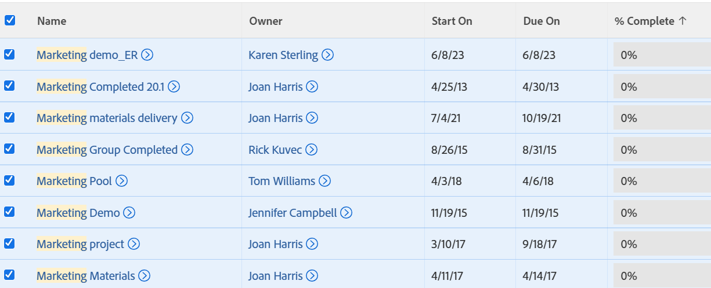

# Export a list

You can export a list of objects from Adobe Workfront. When the list of objects in Workfront contains more than 2000 items, exporting the list is the only way to review all items in the list on one page.

For information on export formats and limits, see [Export data](../../../reports-and-dashboards/reports/creating-and-managing-reports/export-data.md).

## Access requirements

You must have the following access to perform the steps in this article:

<table cellspacing="0"> 
 <col> 
 <col> 
 <tbody> 
  <tr> 
   <td role="rowheader">Adobe Workfront plan*</td> 
   <td> <p>Any</p> </td> 
  </tr> 
  <tr> 
   <td role="rowheader">Adobe Workfront license*</td> 
   <td> <p>Request or higher</p> </td> 
  </tr> 
  <tr> 
   <td role="rowheader">Access level configurations*</td> 
   <td> <p>View access to the area the list is in</p> <p>For example, to export a project's task list, you need View access to Projects.</p> <p>Note: If you still don't have access, ask your Workfront administrator if they set additional restrictions in your access level.<br>For information on how a Workfront administrator can change your access level, see <a href="../../../administration-and-setup/add-users/configure-and-grant-access/create-modify-access-levels.md" class="MCXref xref">Create or modify custom access levels</a>.</p> </td> 
  </tr> 
  <tr> 
   <td role="rowheader">Object permissions</td> 
   <td> <p>View</p> <p>For information on requesting additional access, see <a href="../../../workfront-basics/grant-and-request-access-to-objects/request-access.md" class="MCXref xref">Request access to objects </a>.</p> </td> 
  </tr> 
 </tbody> 
</table>

&#42;To find out what plan, license type, or access you have, contact your Workfront administrator.

## Export a list

1. Go to a list of objects.
1. (Optional) Select any filter, view, and grouping that you want to apply to the list before exporting.  
   For information on filters, views, and groupings, see [Reporting elements: filters, views, and groupings](../../../reports-and-dashboards/reports/reporting-elements/reporting-elements-filters-views-groupings.md).

1. (Optional) To export only specific items in a list, select all items in the list that you want in the exported file.

   >[!TIP]
   >
   >To locate all of the items that you want to include, you can:
   >
   >   
   >   
   >   * **Select to show All or 2000 items in the lists**: For more information, see [Modify how a list displays](../../../workfront-basics/navigate-workfront/use-lists/modify-list-display.md).
   >   
   >   * **Use the quick filter**: For more information, see [Apply the quick filter to a list](../../../workfront-basics/navigate-workfront/use-lists/apply-quick-filter-list.md).  
   >     The quick filter applies only to the current page of the list.
   >   
   >   
   >

   

1. Click **Export** .

1. Select from the following formats:

   * PDF
   * Excel
   * Excel (xlsx)
   * Tab Delimited  
     ```This exports a copy of the list to one of these formats and saves it on your computer.```

1. (Optional) Open the exported list using the appropriate application.  
   All the items in the list display in the exported file, whether they are displayed on the screen in the web application or not.

