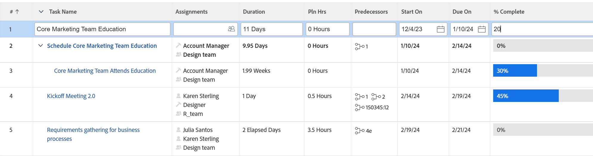

# Inline edit items in a list in [!DNL Adobe Workfront]

You can edit objects inline when they display in a list or report. When you edit the information on objects displayed in a list or report, the object updates immediately.

When you inline edit a field contained in a custom form that is not attached to the object, the custom form is automatically added to the object. If the field exists on multiple custom forms, the custom form which was most recently updated is attached to the object.

For more information on lists, see [Get started with lists in [!DNL Adobe Workfront]](../../../workfront-basics/navigate-workfront/use-lists/view-items-in-a-list.md).

While most objects displayed in lists or reports are inline editable in [!DNL Adobe Workfront], there are some limitations, which include:

* You cannot edit calculated fields or [!DNL Workfront] built-in fields that are calculations.
* You can only edit fields associated directly to the objects in the list. You cannot edit fields that belong to objects associated with the objects in the list.\
   For example, you can edit the status of a task in a Task report, but you cannot edit the name of the project the task is associated with in the same report. You can edit the name of the project only in a Project report.
* You cannot inline edit fields when the view for a list is not displaying the default currency.\
   For information on displaying the default currency, see the section [Edit reports with unique currencies](../../../reports-and-dashboards/reports/creating-and-managing-reports/create-financial-data-reports-unique-exchange-rates.md#editing-reports-with-unique-currencies) in the article [Create financial data reports with unique exchange rates](../../../reports-and-dashboards/reports/creating-and-managing-reports/create-financial-data-reports-unique-exchange-rates.md).
* You cannot edit flags and icons displayed in a list.
* You cannot inline edit report fields that are sourced from other reports.

## Access requirements

You must have the following access to perform the steps in this article:

<table style="table-layout:auto"> 
 <col> 
 <col> 
 <tbody> 
  <tr> 
   <td role="rowheader"><strong>[!DNL Adobe Workfront] plan*</strong></td> 
   <td> 
Any
 </td> 
  </tr> 
  <tr> 
   <td role="rowheader"><strong>[!DNL Adobe Workfront] license*</strong></td> 
   <td> 
[!UICONTROL Review] or higher
 </td> 
  </tr> 
  <tr> 
   <td role="rowheader"><strong>Access level configurations*</strong></td> 
   <td> 
[!UICONTROL Edit] access to the area the list is in
 
For example, to inline edit tasks in a project, you need [!UICONTROL Edit] access to Projects.
 
Note: If you still don't have access, ask your [!DNL Workfront] administrator if they set additional restrictions in your access level. For information on how a [!DNL Workfront] administrator can change your access level, see <a href="../../../administration-and-setup/add-users/configure-and-grant-access/create-modify-access-levels.md" class="MCXref xref">Create or modify custom access levels</a>.
 </td> 
  </tr> 
  <tr> 
   <td role="rowheader"><strong>Object permissions</strong></td> 
   <td> 
[!UICONTROL Manage]
 
You must also have permissions to edit certain fields, such as custom fields, status, etc.
 
For information on requesting additional access, see <a href="../../../workfront-basics/grant-and-request-access-to-objects/request-access.md" class="MCXref xref">Request access to objects </a>.
 </td> 
  </tr> 
 </tbody> 
</table>

&#42;To find out what plan, license type, or access you have, contact your [!DNL Workfront] administrator.

## Edit objects inline

1. Go to a list of objects you want to inline edit.

   The list should display fields that belong to the objects or fields that belong to objects associated with the objects in the list.

1. Locate the object you want to edit, then click inside any field in the list.

   >[!TIP]
   >
   >If you have multiple pages, you can locate an object by using:
   >
   >   
   >   
   >   * **Pagination**: Click the backward and forward arrows to navigate between pages.\
   >     Located at the bottom-right corner of the list, the [!UICONTROL pagination] area remains sticky as you scroll through the list.
   >   * **Quick filter**: Click the filter icon or type Alt+F to open the quick filter, then enter text to display only items that contain the entered text.\
   >     The quick filter is located in the list toolbar. For more information, see [Apply the quick filter to a list](../../../workfront-basics/navigate-workfront/use-lists/apply-quick-filter-list.md).

   If the field can be edited, this turns the field and all other fields displayed in the list into editable cells.

   

1. Edit the information inside this cell, then press [!UICONTROL Enter].

   >[!NOTE]
   >
   >If a custom field has been configured to allow formatting, you can bold, italicize, or underline text when inline editing the field in an updated list.
   >For information on configuring formatting for a custom field, see [Design a form with the form designer](/help/quicksilver/administration-and-setup/customize-workfront/create-manage-custom-forms/form-designer/design-a-form/design-a-form.md).
   >For information on updated lists, see the section "The difference between the updated and the legacy lists" in the article [Get started with lists in [!DNL Adobe Workfront]](../../../workfront-basics/navigate-workfront/use-lists/view-items-in-a-list.md).

1. Press [!UICONTROL Tab] to move to the next editable cell.
1. (Conditional) If you are unable to save your edits and the cell is outlined in red, click inside the field to review the validation message that displays next to the cell and make the appropriate updates.

   Most commonly, this happens when the wrong format is used or a required field has been left blank.

1. After you finish modifying all the cells, press [!UICONTROL Enter] to save your changes.
