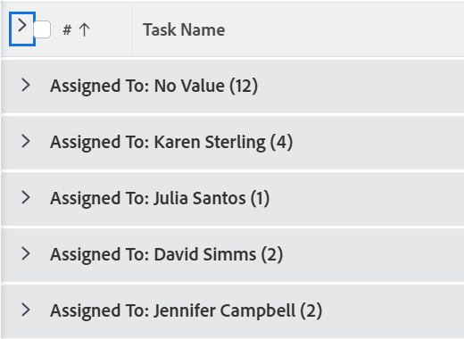
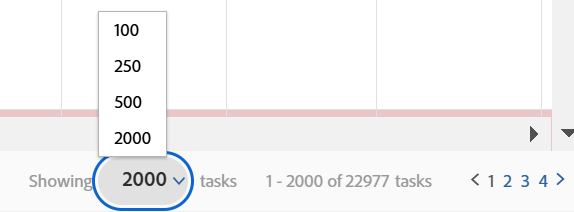

# Modify how a list displays

<!--Audited: 11/2024-->

In [!DNL Adobe Workfront], you can customize how a list displays for you. Other users who view the list do not see your changes.

You can make the following customizations:

* The number of items that display
* Column width or order
* Whether groupings are expanded or collapsed

>[!NOTE]
>
>The above display changes you make are reverted when you log out of [!DNL Workfront] or close your browser. These changes might also be reverted after a period of 8 hours.

In addition to the temporary customizations above, you can also adjust which columns the list sorts by, which [!DNL Workfront] retains even after you log out or close your browser. However, if someone edits the sorting options in a list's view, the previous sorting selection is not retained.

For information on modifying the information that displays in your list, see [Reporting elements: filters, views, and groupings](../../../reports-and-dashboards/reports/reporting-elements/reporting-elements-filters-views-groupings.md).

## Access requirements

+++ Expand to view access requirements for the functionality in this article. 

You must have the following access to perform the steps in this article:

<table style="table-layout:auto"> 
 <col> 
 <col> 
 <tbody> 
  <tr> 
   <td role="rowheader">Adobe Workfront plan</td> 
   <td> 
Any
 </td> 
  </tr> 
  <tr> 
   <td role="rowheader">Adobe Workfront license*</td> 
   <td> 
    
New:

   <ul><li>
Contributor or higher 
</li>
   </ul>

   
Current:

   <ul><li>
Request or higher
</li>
    </ul></td> 
  </tr> 
  <tr> 
   <td role="rowheader">Access level configurations</td> 
   <td> 
[!UICONTROL View] access to the area the list is in
 
For example, to modify the view on a project, you need [!UICONTROL View] access to Projects.
</td> 
  </tr> 
  <tr> 
   <td role="rowheader">Object permissions</td> 
   <td> 
[!UICONTROL View] or higher permissions to the view applied to the list
  </td> 
  </tr> 
 </tbody> 
</table>

*For information, see [Access requirements in Workfront documentation](/help/quicksilver/administration-and-setup/add-users/access-levels-and-object-permissions/access-level-requirements-in-documentation.md). 

+++

## Modify a list

1. Go to the list in [!DNL Workfront] that you want to modify.

   <!--
   
 
   <MadCap:conditionalText data-mc-conditions="QuicksilverOrClassic.Draft mode">
   By default, groupings are collapsed.
   </MadCap:conditionalText>
     

   -->

1. (Optional and conditional) If the groupings in the list are collapsed and you want to view more information, click the desired grouping to expand the list and display the information listed in it.

   Or

   To expand all groupings, click the arrow to the right of the check box in the column header.

   

1. (Optional and conditional) If you want to show a specific number of items on the screen, click the **[!UICONTROL Showing]** drop-down menu in the lower-right corner of the screen, then select to display **100**, **250**, **500**, **[!UICONTROL All]**, or **2000** items.

   

   >[!TIP]
   >
   >By default, 2,000 items display for updated lists and 100 items display for legacy lists. If the list contains more than 2,000 items, you cannot display all the items on one page.
   >
   >
   >For the best performance in large lists where objects contain formatted text fields, we recommend limiting this number to 250.
   >
   >
   >For more information on the 2 list types, see the section [The difference between the updated and the legacy lists](../../../workfront-basics/navigate-workfront/use-lists/view-items-in-a-list.md#updated) in the article [Get started with lists in [!DNL Adobe Workfront]](../../../workfront-basics/navigate-workfront/use-lists/view-items-in-a-list.md).

   The results of your list are paginated to show the selected number of items per page. You can access the results on other pages by clicking the backward and forward arrows or selecting a specific page.

1. To resize a column's width, mouse over the line that separates 2 columns, then click to drag it to the desired width.

   The column is resized until you clear your cache on the browser or until you manually resize it again.

1. To reorder the columns in a list, mouse over a column header to display the hand tool, then click to drag the column to where you want it to display.

   The position of the column is saved until you refresh your page.

   For more information about customizing the width and the order of columns in a list, see the article [Modify column width and order](../../../reports-and-dashboards/reports/reporting-elements/modify-column-width-order.md).

1. To adjust the sorting order of a list, click a column header to select it, then press and hold the CMD key (on [!DNL Mac]) or the CTRL key (on [!DNL Windows]) on your keyboard and select up to 2 additional column headers to sort by them.

   The list is sorted by each of the selected columns in the order of your selection.

   All modifications you make to the list save instantly.

   >[!NOTE]
   >
   >If you are sorting groups in the [!UICONTROL Groups] area in [!UICONTROL Setup], the hierarchy view of groups and their subgroups does not break up when you change the way the list is sorted—subgroups stay with their parent groups. The list is sorted by top-level groups first. Then, under each parent group, the list of subgroups that are on the same level are sorted together.
