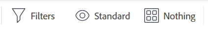
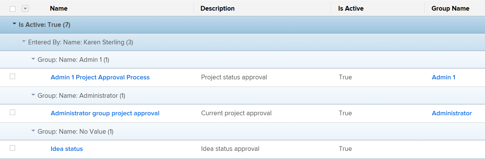
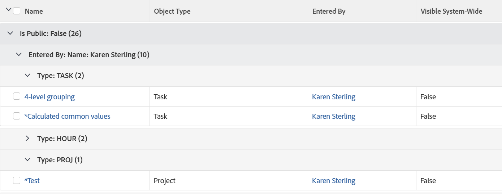

# Get started with lists in [!DNL Adobe Workfront]

<!--
{{highlighted-preview}}
-->

You can view lists of objects in [!DNL Adobe Workfront] to get information about them, such as their start and due dates, users assigned to them, and other objects that are associated with them.

The following are some characteristics of lists in [!DNL Workfront]:

* Lists refresh automatically every five minutes to update information that other users in the system are updating elsewhere.
* Some areas in [!DNL Workfront] are preconfigured with default lists of objects.

   You can customize most of these preconfigured lists.

* A [!DNL Workfront] administrator can create custom lists to apply to various areas of [!DNL Workfront].

   For more information about creating system-level lists, see the article [Create, edit, and share default filters, views, and groupings](../../../administration-and-setup/set-up-workfront/configure-system-defaults/create-and-share-default-fvgs.md).

## Access requirements

You must have the following access to perform the steps in this article:

<table style="table-layout:auto"> 
 <col> 
 <col> 
 <tbody> 
  <tr> 
   <td role="rowheader"><strong>[!DNL Adobe Workfront] plan*</strong></td> 
   <td> 
Any
 </td> 
  </tr> 
  <tr> 
   <td role="rowheader"><strong>[!DNL Adobe Workfront] license*</strong></td> 
   <td> 
[!UICONTROL Request] or higher
 </td> 
  </tr> 
  <tr> 
   <td role="rowheader"><strong>Access level configurations*</strong></td> 
   <td> 
[!UICONTROL View] or higher access to filters, views, groupings
 
For items in the [!UICONTROL Setup] area, you need administrative access for the item or the [!UICONTROL System Administrator] access level.
 
Note: If you still don't have access, ask your [!DNL Workfront] administrator if they set additional restrictions in your access level. For information on how a [!DNL Workfront] administrator can change your access level, see <a href="../../../administration-and-setup/add-users/configure-and-grant-access/create-modify-access-levels.md" class="MCXref xref">Create or modify custom access levels</a>.
 </td> 
  </tr> 
  <tr> 
   <td role="rowheader"><strong>Object permissions</strong></td> 
   <td> 
[!UICONTROL View] or higher permissions with access to share
 
For information on requesting additional access, see <a href="../../../workfront-basics/grant-and-request-access-to-objects/request-access.md" class="MCXref xref">Request access to objects </a>.
 </td>
  </tr> 
 </tbody> 
</table>

To find out what plan, license type, or access you have, contact your [!DNL Workfront] administrator.

## Object lists

Below are some types of object lists that you can find in [!DNL Workfront] and some of the areas where they display by default when you have rights to view an object.

>[!NOTE]
>
>* This list is not comprehensive. Each of these object lists can also appear on a report or a dashboard. For example, a Project report or a dashboard that contains a Project report also displays a list of projects.
>* In this list, "select" means that you need to click the name of the item, not the checkbox to the left of the name.

<table style="table-layout:auto"> 
 <col> 
 <col> 
 <thead> 
  <tr> 
   <th><strong>[!DNL Workfront] list</strong></th> 
   <th><strong>Location of object list</strong></th> 
  </tr> 
 </thead> 
 <tbody> 
  <tr> 
   <td>List of portfolios</td> 
   <td> 
    <ul> 
     <li> 
[!UICONTROL Portfolios]
 </li> 
    </ul> </td> 
  </tr> 
  <tr> 
   <td>List of programs</td> 
   <td> 
    <ul> 
     <li> 
[!UICONTROL Portfolios] >[!UICONTROL select a portfolio] >[!UICONTROL Programs]
 </li> 
     <li data-mc-conditions="QuicksilverOrClassic.Quicksilver"> 
[!UICONTROL Programs]
 </li> 
    </ul> </td> 
  </tr> 
  <tr> 
   <td>List of projects</td> 
   <td> 
    <ul> 
     <li> 
[!UICONTROL Projects]
 </li> 
     <li> 
[!UICONTROL Portfolios] >[!UICONTROL select a portfolio] >[!UICONTROL Projects]
 </li> 
     <li> 
[!UICONTROL Portfolios] >[!UICONTROL select a portfolio] >[!UICONTROL Programs] >[!UICONTROL select a program] >[!UICONTROL Projects]
 </li> 
    </ul> </td> 
  </tr> 
  <tr> 
   <td>List of tasks</td> 
   <td> 
    <ul> 
     <li> 
[!UICONTROL Projects] >[!UICONTROL select a project] > [!UICONTROL Tasks]
 </li> 
     <li> 
[!UICONTROL Projects] >[!UICONTROL select a project] >[!UICONTROL Tasks] >[!UICONTROL select a task] >[!UICONTROL Subtasks]
 </li> 
     <li> 
[!UICONTROL Projects] >[!UICONTROL select a project] >[!UICONTROL Tasks] >[!UICONTROL select a task] > [!UICONTROL Predecessors*]
 </li> 
    </ul> </td> 
  </tr> 
  <tr> 
   <td>List of issues</td> 
   <td> 
    <ul> 
     <li> 
[!UICONTROL Projects] > [!UICONTROL select] a project >[!UICONTROL Issues]
 </li> 
     <li> 
[!UICONTROL Projects] >[!UICONTROL select a project] >[!UICONTROL Tasks] >[!UICONTROL select a task] > [!UICONTROL Issues]
 </li> 
     <li> 
[!UICONTROL Projects] >[!UICONTROL select a project] >[!UICONTROL Tasks] >[!UICONTROL select a task] >[!UICONTROL Subtasks] >[!UICONTROL select a task] > [!UICONTROL Issues]
 </li> 
    </ul> </td> 
  </tr> 
  <tr> 
   <td>List of reports</td> 
   <td> 
    <ul> 
     <li> 
  [!UICONTROL Reports]  
 </li> 
    </ul> </td> 
  </tr> 
  <tr> 
   <td>List of dashboards</td> 
   <td> 
    <ul> 
     <li> 
[!UICONTROL Dashboards]
 </li> 
    </ul> </td> 
  </tr> 
  <tr> 
   <td>List of iterations</td> 
   <td> 
    <ul> 
     <li> 
[!UICONTROL Teams] > [!UICONTROL Iterations]
 </li> 
    </ul> </td> 
  </tr> 
  <tr> 
   <td>List of users</td> 
   <td> 
    <ul> 
     <li> 
[!UICONTROL Users]
 </li> 
    </ul> </td> 
  </tr> 
  <tr> 
   <td>List of documents</td> 
   <td> 
    <ul> 
     <li> 
[!UICONTROL Documents]
 </li> 
     <li> 
[!UICONTROL Portfolios] >[!UICONTROL select a portfolio] > [!UICONTROL Documents]
 </li> 
     <li> 
[!UICONTROL Portfolios] > [!UICONTROL select a portfolio] >[!UICONTROL Programs] >[!UICONTROL select a program] >[!UICONTROL Documents]
 </li> 
     <li> 
[!UICONTROL Projects] >[!UICONTROL select a project] >[!UICONTROL Documents]
 </li> 
     <li> 
[!UICONTROL Projects] >[!UICONTROL select a project] >[!UICONTROL Tasks] >[!UICONTROL select a task] > [!UICONTROL Documents]
 </li> 
     <li> 
[!UICONTROL Projects] > [!UICONTROL select] a project > [!UICONTROL Issues] >[!UICONTROL select an issue] > [!UICONTROL Documents]
 </li> 
    </ul> </td> 
  </tr> 
  <tr> 
   <td>List of timesheets</td> 
   <td> 
    <ul> 
     <li> 
[!UICONTROL Timesheet] s  > [!UICONTROL All Timesheets]*
 </li> 
    </ul> </td> 
  </tr> 
  <tr> 
   <td>List of billing rates</td> 
   <td> 
    <ul> 
     <li> 
[!UICONTROL Projects] >[!UICONTROL select a project] >[!UICONTROL Billing Rates*]
 </li> 
    </ul> </td> 
  </tr> 
  <tr> 
   <td>List of billing records</td> 
   <td> 
    <ul> 
     <li> 
[!UICONTROL Projects] > [!UICONTROL select a project] > [!UICONTROL Billing Records]
 </li> 
    </ul> </td> 
  </tr> 
  <tr> 
   <td>List of risks</td> 
   <td> 
    <ul> 
     <li> 
[!UICONTROL Projects] >[!UICONTROL select a project] >[!UICONTROL Risks]
 </li> 
    </ul> </td> 
  </tr> 
  <tr> 
   <td>List of expenses</td> 
   <td> 
    <ul> 
     <li> 
[!UICONTROL Projects] >[!UICONTROL select] a project >[!UICONTROL Expenses]
 </li> 
     <li> 
[!UICONTROL Projects] > [!UICONTROL select a project] >[!UICONTROL Tasks] >[!UICONTROL select a task] >[!UICONTROL Expenses]
 </li> 
    </ul> </td> 
  </tr> 
  <tr> 
   <td>List of hour entries</td> 
   <td> 
    <ul> 
     <li> 
[!UICONTROL Projects] >[!UICONTROL select] a project
 </li> 
     <li> 
[!UICONTROL Projects] >[!UICONTROL select a project] >[!UICONTROL Tasks] >[!UICONTROL select a task] >[!UICONTROL Hours]
 </li> 
     <li> 
[!UICONTROL Projects] >[!UICONTROL select] a project >[!UICONTROL Issues] >[!UICONTROL select] an issue >[!UICONTROL Hours]
 </li>
    </ul> </td> 
  </tr>
  <tr> 
   <td class="preview">List of custom forms</td> 
   <td> 
    <ul> 
     <li class="preview"> 
[!UICONTROL Setup] >[!UICONTROL Custom Forms]

     <!--Remove the following note box when this goes to Production. Or do this when the Preview highlighting becomes available.-->
     
<b>NOTE</b>: This is currently available only in the Preview environment
 </li> 
    </ul> </td> 
  </tr> 
  <tr> 
    <td>List of groups or subgroups</td> 
   <td> 
    <ul> 
     <li> 
[!UICONTROL Setup] >[!UICONTROL Groups]
 </li>
     <li> 
[!UICONTROL Setup] >[!UICONTROL Groups] >[!UICONTROL select the parent group] >[!UICONTROL Subgroups] </li> 
    </ul> </td> 
  </tr> 
  <tr> 
   <td>List of teams</td> 
   <td> 
    <ul> 
     <li> 
[!UICONTROL Setup] >[!UICONTROL Teams]
 </li> 
    </ul> </td> 
  </tr>
  <tr> 
   <td>List of companies</td> 
   <td> 
    <ul> 
     <li> 
[!UICONTROL Setup] >[!UICONTROL Companies]
 </li> 
    </ul> </td> 
  </tr>
  <tr> 
   <td>List of schedules</td> 
   <td> 
    <ul> 
     <li> 
[!UICONTROL Setup] >[!UICONTROL Schedules]
 </li> 
    </ul> </td> 
  </tr>
  <tr> 
   <td>List of layout templates</td> 
   <td> 
    <ul> 
     <li> 
[!UICONTROL Setup] >[!UICONTROL Layout Templates]
 </li> 
    </ul> </td> 
  </tr>
 </tbody> 
</table>

You cannot customize the list on the specified area. A [!DNL Workfront] administrator can build a customized list at the system level, or you can build a report for this object if your access level allows you have access to edit reports.

## List elements

A list contains certain elements that define its format and the information that displays. You can find several system list elements that are available by default. You can also create custom elements to meet your needs.

>[!NOTE]
>
>When you select a new filter, view or grouping from a list, that selection is retained even if you log out of [!DNL Workfront] or close your browser.

The following are the elements of a list:

<table style="table-layout:auto"> 
 <col> 
 <col> 
 <thead> 
  <tr> 
   <th><strong>Element</strong></th> 
   <th><strong>Explanation</strong></th> 
  </tr> 
 </thead> 
 <tbody> 
  <tr> 
   <td><strong>[!UICONTROL Filter]</strong></td> 
   <td> 
Filters keep unnecessary information out of a list, based on the criteria that you specify. 
 
For more information, see <a href="../../../reports-and-dashboards/reports/reporting-elements/filters-overview.md" class="MCXref xref">Filters overview</a>.
 </td> 
  </tr> 
  <tr> 
   <td><strong>[!UICONTROL View]</strong></td> 
   <td> 
Views define which fields (columns) you display on the screen.
 
For more information, see <a href="../../../reports-and-dashboards/reports/reporting-elements/views-overview.md" class="MCXref xref">Views overview in [!DNL Adobe Workfront]</a>.
 </td> 
  </tr> 
  <tr> 
   <td><strong>[!UICONTROL Grouping]</strong></td> 
   <td> 
Groupings separate the objects on the list in areas based on the criteria that you specify.
 
For example, the issues in a list can display in sections by status or priority.
 
You can have up to three layers of groupings in a standard grouping, and you can add a fourth layer if you are configuring a grouping in text mode.
 
For more information about groupings, see <a href="../../../reports-and-dashboards/reports/reporting-elements/groupings-overview.md" class="MCXref xref">Groupings overview in [!DNL Adobe Workfront]</a>.
 
For more information about text mode, see <a href="../../../reports-and-dashboards/reports/text-mode/understand-text-mode.md" class="MCXref xref">Text Mode overview</a>.
 </td> 
  </tr> 
 </tbody> 
</table>

These elements display at the top of every list by default. They are sticky and do not move as you scroll through the list. Mouse over the icon for each element to identify them.

You can can customize list elements in the following areas and share them with other users:

* Any system default list found in the section [Get started with lists in [!DNL Adobe Workfront]](#default-workfront-lists) in this article
* Any report that is shared with you

The building elements for lists are the same as the building elements for reports.

For more information about creating and customizing the building elements of lists and reports, see [Reporting elements: filters, views, and groupings](../../../reports-and-dashboards/reports/reporting-elements/reporting-elements-filters-views-groupings.md).

## List actions

You can complete the following actions in a list:

<table style="table-layout:auto"> 
 <col> 
 <col> 
 <thead> 
  <tr> 
   <th><strong>Action</strong></th> 
   <th><strong>Information</strong></th> 
  </tr> 
 </thead> 
 <tbody> 
  <tr> 
   <td><strong>Inline edit</strong> </td> 
   <td> 
Edit objects and their information directly in the list.
 
For more information, see <a href="../../../workfront-basics/navigate-workfront/use-lists/inline-edit-objects.md" class="MCXref xref">Inline edit items in a list in [!DNL Adobe Workfront]</a>.
 </td> 
  </tr> 
  <tr data-mc-conditions="QuicksilverOrClassic.Quicksilver"> 
   <td><strong>Update with the [!UICONTROL Summary]</strong> </td> 
   <td> 
Update tasks and issues at the project level using the [!UICONTROL Summary] panel.
 
Tip: The Summary is not available for all objects and it is not available in Task or Issue reports.
 
For more information, see <a href="../../../workfront-basics/the-new-workfront-experience/summary-overview.md" class="MCXref xref">Summary overview</a>.
 </td> 
  </tr> 
  <tr> 
   <td><strong>Customize list display</strong> </td> 
   <td> 
Customize the look and feel of a list, column arrangement, sorting order of items, or number of items that display.
 
Note: Changes you make to the number of items to display on a page are reverted when you log out of [!DNL Workfront] or close your browser. Changes might also be reverted after a period of 8 hours.
 
For more information, see <a href="../../../workfront-basics/navigate-workfront/use-lists/modify-list-display.md" class="MCXref xref">Modify how a list displays</a>.
 </td> 
  </tr> 
  <tr> 
   <td><strong>Quick filter</strong> </td> 
   <td> 
Apply a quick filter to find only items that are important to you so that you can quickly review, update, or share them with others.
 
Important:  You can find items that contain a search word using the quick filter, whether that item is visible on your screen or will display after you scroll to the bottom of the page. When you use your browser's search capabilities, you can find only items that are already visible on the screen. If your list has multiple pages, quick filters find only the items on the current page.
 
For more information, see <a href="../../../workfront-basics/navigate-workfront/use-lists/apply-quick-filter-list.md" class="MCXref xref">Apply the quick filter to a list</a>.
 </td> 
  </tr> 
  <tr> 
   <td><strong>Export</strong> </td> 
   <td> 
Export a list of objects from [!DNL Workfront]. When a list contains more than 2000 items, exporting the list is the only way to review all of the items on one page.
 
For more information about exporting a list, see <a href="../../../workfront-basics/navigate-workfront/use-lists/export-lists.md" class="MCXref xref">Export a list</a>. For more information about export formats and limits, see <a href="../../../reports-and-dashboards/reports/creating-and-managing-reports/export-data.md" class="MCXref xref">Export data</a>.
 </td> 
  </tr> 
 </tbody> 
</table>

### List toolbar

The following table lists many of the icons available in the toolbar and indicates what happens when you click them:

<table style="table-layout:auto"> 
 <col> 
 <col> 
 <col> 
 <tbody> 
  <tr> 
   <td><strong>Icon</strong></td> 
   <td><strong>Description</strong></td> 
   <td><strong>On click</strong></td> 
  </tr> 
  <tr> 
   <td>  </td> 
   <td>[!UICONTROL Add item or user]</td> 
   <td>Open more options including adding a new item or user.</td> 
  </tr> 
  <tr> 
   <td>  </td> 
   <td>[!UICONTROL Insert task above]</td> 
   <td> 
Insert a task above the selected task.
 
This is available only for tasks. 
 </td> 
  </tr> 
  <tr> 
   <td>  </td> 
   <td>[!UICONTROL Insert task below]</td> 
   <td> 
Insert a task below the selected task.
 
This is available only for tasks. 
 </td> 
  </tr> 
  <tr> 
   <td>  </td> 
   <td>[!UICONTROL Edit]</td> 
   <td>Edit the selected item.</td> 
  </tr> 
  <tr> 
   <td>  </td> 
   <td>[!UICONTROL Copy]</td> 
   <td>Copy the selected item.</td> 
  </tr> 
  <tr> 
   <td>  </td> 
   <td>[!UICONTROL Delete]</td> 
   <td>Delete the selected item.</td> 
  </tr> 
  <tr> 
   <td>  </td> 
   <td>[!UICONTROL Add to]</td> 
   <td> 
Open the dialog box to add the selected issue to an iteration.
 
This is available only for issues.
 </td> 
  </tr> 
  <tr> 
   <td>  </td> 
   <td>[!UICONTROL Share]</td> 
   <td>Share the selected item.</td> 
  </tr> 
  <tr> 
   <td>  </td> 
   <td>[!UICONTROL Indent and outdent tasks] </td> 
   <td> 
Indent or outdent the selected task. 
 
This is available only for tasks. 
 </td> 
  </tr> 
  <tr> 
   <td></a> </td> 
   <td>[!UICONTROL More]</td> 
   <td>Open additional options for the selected item.</td> 
  </tr> 
  <tr> 
   <td> 
  
 </td> 
   <td> 
[!UICONTROL Quick filter] 
 </td> 
   <td> 
Open the quick filter search box for finding items in the displayed list.
 </td> 
  </tr> 
  <tr> 
   <td>  </td> 
   <td>[!UICONTROL Export]</td> 
   <td>Export the list to PDF, Excel, or tab-delimited files.</td> 
  </tr> 
  <tr> 
   <td>  </td> 
   <td>[!UICONTROL Agile View]</td> 
   <td>Display the list in the Agile view. This is available only for tasks.</td> 
  </tr> 
  <tr> 
   <td>  </td> 
   <td>[!UICONTROL Gantt Chart]</td> 
   <td> 
Display the list in the [!UICONTROL Gantt Chart] view.
 
This is available only for projects and tasks.
 </td> 
  </tr> 
  <tr data-mc-conditions=""> 
   <td>  
  
 </td> 
   <td>[!UICONTROL Filter] drop-down menu</td> 
   <td> 
Display a list of filters and additional options to manage filters, including creating one. 
 
On a small screen, the Filter name is replaced by the filter icon. A blue dot displays on the Filter icon when you apply any filter other than "[!UICONTROL All]."
 </td> 
  </tr> 
  <tr data-mc-conditions=""> 
   <td>  
  
 </td> 
   <td>[!UICONTROL View] drop-down menu</td> 
   <td> 
Display a list of views and additional options to manage views, including creating one. 
 
On a small screen, the View name is replaced by the [!UICONTROL view] icon. A blue dot displays on the [!UICONTROL View] icon when you apply any view other than "[!UICONTROL Standard]."
 </td> 
  </tr> 
  <tr data-mc-conditions=""> 
   <td>  
  
 </td> 
   <td>[!UICONTROL Grouping] drop-down menu</td> 
   <td> 
Display a list of groupings and additional options to manage groupings, including creating one. 
 
On a small screen, the Grouping name is replaced by the [!UICONTROL grouping] icon. A blue dot displays on the [!UICONTROL Grouping] icon when you apply any grouping other than "[!UICONTROL Nothing]."
 </td> 
  </tr> 
  <tr data-mc-conditions=""> 
   <td>  </td> 
   <td> 
[!UICONTROL Plan mode]
 </td> 
   <td> 
Choose whether you want to save the changes you make in a task list automatically or manually. 
 
For information about editing tasks in a list, see <a href="/help/quicksilver/manage-work/tasks/manage-tasks/edit-tasks-in-a-list.md" class="MCXref xref">Edit tasks in a list</a>. 
 
This is available only for tasks.
 </td> 
  </tr> 
  <tr> 
   <td>  </td> 
   <td>[!UICONTROL Summary]</td> 
   <td> 
Display or hide the [!UICONTROL Summary] box for the selected item.
 
This is available only for tasks and issues.
 
For information about the [!UICONTROL Summary] panel in the new [!DNL Adobe Workfront] experience, see <a href="/help/quicksilver/workfront-basics/the-new-workfront-experience/summary-overview.md" class="MCXref xref">Summary overview</a>.
 </td> 
  </tr> 
  <tr> 
   <td>  </td> 
   <td>[!UICONTROL Remove]</td> 
   <td>Remove something from the list. For example, as a group administrator managing group or subgroup memberships, remove a group member as explained in <a href="/help/quicksilver/administration-and-setup/manage-groups/create-and-manage-groups/view-and-manage-a-groups-memberships.md" class="MCXref xref">View and manage a group's memberships</a>.</td> 
  </tr> 
  <tr> 
   <td>  </td> 
   <td>[!UICONTROL Comment] /[!UICONTROL Update]</td> 
   <td> 
Type a comment or update.
 </td> 
  </tr> 
 </tbody> 
</table>

## The difference between lists and reports

Both lists and reports are grids that contain information about a type of object.

The following table outlines the similarities and differences between lists and reports:

<table style="table-layout:auto"> 
 <col> 
 <col> 
 <col> 
 <thead> 
  <tr> 
   <th><strong>Functionality</strong> </th> 
   <th><strong>List</strong> </th> 
   <th><strong>Report</strong> </th> 
  </tr> 
 </thead> 
 <tbody> 
  <tr> 
   <td> 
Anyone can create them
 </td> 
   <td>✓* </td> 
   <td> </td> 
  </tr> 
  <tr> 
   <td> 
Only a [!DNL Workfront] administrator and users with a [!UICONTROL Plan] license can create them
 </td> 
   <td> </td> 
   <td>✓**</td> 
  </tr> 
  <tr> 
   <td> 
A default set is available from [!DNL Workfront]
 </td> 
   <td>✓</td> 
   <td>✓</td> 
  </tr> 
  <tr> 
   <td> 
Customizable in standard mode
 </td> 
   <td>✓</td> 
   <td>✓</td> 
  </tr> 
  <tr> 
   <td> 
Customizable in text mode
 </td> 
   <td>✓</td> 
   <td>✓</td> 
  </tr> 
  <tr> 
   <td> 
You can share them with other users
 </td> 
   <td>✓</td> 
   <td>✓</td> 
  </tr> 
  <tr> 
   <td> 
You can share them system wide
 </td> 
   <td>✓</td> 
   <td> ✓ </td> 
  </tr> 
  <tr> 
   <td> 
You can share them outside of the system
 </td> 
   <td> </td> 
   <td>✓ </td> 
  </tr> 
  <tr> 
   <td> 
You can export to .pdf, [!DNL Excel], and Tab Delimited formats
 </td> 
   <td>✓</td> 
   <td> ✓ </td> 
  </tr> 
  <tr> 
   <td> 
You can schedule them for delivery in an email
 </td> 
   <td> </td> 
   <td>✓ </td> 
  </tr> 
  <tr> 
   <td> 
You can add to a Layout Template
 </td> 
   <td>✓</td> 
   <td> </td> 
  </tr> 
  <tr> 
   <td> 
You can add them to custom  sections 
 </td> 
   <td> </td> 
   <td>✓</td> 
  </tr> 
  <tr> 
   <td> 
You can add them to a dashboard
 </td> 
   <td> ✓*** </td> 
   <td>✓</td> 
  </tr> 
  <tr> 
   <td> 
You can use prompts to customize what they display
 </td> 
   <td> </td> 
   <td>✓</td> 
  </tr> 
  <tr> 
   <td> 
You can display them in a chart
 </td> 
   <td> </td> 
   <td>✓</td> 
  </tr> 
  <tr> 
   <td> 
You can inline edit objects in them
 </td> 
   <td>✓</td> 
   <td>✓</td> 
  </tr> 
 </tbody> 
</table>

 You must have access to filters, views, and groupings to be able to create them. For more information, see [Grant access to filters, views, and groupings](../../../administration-and-setup/add-users/configure-and-grant-access/grant-access-fvg.md).

 You must have access to filters, views, and groupings as well as reports, dashboards, and calendars to be able to create them. For more information, see [Grant access to reports, dashboards, and calendars](../../../administration-and-setup/add-users/configure-and-grant-access/grant-access-reports-dashboards-calendars.md).

 You can customize lists for reports that are placed on a dashboard only if the creator of the report has configured the list elements to be visible on the dashboard.

>[!NOTE]
>
>You cannot add a list to a dashboard without creating a report and adding it to the dashboard first.

For more information about building a report, see [Create a custom report](../../../reports-and-dashboards/reports/creating-and-managing-reports/create-custom-report.md). For information about creating custom  sections , see [Create custom tabs or sections](../../../workfront-basics/manage-your-account-and-profile/configuring-your-user-profile/create-custom-tabs.md).

## The difference between the updated and the legacy lists

There are two types of lists in [!DNL Workfront]:

* Legacy lists

   

* Updated lists

   

Both types of lists appear in the [!DNL Adobe Workfront].

All lists and reports in the [!DNL Adobe Workfront] are updated lists, except for the following:

* Lists in the [!UICONTROL Setup] area
* Lists in the [!UICONTROL Reports] area

The following table shows some of the differences between the legacy and updated lists in [!DNL Workfront]:

<!--
 [Legacy does not equal Classic. Legacy lists appear in NWE and Classic. Updated lists appear in NWE and Classic.]
-->

<table style="table-layout:auto"> 
 <col> 
 <col> 
 <tbody> 
  <tr> 
   <td><b>Legacy lists</b></td> 
   <td><b>Updated lists</b></td> 
  </tr> 
  <tr> 
   <td> 
Legacy fonts, column headers, blue grouping color scheme
 </td> 
   <td> 
Updated fonts, column headers, gray grouping color scheme
 </td> 
  </tr> 
  <tr> 
   <td> 
Slower inline editing
 </td> 
   <td> 
Faster inline editing
 </td> 
  </tr> 
  <tr> 
   <td> 
Display <strong>100</strong> items by default
 </td> 
   <td> 
Display <strong>All</strong> or up to <strong>2000</strong> items by default
 </td> 
  </tr> 
  <tr> 
   <td> 
Use CTRL+F to find items in a list
 </td> 
   <td> 
Use quick filters to quickly find information in a large list
 
For information about using quick filters in lists, see <a href="../../../workfront-basics/navigate-workfront/use-lists/apply-quick-filter-list.md" class="MCXref xref">Apply the quick filter to a list</a>.
 </td> 
  </tr> 
  <tr> 
   <td>You can't inline edit custom fields with rich text formatting.</td> 
   <td> 
Text in custom fields with formatting can be configured to allow bold, italics, underline, bullets, numbering, hyperlinks, and block quotes.
 
For more information, see <a href="/help/quicksilver/administration-and-setup/customize-workfront/create-manage-custom-forms/form-designer/design-a-form/design-a-form.md">Design a form with the form designer</a>.
 </td> 
  </tr> 
  <tr> 
   <td>Conditional formatting can change the text color of links in a list</td> 
   <td>Cannot apply text color changes to links in a list</td> 
  </tr> 
 </tbody> 
</table>
