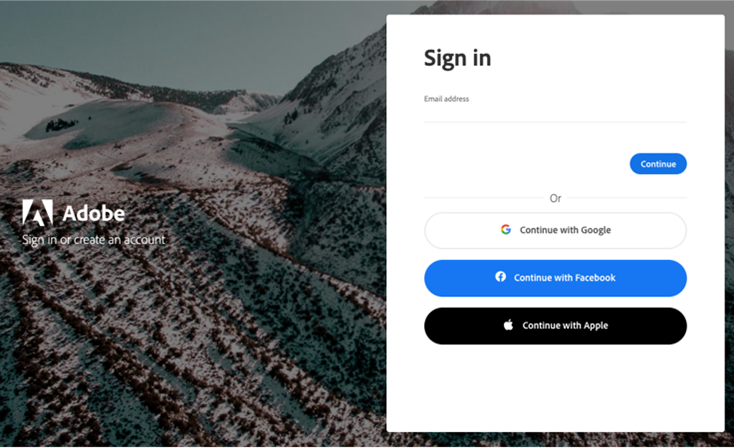
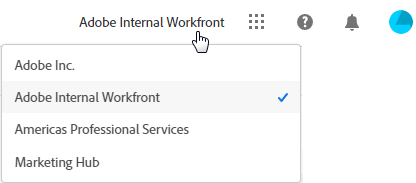
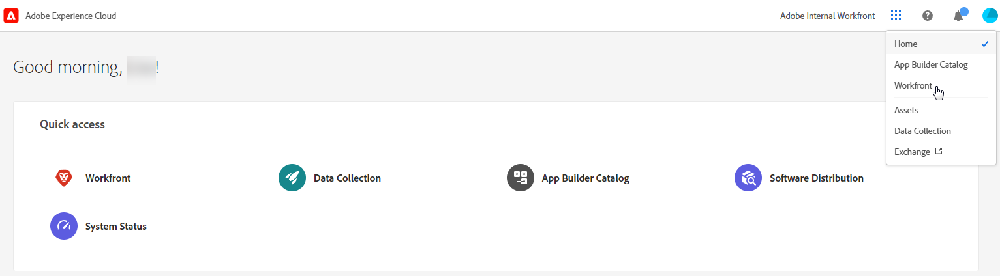

# Adobe Unified Experience for Workfront

Accessing Workfront through Adobe Experience Cloud gives you a seamless, unified experience for managing all of your Adobe applications. Single identity management gives you one place to log in, without multiple URLs or login IDs.

## Access requirements

You must have the following access to perform the steps in this article:

<table style="table-layout:auto"> 
 <col> 
 <col> 
 <tbody> 
  <tr> 
   <td role="rowheader"><strong>Adobe Workfront plan*</strong></td> 
   <td> 
Any
 </td> 
  </tr> 
  <tr> 
   <td role="rowheader"><strong>Adobe Workfront license*</strong></td> 
   <td> 
Request or higher
 </td> 
  </tr> 
 </tbody> 
</table>

&#42;To find out what plan, license type, or access you have, contact your Workfront administrator.

## Prerequisites

Your organization's instance of Workfront must be onboarded to the Adobe Business Platform / Adobe Admin Console.

## Log in to Adobe Experience Cloud

1. Open a browser window and go to <https://experience.adobe.com>.
1. On the Sign in screen, type your email address and click **Continue**.

   

## Access Workfront

Once you are logged in to Adobe Experience Cloud, you can view all of the Workfront organizations and environments that you have access to by clicking the organization switcher in the top navigation area. Select the Workfront organization or environment that you want to work in. Environments could include Preview and Sandbox if your organization uses them.

>[!NOTE]
>
>The first time you log in to Adobe Experience Cloud, the organization defaults to the first one in the alphabetical list. The next time you log in, the organization defaults to the last one you visited.

Workfront appears in the list of Adobe Experience Cloud products you have access to. You can choose Workfront in the quick access menu on the Experience Cloud home page, or use the product switcher  to change applications at any time.

## Navigate Workfront

Use the Main Menu icon  on the left of the Workfront navigation bar to navigate to any pages that you have access to. The options that are available in the Main Menu are dependent on:

* **Layout template configurations**: To learn how a Workfront administrator can modify the Main Menu from a layout template, see [Customize the Main Menu using a layout template](help/quicksilver/administration-and-setup/customize-workfront/use-layout-templates/customize-main-menu.md).
* **License type**: To learn the default configurations for different license types, see [Understand the navigation for a Review-license user](help/quicksilver/workfront-basics/navigate-workfront/workfront-navigation/reviewer-global-navigation-bar.md) or [Understand the navigation for a Work-license user](help/quicksilver/workfront-basics/navigate-workfront/workfront-navigation/worker-global-navigation-bar.md).

## Access your profile and preferences

You can access your profile and preference options by clicking your profile picture in the top navigation area.

This menu allows you to:

* Choose **Dark theme** formatting for Adobe Experience Cloud.
* Set **Preferences** for Adobe Experience Cloud, including primary and secondary language preferences.
* Access your **Workfront Profile**. Once you are on the profile, click the **More** menu  and select **Edit**. For more information about the profile, see [Configure My Settings](help/quicksilver/workfront-basics/manage-your-account-and-profile/configuring-your-user-profile/configure-my-settings.md).
* **Sign out** of Adobe Experience Cloud.
