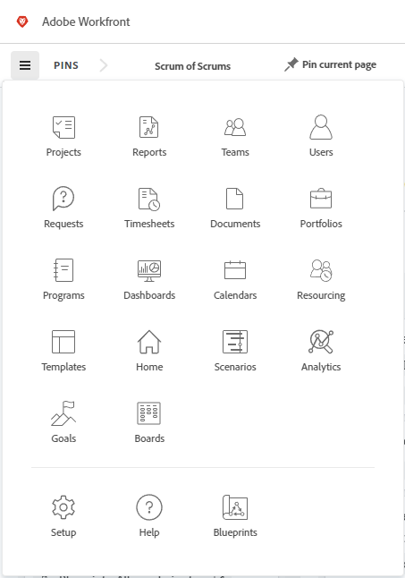

# [!DNL Adobe Unified Experience] for [!DNL Workfront]

Accessing [!DNL Workfront] through [!DNL Adobe Experience Cloud] gives you a seamless, unified experience for managing all of your [!DNL Adobe] applications. Single identity management gives you one place to log in, without multiple URLs or login IDs.

To determine whether your organization is on the Adobe Unified Experience, examine the URL that you use to access Workfront.

| URL | Adobe Experience|
|------------|------------|
| (CompanyName).my.workfront.com | Workfront experience |
| experience.adobe.com | Adobe Unified Experience |

## Access requirements

You must have the following access to perform the steps in this article:

<table style="table-layout:auto"> 
 <col> 
 <col> 
 <tbody> 
  <tr> 
   <td role="rowheader"><strong>[!DNL Adobe Workfront] plan*</strong></td> 
   <td> 
Any
 </td> 
  </tr> 
  <tr> 
   <td role="rowheader"><strong>[!DNL Adobe Workfront] license*</strong></td> 
   <td> 
[!UICONTROL Request] or higher
 </td> 
  </tr> 
 </tbody> 
</table>

&#42;To find out what plan, license type, or access you have, contact your [!DNL Workfront] administrator.

## Prerequisites

Your organization's instance of [!DNL Workfront] must be onboarded to the [!DNL Adobe Business Platform] / [!DNL Adobe Admin Console].

If you have questions about onboarding to the [!DNL Adobe Admin Console], see the [[!DNL Adobe Unified Experience] FAQ](/help/quicksilver/workfront-basics/navigate-workfront/workfront-navigation/unified-experience-faq.md/).

## Log in to [!DNL Adobe Experience Cloud]

1. Open a browser window and go to <https://experience.adobe.com>.
1. On the [!UICONTROL Sign in] screen, type your email address and click **[!UICONTROL Continue]**.

   ![Sign in to [!DNL Adobe Experience Cloud]](assets/aec-login-page.png)

## Access [!DNL Workfront]

Once you are logged in to [!DNL Adobe Experience Cloud], you can view all of the [!DNL Workfront] organizations and environments that you have access to by clicking the organization switcher in the top navigation area. Select the [!DNL Workfront] organization or environment that you want to work in. Environments could include [!UICONTROL Preview] and [!UICONTROL Sandbox] if your organization uses them.

![View [!DNL Workfront] organizations and environments](assets/aec-view-all-orgs.png)

>[!NOTE]
>
>The first time you log in to [!DNL Adobe Experience Cloud], the organization defaults to the first one in the alphabetical list. The next time you log in, the organization defaults to the last one you visited.

[!DNL Workfront] appears in the list of [!DNL Adobe Experience Cloud] products you have access to. You can choose [!DNL Workfront] in the quick access menu on the [!DNL Experience Cloud] home page, or use the product switcher  to change applications at any time.

![Select [!DNL Workfront] to access the application](assets/aec-product-switcher.png)

## Navigate [!DNL Workfront]

Use the [!UICONTROL Main Menu] icon  on the left of the [!DNL Workfront] navigation bar to navigate to any pages that you have access to. The options that are available in the [!UICONTROL Main Menu] are dependent on:

* **Layout template configurations**: To learn how a [!DNL Workfront] administrator can modify the [!UICONTROL Main Menu] from a layout template, see [Customize the [!UICONTROL Main Menu] using a layout template](/help/quicksilver/administration-and-setup/customize-workfront/use-layout-templates/customize-main-menu.md).
* **License type**: To learn the default configurations for different license types, see [Understand the navigation for a [!UICONTROL Review]-license user](/help/quicksilver/workfront-basics/navigate-workfront/workfront-navigation/reviewer-global-navigation-bar.md) or [Understand the navigation for a [!UICONTROL Work]-license user](/help/quicksilver/workfront-basics/navigate-workfront/workfront-navigation/worker-global-navigation-bar.md).

## Access your profile and preferences

You can access your profile and preference options by clicking your profile picture in the top navigation area.

This menu allows you to:

* Choose **[!UICONTROL Dark theme]** formatting for [!DNL Adobe Experience Cloud].
* Set **[!UICONTROL Preferences]** for [!DNL Adobe Experience Cloud], including primary and secondary language preferences.
* Access your **[!UICONTROL [!DNL Workfront] Profile]**. Once you are on the profile, click the **[!UICONTROL More]** menu  and select **[!UICONTROL Edit]**. For more information about the profile, see [Configure My Settings](/help/quicksilver/workfront-basics/manage-your-account-and-profile/configuring-your-user-profile/configure-my-settings.md).
* **[!UICONTROL Sign out]** of Adobe Experience Cloud.

## Manage your password

>[!NOTE]
>
>Changing your password changes it for all of your [!DNL Adobe Experience Cloud] applications.

Your password is not managed in [!DNL Workfront].

If your organization uses a separate application to manage passwords, you will change your password through that provider.

If your password is managed by [!DNL Adobe], you can change the password in your Adobe account.

[See this article for changing your Adobe password.](https://helpx.adobe.com/manage-account/using/change-or-reset-password.html){target="_blank"}

For more information on changing your password, contact your administrator.
