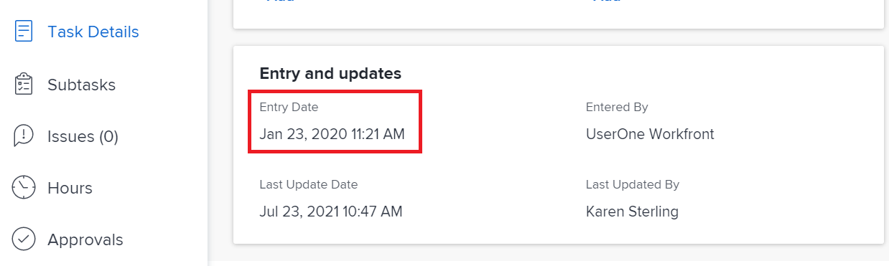
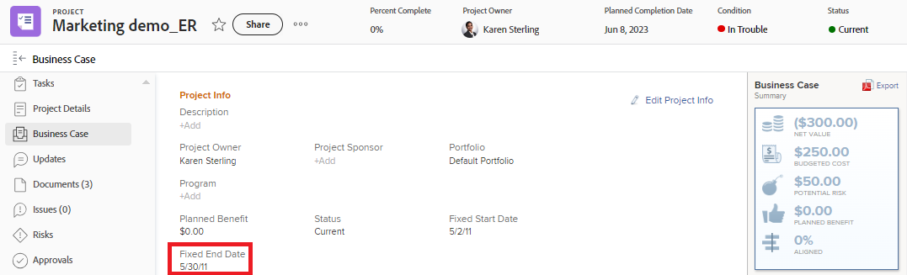
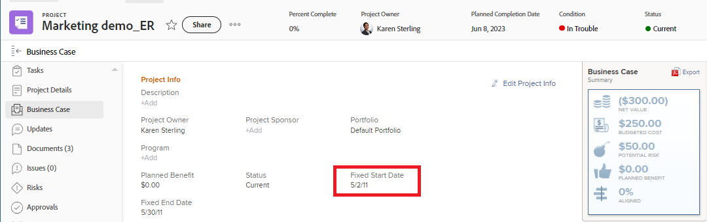
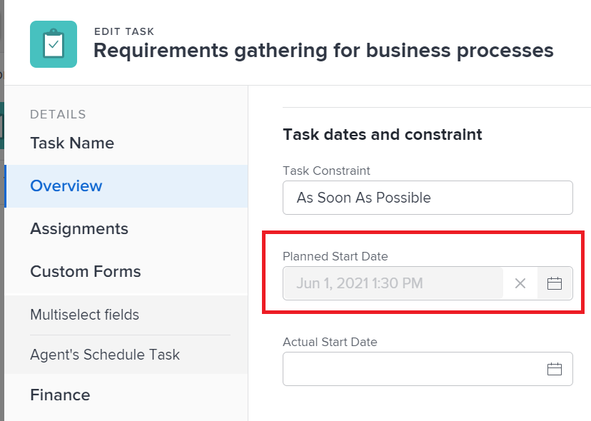

# Overview of the Project, Task, and Issue dates in [!DNL Workfront]

<!-- Audited: 05/2024 -->

<!--consider expanding on this article with ALL dates for PTIs - Hand off dates, Approval Dates, etc-->

<!-- there are dates below that need definition - ask Product-->

This article provides definitions to the most common dates associated with projects, tasks, and issues in [!DNL Adobe Workfront]. The images included here are examples of where the dates display in Workfront and they are not exhaustive. There are other areas that display the dates. All dates are also visible in project, task, and issue reports and lists.

For information about reports and lists, see the following articles:

* [Get started with lists in [!DNL Adobe Workfront]](../../../workfront-basics/navigate-workfront/use-lists/view-items-in-a-list.md)
* [Get started with reports](../../../reports-and-dashboards/reports/reporting/get-started-reports-workfront.md)

For more information about project, task, and issue fields, see [Glossary of [!DNL Adobe Workfront] terminology](../../../workfront-basics/navigate-workfront/workfront-navigation/workfront-terminology-glossary.md).

## [!UICONTROL Actual Start Date]

The [!UICONTROL Actual Start Date] is the date a user actually starts working on a project, task, or issue. The [!UICONTROL Actual Start Date] is empty when the project, task, or issue is created.

You can manually indicate when work started on a task or an issue, or the [!UICONTROL Actual Start Date] automatically populates when the task or issue status changes from [!UICONTROL New] to [!UICONTROL In Progress] or [!UICONTROL Complete]. The [!UICONTROL Actual Start Date] of a project coincides with the date when the first task on the project starts.

>[!TIP]
>
>The [!UICONTROL Actual Start Date] may not match a [!UICONTROL Planned Start Date] of a project, task, or issue because the user may start work later or earlier than its planned date.

For more information, see [Overview of the project [!UICONTROL Actual Start Date]](../../../manage-work/projects/planning-a-project/project-actual-start-date.md).

>[!NOTE]
>
>The [!UICONTROL Must Start On] task or the Fixed Dates constraints affect the [!UICONTROL Planned Start Date] of a task, not the [!UICONTROL Actual Start Date]. This updates the [!UICONTROL Planned Start Date] to a date you specify. The [!UICONTROL Actual Start Date] is updated independently of the [!UICONTROL Planned Start Date], as described above.

## [!UICONTROL Actual Completion Date]

The [!UICONTROL Actual Completion Date] is the date a user actually completes a project, task, or issue. The [!UICONTROL Actual Completion Date] is empty when the project, task, or issue is created.

You can manually indicate when work completes on a task or an issue, or the [!UICONTROL Actual Completion Date] automatically populates when any of the following occur:

* The project, task, or issue status changes to [!UICONTROL Complete], [!UICONTROL Closed], or [!UICONTROL Resolved].
* The task or project percent complete is 100%.

The [!UICONTROL Actual Completion Date] of a project coincides with the date when you completed the last task on the project.

>[!TIP]
>
>The [!UICONTROL Actual Completion Date] may not match the [!UICONTROL Planned Completion Date].  

For more information, see [Overview of the project [!UICONTROL Actual Completion Date]](../../../manage-work/projects/planning-a-project/project-actual-completion-date.md).

## Approval Path Completion Date 

The Approval Path Completion Date is the date when the approval of a project, task, or issue was granted and the Status of the item was changed. 

The Approval Path Completion Date is visible in project,task, and issue lists and reports. 

## Approval Path Start Date 

The Approval Path Start Date is the date when the project, task, or issue Status changed to "Pending approval" and the project approval request was sent to the approvers. 

The Approval Path Start Date is visible in project, task, and issue lists and reports. 

<!--## Auto Closure Date -->

## Budgeted Completion Date 

This is a deprecated field for projects. Any information that this field might display in a list or report is related to a feature that Workfront has removed. This field cannot be updated. 

The field is visible in project reports and lists.

## Budgeted Start Date

This is a deprecated field for projects. Any information that this field might display is related to a feature that Workfront has removed. This field cannot be updated.

The field is visible in project reports and lists.

## [!UICONTROL Commit Date]

The [!UICONTROL Commit Date] is the date by which a user assigned to a task or an issue commits to complete the task or the issue. This is different than the [!UICONTROL Planned Completion Date], as it is a more realistic estimate of the completion date given only by the user in charge of the work. For more information, see [[!UICONTROL Commit Date] overview](../../../manage-work/projects/updating-work-in-a-project/overview-of-commit-dates.md).

>[!NOTE]
>
>Changing the [!UICONTROL Commit Date] affects the [!UICONTROL Projected Completion Date] but not the [!UICONTROL Planned Completion Date] of a task or an issue. The project manager can use the changes an assignee makes on the [!UICONTROL Commit Date] to update the [!UICONTROL Planned Completion Date] of a task or an issue.

<!--## Completion Pending Date-->

## Constraint Date

If you are using a Task Constraint that is tied to a specific date, then that specific date becomes the Constraint Date of the task.

The following task constraints update the Constraint Date field:

* Must Start On
* Must Finish On
* Start No Later Than
* Start No Earlier Than

>[!TIP]
>
>A task with a Constraint of Fixed Dates has no Constraint Date.
>

The Constraint Date is visible in a task list or report. 

## Converted Issue Entry Date 

The date when the issue that was converted to the project or the task was created. 

The Converted Issue Entry Date is visible in project and task lists and reports. 

## Due Date

The date when a task or an issue is due to complete. The Due Date of a task or issue is the same date as the  Planned Completion Date. 

The task and issue Due Date is visible in task and issue lists and reports. 

For information, see the [Planned Completion Date](#planned-completion-date) section in this article. 

## Due On 

The date when the project is due to complete. The Due On date of a project is the same date as the project's Planned Completion Date. 

The project Due On date is visible in project lists and reports. 

For information, see the [Planned Completion Date](#planned-completion-date) section in this article. 

## [!UICONTROL Entry Date]

The [!UICONTROL Entry Date] is the date when a project, task, or issue was created in [!DNL Workfront].

The [!UICONTROL Entry Date] does not influence the timeline of projects, tasks, or issues, but it is important for tracking and reporting purposes. [!DNL Workfront] automatically generates the [!UICONTROL Entry Date] when the object is created and you cannot manually edit it.

## Estimated Due Date 

The task and project Estimated Due Date shows a more realistic date of when the project or the task should complete. 

Estimated dates are more in line with the reality of the project and task, as they take into account what influences the actual completion of the project or task. Estimated Due Dates are similar to Projected Completion Dates. 

For more information, see [Overview of Projected and Estimated Dates](/help/quicksilver/manage-work/tasks/task-information/differentiate-projected-estimated-dates.md). 

The project and task Estimated Due Dates are visible in project and task lists and reports. 

## Estimated Start Date 

The task and project Estimated Start Date shows a more realistic date of when the project or the task could start. 

Estimated dates are more in line with the reality of the project and task, as they take into account what influences the actual start of the project or task. Estimated Start Dates are similar to Projected Start Dates. 

For more information, see [Overview of Projected and Estimated Dates](/help/quicksilver/manage-work/tasks/task-information/differentiate-projected-estimated-dates.md). 

The project and task Estimated Start Dates are visible in project and task lists and reports. 

<!--## Exchange Rate Date-->

## Fixed End Date

The project requestor or owner identifies the Fixed End Date of a project when completing the Business Case. It is the date by which they recommend that the project must complete. 

This is a manual estimation and it does not take into account any actual progress of the tasks on the project.

The Fixed End Date of a project is visible in the project's Business Case section as well as in project lists and reports. 

## Fixed Start Date

The project requestor or owner identifies the Fixed Start Date of a project when completing the Business Case. It is the date by which they recommend that the project should start. 

This is a manual estimation and it does not take into account any actual progress of the tasks on the project.

The Fixed Start Date of a project is visible in the project's Business Case section as well as in project lists and reports. 

## Handoff Date 

The date when a task becomes available for work. This means that all constraints, approvals and dependencies have completed and users can start working on the task. 

The Handoff Date is a calculation and cannot be set manually.

For more information about the Handoff Date, see [Task Handoff Date overview](/help/quicksilver/manage-work/tasks/task-information/handoff-task-date.md).

The Handoff Date of a task is visible in task lists and reports.

## Last Finance Update Date 

The date when any of the financial information on a project was updated. This includes updating financial fields in the Finance section or the Business Case section of the project. 

The Last Finance Update Date is visible in project lists and reports. 

## Last Update Date 

The date when the project, task, or issue was last updated. An update is considered any change that triggers a project, task, or issue to be saved. This includes changes of status, condition, timeline, finances, or any other field.

The Last Update Date is visible in project, task, and issue lists and reports. 

## [!UICONTROL Hour Entry Date]

When you log time for projects, tasks, and issues to indicate how much actual time (in hours) you spend working on the project, task, or issue, the time you log becomes the [!UICONTROL Actual Hours] of the project, task, or issue.

The date for which you log the time is the [!UICONTROL Hour Entry Date] field on the hour entry. 

The Hour Entry Date is visible in hour lists and reports.

>[!TIP]
>
>An hour's [!UICONTROL Entry Date] is different than the [!UICONTROL Entry Date] of another Workfront object, in that it is not the date when the hour log was created, but rather the date with which you want the hours to be associated.
>
>For example, you can log hours for a task on September 5, but associate the hours with September 1. The hour's Entry Date is September 1. 

For information about how to log time in Workfront, see [Log time](../../../timesheets/create-and-manage-timesheets/log-time.md).

>[!TIP]
>
>We recommend logging time on working tasks and issues, rather than parent tasks or projects. Time logged on the working tasks rolls up to the parent tasks and the project as [!UICONTROL Actual Hours] for the parent tasks and the project. Time logged on issues rolls up to the project as [!UICONTROL Actual Hours] for the project.

## [!UICONTROL Planned Completion Date]

The [!UICONTROL Planned Completion Date] or the [!UICONTROL Due On] date is the date when a project, task, or issue is planned to complete.

Depending on the [!UICONTROL Task Constraint], you might not be able to edit the [!UICONTROL Planned Completion Date] of a task. Depending on the [!UICONTROL Schedule Mode] of the project, you might not be able to edit the [!UICONTROL Planned Completion Date] of a project.

The [!UICONTROL Planned Completion Date] displays as the Due On date in some areas of [!DNL Workfront].

For more information, see the following articles:

* [Overview of the task [!UICONTROL Planned Completion Date]](../../../manage-work/tasks/task-information/task-planned-completion-date.md)
* [Set the project [!UICONTROL Planned Completion Date]](../../../manage-work/projects/planning-a-project/project-planned-completion-date.md)
* [Overview of the issue [!UICONTROL Planned Completion Date]](../../../manage-work/issues/issue-information/issue-planned-completion-date.md)

## Planned Date Alignment

This is an automatic indicator that Workfront assigns projects, tasks, and issues to show when an item will be completed in relation to its Planned Completion Date. 

The following are possible values for the Planned Date Alignment indicator: 

* Will be done on the planned completion date
* Will be done before the planned completion date
* Will be done after the planned completion date

The Planned Date Alignment is visible in project, task, and issue lists and reports. 

## [!UICONTROL Planned Start Date]

The [!UICONTROL Planned Start Date] is the date when a project, task, or issue is planned to start.

Depending on the [!UICONTROL Task Constraint], you might not be able to edit the [!UICONTROL Planned Start Date] of a task. Depending on the [!UICONTROL Schedule Mode] of the project, you might not be able to edit the [!UICONTROL Planned Start Date] of a project.

For more information, see [Overview of the project [!UICONTROL Planned Start Date]](../../../manage-work/projects/planning-a-project/project-planned-start-date.md).

## [!UICONTROL Projected Completion Date]

The [!UICONTROL Projected Completion Date] is a real-time, calculated indicator of when the project, task, or issue will be completed. When the project, task, or issue is marked as Completed, the [!UICONTROL Projected Completion Date] changes to the date of the [!UICONTROL Actual Completion Date].

If everything goes smoothly and as planned, the [!UICONTROL Projected Completion date] should match the [!UICONTROL Planned Completion Date]. Otherwise, due to the delays on the predecessor tasks, the [!UICONTROL Projected Completion Date] might become different from the [!UICONTROL Planned Completion Date].

For more information, see [Overview of the [!UICONTROL Projected Completion Date] for projects, tasks, and issues](../../../manage-work/projects/planning-a-project/project-projected-completion-date.md).

## [!UICONTROL Projected Start Date]

The [!UICONTROL Projected Start Date] is a real-time date of when the project, task, or issue begins and takes into account all the delays. This is a more accurate Start Date for the project, task, or issue than the [!UICONTROL Planned Start Date]. The [!UICONTROL Planned Start Date] does not take into account delays or past dates.

When you first plan a project, the [!UICONTROL Planned Start Date] and the [!UICONTROL Projected Start Date] of the tasks and of the project are identical. As delays may happen or tasks might be completed earlier, the [!UICONTROL Projected Start Date] can become different than the [!UICONTROL Planned Start Date]. 

For a task, a [!UICONTROL Projected Start Date] may also differ from its [!UICONTROL Planned Start Date] when one of its predecessors is running behind the schedule.  

>[!TIP]
>
>You can view the [!UICONTROL Projected Start Date] of an issue only in a list or report.

For more information, see [Overview of the project [!UICONTROL Projected Start Date]](../../../manage-work/projects/planning-a-project/project-projected-start-date.md).

<!--## Rejection Date-->

## Slack Date

Tasks can sometimes start and complete late without impacting the Completion Date of the project.

The Slack Date displays the exact date when a task could definitely impact the Completion Date of the project.

For information about the Slack Date of a task, see [Task Slack Date overview](/help/quicksilver/manage-work/tasks/task-information/task-slack-date.md).

Task Slack Dates are visible in task lists and reports.

## Start On 

The date when the project is planned to start. The Start On date of a project is the same date as the project's Planned Start Date. 

This field is visible in project lists and reports. 

For information, see the [Planned Start Date](#planned-start-date) section in this article. 

