# Overview of the Project, Task, and Issue dates in [!DNL Adobe Workfront]

<!--

(NOTE: consider expanding on this article with ALL dates for PTIs - Hand off dates, Approval Dates, etc) 

-->

This article provides definitions to the most common dates associated with projects, tasks, and issues in [!DNL Adobe Workfront]. The images included here are examples of where the dates display in Workfront and they are not exhaustive. There are other areas that display the dates. All dates are also visible in project, task, and issue reports and lists.

For information about reports and lists, see the following articles:

* [Get started with lists in [!DNL Adobe Workfront]](../../../workfront-basics/navigate-workfront/use-lists/view-items-in-a-list.md)
* [Get started with reports](../../../reports-and-dashboards/reports/reporting/get-started-reports-workfront.md)

For more information on project, task, and issue fields, see [Glossary of [!DNL Adobe Workfront] terminology](../../../workfront-basics/navigate-workfront/workfront-navigation/workfront-terminology-glossary.md).

## [!UICONTROL Planned Start Date]

The [!UICONTROL Planned Start Date] is the date when a project, task, or issue is planned to start.

Depending on the [!UICONTROL Task Constraint], you might not be able to edit the [!UICONTROL Planned Start Date] of a task. Depending on the [!UICONTROL Schedule Mode] of the project, you might not be able to edit the [!UICONTROL Planned Start Date] of a project.

For more information, see [Overview of the project [!UICONTROL Planned Start Date]](../../../manage-work/projects/planning-a-project/project-planned-start-date.md).

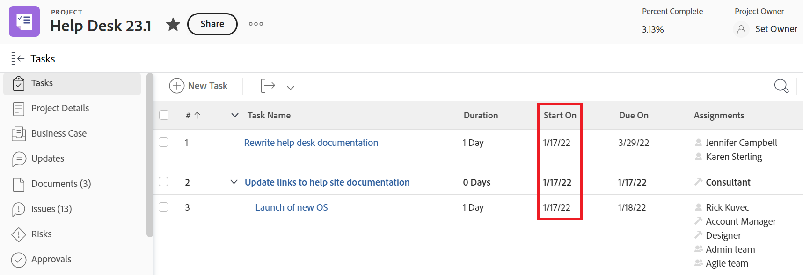

## [!UICONTROL Planned Completion Date]

The [!UICONTROL Planned Completion Date] or the [!UICONTROL Due On] date is the date when a project, task, or issue is planned to complete.

Depending on the [!UICONTROL Task Constraint], you might not be able to edit the [!UICONTROL Planned Completion Date] of a task. Depending on the [!UICONTROL Schedule Mode] of the project, you might not be able to edit the [!UICONTROL Planned Completion Date] of a project.

The [!UICONTROL Planned Completion Date] displays as the Due On date in some areas of [!DNL Workfront].

For more information, see the following articles:

* [Overview of the task [!UICONTROL Planned Completion Date]](../../../manage-work/tasks/task-information/task-planned-completion-date.md)
* [Set the project [!UICONTROL Planned Completion Date]](../../../manage-work/projects/planning-a-project/project-planned-completion-date.md)
* [Overview of the issue [!UICONTROL Planned Completion Date]](../../../manage-work/issues/issue-information/issue-planned-completion-date.md)

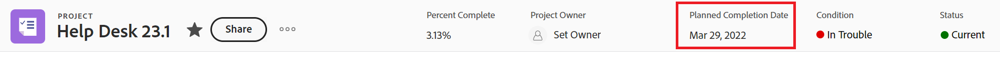

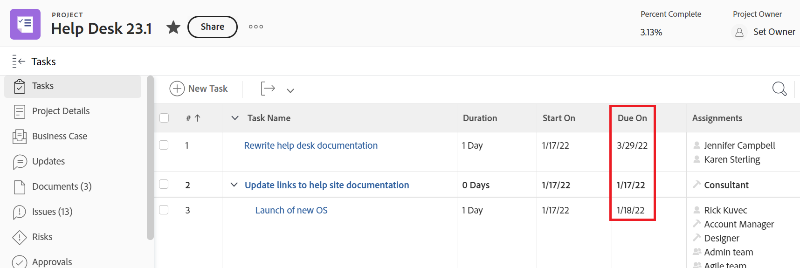

## [!UICONTROL Entry Date]

The [!UICONTROL Entry Date] is the date when a project, task, or issue was created in Workfront.

The [!UICONTROL Entry Date] does not influence the timeline of projects, tasks, or issues, but it is important for tracking and reporting purposes. [!DNL Workfront] automatically generates the [!UICONTROL Entry Date] when the object is created and you cannot manually edit it.

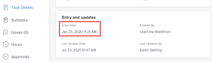

## [!UICONTROL Actual Start Date]

The [!UICONTROL Actual Start Date] is the date a user actually starts working on a project, task, or issue. The [!UICONTROL Actual Start Date] is empty when the project, task, or issue is created.

You can manually indicate when work started on a task or an issue, or the [!UICONTROL Actual Start Date] automatically populates when the task or issue status changes from [!UICONTROL New] to [!UICONTROL In Progress] or [!UICONTROL Complete]. The [!UICONTROL Actual Start Date] of a project coincides with the date when the first task on the project starts.

>[!TIP]
>
>The [!UICONTROL Actual Start Date] may not match a [!UICONTROL Planned Start Date] of a project, task, or issue because the user may start work later or earlier than its planned date.

For more information, see [Overview of the project [!UICONTROL Actual Start Date]](../../../manage-work/projects/planning-a-project/project-actual-start-date.md).

>[!NOTE]
>
>The [!UICONTROL Must Start On] task or the Fixed Dates constraints affect the [!UICONTROL Planned Start Date] of a task, not the [!UICONTROL Actual Start Date]. This updates the [!UICONTROL Planned Start Date] to a date you specify. The [!UICONTROL Actual Start Date] is updated independently of the [!UICONTROL Planned Start Date], as described above.

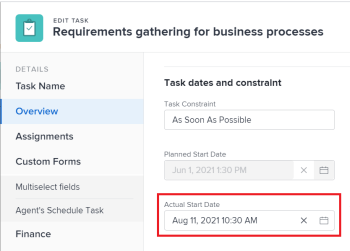

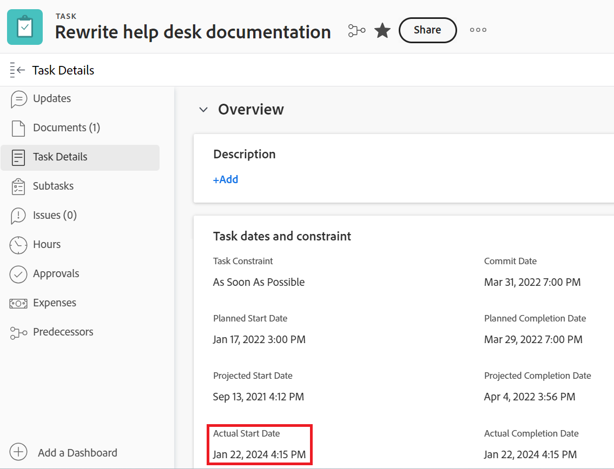

## [!UICONTROL Actual Completion Date]

The [!UICONTROL Actual Completion Date] is the date a user actually completes a project, task, or issue. The [!UICONTROL Actual Completion Date] is empty when the project, task, or issue is created.

You can manually indicate when work completes on a task or an issue, or the [!UICONTROL Actual Complete Date] automatically populates when any of the following occur:

* The project, task, or issue status changes to [!UICONTROL Complete], [!UICONTROL Closed], or [!UICONTROL Resolved].
* The task or project percent complete is 100%.

The [!UICONTROL Actual Completion Date] of a project coincides with the date when the first task on the project completes.

>[!TIP]
>
>The [!UICONTROL Actual Completion Date] may not match the [!UICONTROL Planned Completion Date].  

For more information, see [Overview of the project [!UICONTROL Actual Completion Date]](../../../manage-work/projects/planning-a-project/project-actual-completion-date.md).

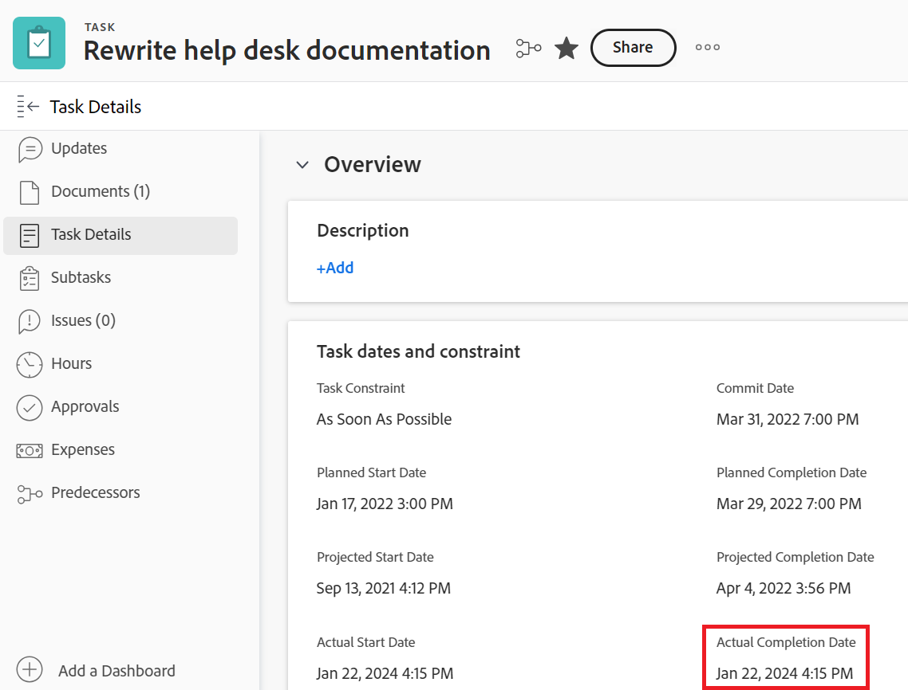

## [!UICONTROL Commit Date]

The [!UICONTROL Commit Date] is the date by which an user assigned to task or an issue commits to complete the task or the issue. This is different than the [!UICONTROL Planned Completion Date], as it is a more realistic estimate of the completion date given only by the user in charge of the work. For more information, see [[!UICONTROL Commit Date] overview](../../../manage-work/projects/updating-work-in-a-project/overview-of-commit-dates.md).

>[!NOTE]
>
>Changing the [!UICONTROL Commit Date] affects the [!UICONTROL Projected Completion Date] but not the [!UICONTROL Planned Completion Date] of a task or an issue. The project manager can use the changes an assignee makes on the [!UICONTROL Commit Date] to update the [!UICONTROL Planned Completion Date] of a task or an issue.

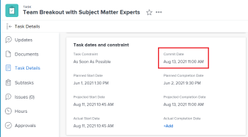

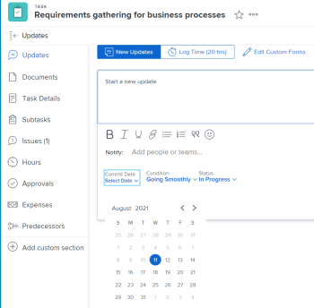

## [!UICONTROL Projected Start Date]

The [!UICONTROL Projected Start Date] is a real-time date of when the project, task, or issue and takes into account all the delays. This is a more accurate Start Date for the project, task, or issue than the [!UICONTROL Planned Start Date]. The [!UICONTROL Planned Start Date] does not take into account delays or past dates.

When you first plan a project, the [!UICONTROL Planned Start Date] and the [!UICONTROL Projected Start Date] of the tasks and of the project are identical. As delays may happen or tasks might be completed earlier, the [!UICONTROL Projected Start Date] can become different than the [!UICONTROL Planned Start Date]. 

For a task, a [!UICONTROL Projected Start Date] may also differ from its [!UICONTROL Planned Start Date] when one of its predecessors is running behind the schedule.  

>[!TIP]
>
>You can view the [!UICONTROL Projected Start Date] of an issue only in a list or report.

For more information, see [Overview of the project [!UICONTROL Projected Start Date]](../../../manage-work/projects/planning-a-project/project-projected-start-date.md).

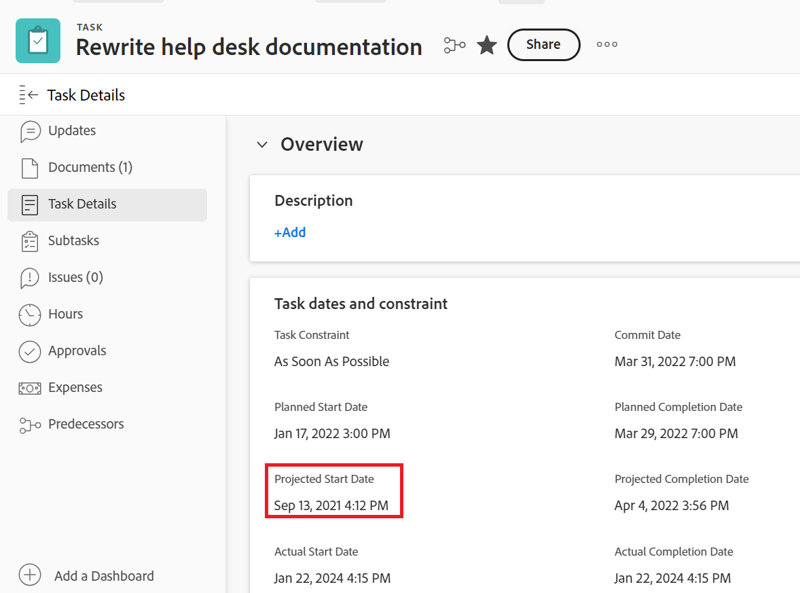

## P[!UICONTROL rojected Completion Date]

The [!UICONTROL Projected Completion Date] is a real-time, calculated indicator of when the project, task, or issue will be completed. When the project, task, or issue is marked as Completed, the [!UICONTROL Projected Completion Date] changes to the date of the [!UICONTROL Actual Completion Date].

If everything goes smoothly and as planned the [!UICONTROL Projected Completion date] should match the [!UICONTROL Planned Completion Date]. Otherwise due to the delays on the predecessor tasks the [!UICONTROL Projected Completion Date] might become different from the [!UICONTROL Planned Completion Date].

For more information, see [Overview of the [!UICONTROL Projected Completion Date] for projects, tasks, and issues](../../../manage-work/projects/planning-a-project/project-projected-completion-date.md).

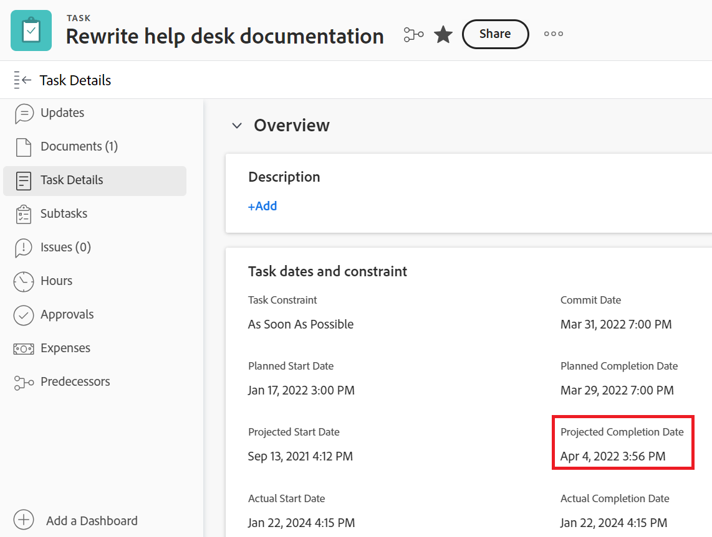

## [!UICONTROL Hour Entry Date]

When you log time for projects, tasks, and issues to indicate how much actual time (in hours) you spend working on the project, task, or issue, the time you log becomes the [!UICONTROL Actual Hours] of the project, task, or issue.

The date for which you log the time is the [!UICONTROL Hour Entry Date] field on the hour entry.

>[!TIP]
>
>The [!UICONTROL Hour Entry Date] is different than the [!UICONTROL Entry Date] in that it is not the date when the hour log was created, but rather the date to which you want to hours associated.

You can log time in the [!UICONTROL project], [!UICONTROL task], or [!UICONTROL issue Updates] section or in the [!UICONTROL Hours] section . When logging time in the [!UICONTROL Hours] section , you can manually specify the Hour Entry Date and the user the hours belong to.

For more information, see [Log time](../../../timesheets/create-and-manage-timesheets/log-time.md).

>[!TIP]
>
>We recommend logging time on working tasks and issues, rather than parent tasks or projects. Time logged on the working tasks rolls up to the parent tasks and the project as [!UICONTROL Actual Hours] for the parent tasks and the project. Time logged on issues rolls up to the project as [!UICONTROL Actual Hours] for the project.

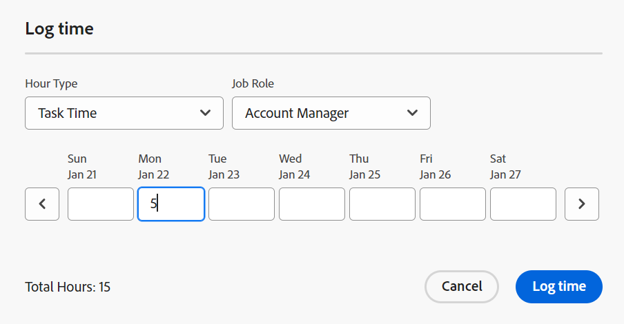

You can view the [!UICONTROL Hour Entry Dates] in hour reports and lists.

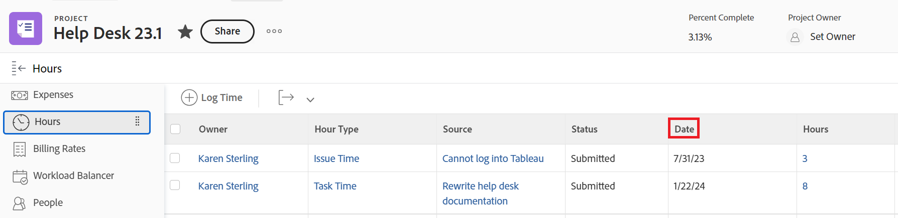
