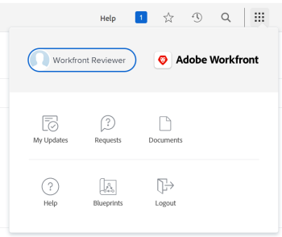

# Understand the navigation for a [!UICONTROL Review]-license user

The  [!UICONTROL Main Menu] changes with the access level you have been assigned by your [!DNL Adobe Workfront] administrator. By default, you are given access only to the areas that include functionality allowed by your access level. To understand the components of the default layout of each access level, see [About the default [!DNL Adobe Workfront] layout](../../../administration-and-setup/customize-workfront/use-layout-templates/about-the-default-wf-layout.md).

## Understand the default [!UICONTROL Main Menu] of a [!UICONTROL Reviewer]

As a [!UICONTROL Reviewer], your main responsibility is to review, comment on, and approve work. The areas that are visible to you in the [!UICONTROL Main Menu] allow you to do that.

The following areas are included in the default layout of a [!UICONTROL Reviewer]:

* **[!UICONTROL My Updates]**: The **[!UICONTROL Home]** area which is available to users of all access levels is replaced by the **[!UICONTROL My Updates]** for users with a Review license type, by default. As a [!UICONTROL Reviewer], you do not complete work. You need to only see information about work you have to review, comment on, or approve. The **[!UICONTROL My Updates]** area allows you to perform these actions. This is the default landing area for new Review users.

   >[!TIP]
   >
   >Your [!DNL Workfront] or Group administrator may assign you a layout template that could change your default landing page. Using a layout template, you can also view both the [!UICONTROL Home] and the [!UICONTROL Updates] area as a [!UICONTROL Review]-license user.

* **[!UICONTROL Requests]**: You can submit and review requests you or other users from your company have submitted in this area.
* **[!UICONTROL Documents]**: You can upload documents, or review documents shared with you here.
* **[!UICONTROL Blueprints]**: Review existing blueprints in your system and request one to be installed, if the [!DNL Workfront] administrator configured the request queue for blueprints. For more information, see [Blueprints overview](../../../administration-and-setup/blueprints/blueprints-overview.md).

## Customize your default [!UICONTROL Main Menu]

Your [!DNL Workfront] administrator can modify your [!DNL Workfront] default layout by assigning you a layout template. For more information about working with layout templates, see [Customize the [!UICONTROL Main Menu] using a layout template](../../../administration-and-setup/customize-workfront/use-layout-templates/customize-main-menu.md).
