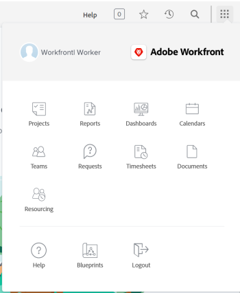

# Understand the navigation for a [!UICONTROL Work]-license user

The [!UICONTROL Main Menu] changes with the access level you have been assigned by your [!DNL Adobe Workfront] administrator. By default, you are given access only to the areas that include functionality allowed by your access level. To understand the components of the default layout of each access level, see [About the default [!DNL Adobe Workfront] layout](../../../administration-and-setup/customize-workfront/use-layout-templates/about-the-default-wf-layout.md).

## Understand the default [!UICONTROL Main Menu] of a Worker

As a [!UICONTROL Worker], your main responsibility is to complete work. The areas in the [!UICONTROL Main Menu] that are visible to you allow you to do that.

The following areas are included in the default layout of a [!UICONTROL Worker]:

* **[!UICONTROL Home]**: Tasks and issues assigned to you display here. This is the default landing page for a Worker , however, it doesn't appear in the [!UICONTROL Main Menu] unless a Workfront administrator adds it in the layout template .  For information, see [Get started with [!UICONTROL Home]](../../../workfront-basics/using-home/using-the-home-area/get-started-with-home.md).

* **[!UICONTROL Projects]**: Projects that are shared with you display here. For information, see [Projects: article index](../../../manage-work/projects/projects-overview.md).

* **[!UICONTROL Reports]**: Reports that are shared with you display here. For information, see [Reports](../../../reports-and-dashboards/reports/reports-overview.md).

* **[!UICONTROL Dashboards]**: Dashboards that are shared with you display here. For information, see [Dashboards](../../../reports-and-dashboards/dashboards/dashboards-overview.md).

* **[!UICONTROL Calendars]**: Calendars that are shared with you display here. For information, see [Calendars: article index](../../../reports-and-dashboards/reports/calendars/calendars.md).

* **[!UICONTROL Teams]**: Tasks and issues assigned to your teams display in this area. As a Worker, you are the only [!DNL Workfront] user who sees the [!UICONTROL Teams] area by default.

   For information, see [Create and manage teams](../../../people-teams-and-groups/create-and-manage-teams/create-and-mange-teams.md).

* **[!UICONTROL Requests]**: You can submit requests and review requests you or your team members have submitted here. For information, see [Requests](../../../manage-work/requests/requests-overview.md).

* **[!UICONTROL Timesheets]**: You can access your current, future, or old timesheets here. For information, see [Timesheets: article index](../../../timesheets/timesheets-all.md).

* **[!UICONTROL Documents]**: You can upload documents, or review documents shared with you, here. For information, see [Documents](../../../documents/documents-overview.md).

* **[!UICONTROL Resourcing]**: You can view resource allocation in the Resource Planning tools and view Resource Pools here. For information, see [Manage resources](../../../resource-mgmt/manage-resources.md).

* **[!UICONTROL Analytics]**: Look at project data and identify trends with planning and completion. This area displays insight into projects you have access to view. For more information, see [Enhanced analytics overview](../../../enhanced-analytics/enhanced-analytics-overview.md).

* **[!UICONTROL Boards]**: Work with flexibility and collaboration with your team members by using shared boards that contains columns and cards reflecting work you want to get done. For information, see [Get started with boards: article index](../../../agile/get-started-with-boards/get-started-with-boards.md).

* **[!UICONTROL Blueprints]**: Review existing blueprints in your system and request one to be installed, if the [!DNL Workfront] administrator configured the request queue for blueprints. For more information, see [Blueprints overview](../../../administration-and-setup/blueprints/blueprints-overview.md).

## Customize your default [!UICONTROL Main Menu]

Your [!DNL Workfront] administrator can modify your [!DNL Workfront] default layout by assigning you a layout template. For more information about working with layout templates, see  [Customize the [!UICONTROL Main Menu] using a layout template](../../../administration-and-setup/customize-workfront/use-layout-templates/customize-main-menu.md).
