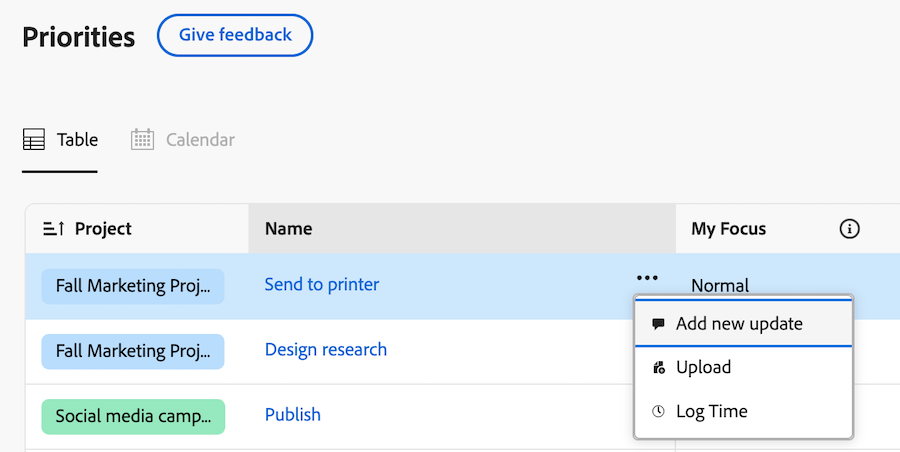
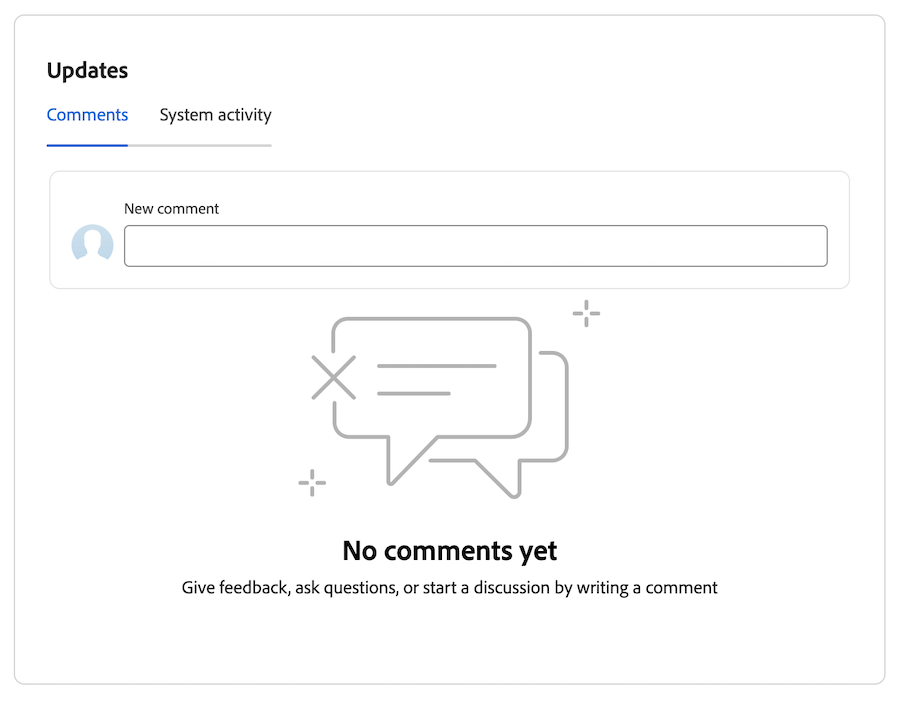
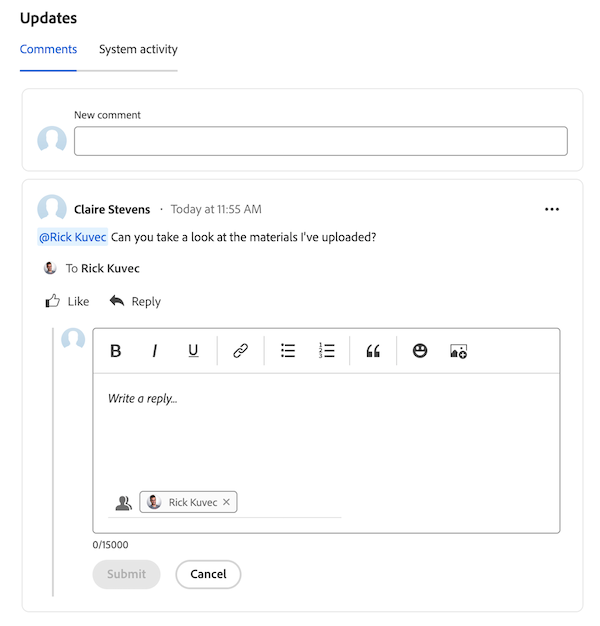

# Add and view comments in Priorities

You can add an update on a task or issue to communicate to others about progress on the work item. 

## Access requirements

+++ Expand to view access requirements for the functionality in this article.

You must have the following access to perform the steps in this article:

<table style="table-layout:auto"> 
 <col> 
 </col> 
 <col> 
 </col> 
 <tbody> 
  <tr> 
   <td role="rowheader"><strong>Adobe Workfront plan</strong></td> 
   <td> 
Any
 </td> 
  </tr> 
  <tr> 
   <td role="rowheader"><strong>Adobe Workfront license*</strong></td> 
   <td> 
   
Current: Request or higher for issues <!--and documents-->; Review or higher for all other objects

   
New: Contributor or higher for issues <!--and documents-->: Light or higher for all other objects
 
   </td> 
  </tr> 
  <tr> 
   <td role="rowheader"><strong>Access level configurations</strong></td> 
   <td> 
View or Edit access for the object the update is on
</td> 
  </tr> 
  <tr> 
   <td role="rowheader"><strong>Object permissions</strong></td> 
   <td> 
View access to the object
</td> 
  </tr> 
 </tbody> 
</table>

*For more information, see [Access requirements in Workfront documentation](/help/quicksilver/administration-and-setup/add-users/access-levels-and-object-permissions/access-level-requirements-in-documentation.md).

+++

## Add a quick comment

You can add a comment from the worklist:

{{step1-to-priorities}}

1. Locate the work item you want to update. 
1. Hover over the name, then click **Add new update**.
    
1. Begin typing your comment.
1. (Optional) In the Tag people or teams area, start typing the name or the email of a user, or a team that you would like to include in this comment, then select it when it displays in the list.
1. (Optional) Use the options in the Rich Text toolbar to format your text, add emojis, links, or images to your comment, to enhance your content.
1. Click Submit to add the comment to the work item.

    >[!IMPORTANT]
    >
    >You can edit your comment only within 15 minutes from submitting it. To edit a comment, click the More menu in the upper-right corner of the comment, then click Edit.

For more detailed information about adding updates, see [Add an update to a work item](/help/quicksilver/workfront-basics/updating-work-items-and-viewing-updates/update-work.md).

## View and add comments and system updates in a work item

You can view and add comments and view system updates in an individual work item:

{{step1-to-priorities}}

1. Click on a work item name to open the Overview page.
1. Locate the **Updates** area in the botton-right corner of the screen.
1. (Optional) Use the **Comments** tab to updates others have made on the work item.
1. (Optional) Use the **System activity** tab to view the system activity related to the work item.
1. (Optional) To add a comment, go to the Comment tab and begin typing in the New comment box. Click **Submit** when you are finished. 

## Reply to a comment

You can reply to a comment in a work item:

{{step1-to-priorities}}

1. Click on a work item name to open the Overview page.
1. Locate the **Updates** area in the botton-right corner of the screen.
1. On the Comments tab, find the comment you want to reply to, then click **Reply**. 
1. (Conditional) If you want to reply to bring the content of a message into your reply, click the **More** menu icon  next to the body of the message and choose **Quote reply**.
    
1. Type your reply, then click **Submit**. 

    >[!IMPORTANT]
    >
    >You can edit your comment only within 15 minutes from submitting it. To edit a comment, click the More menu in the upper-right corner of the comment, then click Edit.

    