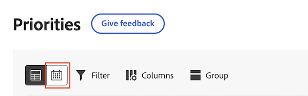
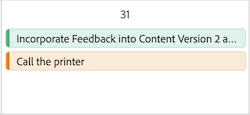

# Manage your work in the Priorities calendar

Easily track your work with a clear, visual calendar. With the Priorities calendar, you can

* Use filters to find your work
* Apply custom fields like status and focus level to identify high-priority work
* Apply colors for quick organization

>[!IMPORTANT]
>
>Projects must be in Current status or a status that equates current in order to display projects as well as their child tasks and issues. 

## Access requirements

+++ Expand to view access requirements for the functionality in this article.

You must have the following access to perform the steps in this article:

<table style="table-layout:auto"> 
 <col> 
 </col> 
 <col> 
 </col> 
 <tbody> 
  <tr> 
   <td role="rowheader"><strong>Adobe Workfront plan</strong></td> 
   <td> 
Any
 </td> 
  </tr> 
  <tr> 
   <td role="rowheader"><strong>Adobe Workfront license*</strong></td> 
   <td> 
   
Current: Reviewer or higher

   
New: Light or higher
 
   </td> 
  </tr> 
  <tr> 
   <td role="rowheader"><strong>Access level configurations</strong></td> 
   <td> 
View or Edit access for the object the update is on
</td> 
  </tr> 
  <tr> 
   <td role="rowheader"><strong>Object permissions</strong></td> 
   <td> 
View access to the object
</td> 
  </tr> 
 </tbody> 
</table>

*For more information, see [Access requirements in Workfront documentation](/help/quicksilver/administration-and-setup/add-users/access-levels-and-object-permissions/access-level-requirements-in-documentation.md).

+++

## View your work in the calendar

Priorities displays work items assigned to you. You cannot see work items assigned to your team in the Priorities calendar.

{{step1-to-priorities}}

1. Click the Calendar icon at the top of the worklist. 
    
1. Select one or several filters to narrow down your work items.

    +++Expand to see detailed information about available filters
    <table>
    <tbody>
    <tr>
    <th>Filter</th>
    <th>Description</th>
    </tr>
        <tr>
        <td>Working on it</td>
        <td>Displays items that you are currently working on</td>
        </tr>
        <tr>
        <td>Ready to start</td>
        <td>Displays items with 
        <ul>
        <li>No incomplete predecessors or task constraints</li>
        
and

        <li>The Planned Start Date is in the past or up to two weeks in the future</li>
        </ul>
        </td>
        </tr>
        <tr>
        <td>Not ready</td>
        <td>Displays items that have
        <ul>
        <li>Incomplete predecessors or task constraints that prevent the item from being worked on</li>
        
or

        <li>The Planned Start Date more than two weeks in the future</li>
        </ul>
        </td>
        </tr>
        <tr>
        <td>Requested</td>
        <td>Displays issues that you have not started work on</td>
        </tr>
        <td>Done</td>
        <td>Displays work completed within the last two weeks. This filter option does not include approvals.</td>
        </tr>
        <tr>
        <td>Project</td>
        <td>Displays projects that contain tasks or issues you've been assigned to</td>
        </tr>
        <tr>
        <td>Due date</td>
        <td>Displays work by Planned Completion Date</td>
        </tr>
        <tr>
        <td>Status</td>
        <td>Displays tasks or issues in new, in progress, and complete statuses</td>
        </tr>
        <tr>
        <td>My Focus</td>
        <td>Displays tasks or issues in that have assigned focus levels. Focus levels are assigned and managed by the individual user.</td>
        </tr>
    </tbody>
    </table>

    +++

1. Click on the work item bar in the calendar to open the side summary. The side summary allows you to

* View and edit project and work item details
* Make and view comments
* View and upload documents
* Create a proof
* Navigate to the project page in Workfront
* Navigate to the work item details page in Priorities
* Log time
* Add quick links

1. (Optional) Click **Create new** to add a new work item to the calendar. For more information, see [Create a new task or issue in Priorities](/help/quicksilver/workfront-basics/priorities/create-task-issue-priorities.md).

## Configure the calendar

{{step1-to-priorities}}

1. Click the Calendar icon at the top of the worklist. 
    
1. Click the **Settings** icon in the right corner of the calendar. 

1. On the **Bar style** tab, choose up to 5 fields to display on the work item bar in the calendar.
      

1. On the **Color** tab, choose how you would like your work items to display. For example, if you choose Project, your work items display according to the color assigned to the project on the worklist. 
    
