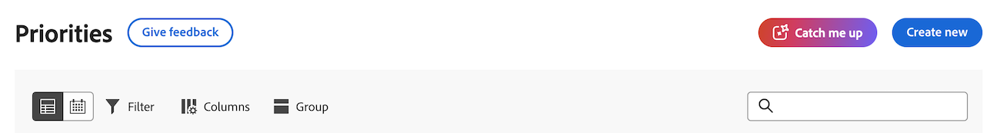

# Catch up on work in Priorities

The information on this page refers to functionality not yet generally available. It is available only in the Preview Sandbox environment.

Catch me up—-powered by Workfront's AI Assistant—summarizes updates, uploaded documents, and other notable changes about your projects within the following time frames: 24 hours, 3 days, 7 days, which helps reduce the amount of time looking for information on active projects.

>[!NOTE]
>
>This feature is only available for customers on the Unified Adobe Experience using the AI Assistant. For more information about the AI Assistant, see [AI Assistant overview](/help/quicksilver/workfront-basics/ai-assistant/ai-assistant-overview.md).

## Access requirements

+++You must have the following access to perform the steps in this article: 

<table style="table-layout:auto"> 
 <col> 
 <col> 
 <tbody> 
  <tr> 
   <td role="rowheader">Adobe Workfront plan</td> 
   <td>
New: Any

       
or

       
Current: Not available
</td>
  </tr> 
  <tr> 
   <td role="rowheader">Adobe Workfront license</td> 
   <td>
New: Standard

       
or

       
Current: Not available
</td>
  </tr> 
 </tbody> 
</table>

For more detail about the information in this table, see [Access requirements in Workfront documentation](/help/quicksilver/administration-and-setup/add-users/access-levels-and-object-permissions/access-level-requirements-in-documentation.md).

+++

## Access Catch me up

{{step1-to-priorities}}

1. At the top of the page, click the **Catch me up**.
    
1. Choose the timeframe you want to summarize:
    1. 24 hours
    1. 3 Days
    1. 7 Days

   If you cannot interact with this panel, your organization does not have a signed Adobe Gen AI agreement on file.