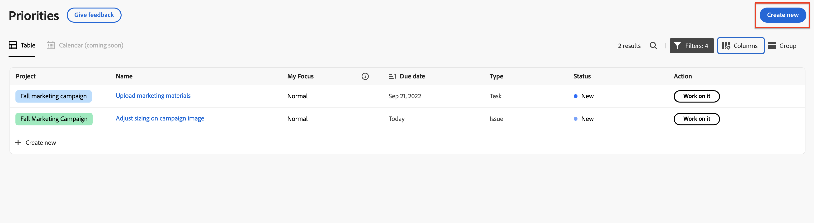
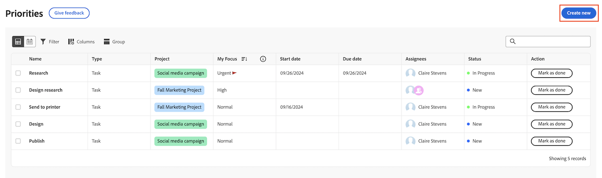

# Create a new task or issue in Priorities

You can create new tasks and issues directly from Priorities:

## Access requirements

+++ Expand to view access requirements for the functionality in this article.

You must have the following access to perform the steps in this article:

<table style="table-layout:auto"> 
 <col> 
 </col> 
 <col> 
 </col> 
 <tbody> 
  <tr> 
   <td role="rowheader"><strong>Adobe Workfront plan</strong></td> 
   <td> 
Any
 </td> 
  </tr> 
  <tr> 
   <td role="rowheader"><strong>Adobe Workfront license*</strong></td> 
   <td> 
   
Current: Request or higher for Requests; Review or higher for issues; Work or higher for tasks

   
New: Contributor or higher for Requests; Light or higher for issues <!--and documents-->: Standard or higher tasks
 
   </td> 
  </tr> 
  <tr> 
   <td role="rowheader"><strong>Access level configurations</strong></td> 
   <td> 
View or Edit access for the object the update is on
</td> 
  </tr> 
  <tr> 
   <td role="rowheader"><strong>Object permissions</strong></td> 
   <td> 
View access to the object
</td> 
  </tr> 
 </tbody> 
</table>

*For more information, see [Access requirements in Workfront documentation](/help/quicksilver/administration-and-setup/add-users/access-levels-and-object-permissions/access-level-requirements-in-documentation.md).

+++

## Create tasks or issues in Priorities

You can create a task or issue in a project. 

>[!NOTE]
>
>If you have a Request or Contributor license, you can create a request directly in Priorities. 

To create a task or issue in a project:

{{step1-to-priorities}}

1. Click **Create new** in the upper-right corner.
  
  <!--new screen for prod -->
1. Specify the following information:

    | Field         | Instructions       |
    |---------------|-------------|
    | Work item type (Optional)  |  Choose if you want to create a **Task** or **Issue**.          |
    | Name          |  Enter a name.           |
    | Description (Optional)  |  Enter a description.           |
    | Project       |  Begin typing a project name, then select it from the drop-down list.           |
    | Assignees (Optional)     |  Assign people to the work item.           |
    | Due date (Optional)      |  Choose a due date.           |

1. Click **Create**.
