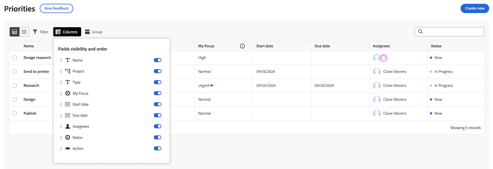
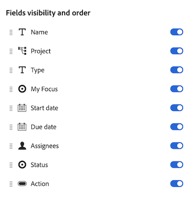

# Customize the Priorities worklist columns

You can customize the columns on the worklist in Priorities to support the way you work. 

Priorities displays work items assigned to you. You cannot see work items assigned to your team.

>[!NOTE]
>
>You cannot add custom data to columns at this time.

## Access requirements

+++ Expand to view access requirements for the functionality in this article.

<table style="table-layout:auto"> 
 <col> 
 </col> 
 <col> 
 </col> 
 <tbody> 
  <tr> 
   <td role="rowheader"><strong>Adobe Workfront plan</strong></td> 
   <td> 
Any
 </td> 
  </tr> 
  <tr> 
   <td role="rowheader"><strong>Adobe Workfront license*</strong></td> 
   <td> 
   
Current: Reviewer or higher

   
New: Light or higher
 
   </td> 
  </tr> 
  <tr> 
   <td role="rowheader"><strong>Access level configurations</strong></td> 
   <td> 
View or Edit access for the object the update is on
</td> 
  </tr> 
  <tr> 
   <td role="rowheader"><strong>Object permissions</strong></td> 
   <td> 
View access to the object
</td> 
  </tr> 
 </tbody> 
</table>

For more detail about the information in this table, see [Access requirements in Workfront documentation](/help/quicksilver/administration-and-setup/add-users/access-levels-and-object-permissions/access-level-requirements-in-documentation.md).

+++

## Customize the Priorities worklist columns

### Enable or disable columns 

{{step1-to-priorities}}

1. Click **Columns** on the left side of the screen.
    
1. Use the toggles to enable or disable columns in the worklist. 

### Reorder the columns

{{step1-to-priorities}}

1. Click **Columns** on the left side of the screen.
1. Click the **Drag** icon and move the column to your desired location. Moving columns updates in the worklist automatically.
    

>[!NOTE]
>
>The Name column is fixed and cannot be moved. 
