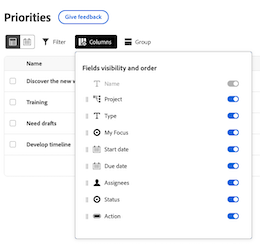
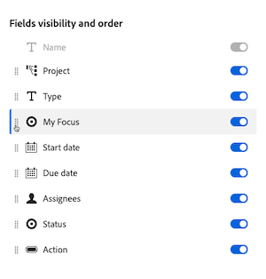

# Customize the worklist columns

You can customize the columns on the worklist in Priorities to support the way you work. 

>[!NOTE]
>
>You cannot add custom data to columns at this time.

## Enable or disable columns 

{{step1-to-priorities}}

1. Click **Columns** on the right side of the screen.
    
1. Use the toggles to enable or disable columns in the worklist. 

## Reorder the columns

{{step1-to-priorities}}

1. Click **Columns** on the right side of the screen.
1. Click the Drag icon and move the column to your desired location. This updates in the worklist automatically. 
    

## Reset Column widths

{{step1-to-priorities}}

1. Click **Columns** on the right side of the screen.
1. Click the More icon , and choose **Reset column widths**.
 