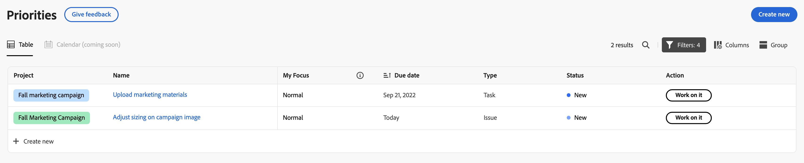

# Filter and group your work with Priorities

The highlighted information on this page refers to functionality not yet generally available. It is available only in the Preview Sandbox environment.

You can use filters to find the work you are looking for and then apply a grouping to keep it organized. 

## Access requirements

+++ Expand to view access requirements for the functionality in this article.

You must have the following access to perform the steps in this article:

<table style="table-layout:auto"> 
 <col> 
 </col> 
 <col> 
 </col> 
 <tbody> 
  <tr> 
   <td role="rowheader"><strong>Adobe Workfront plan</strong></td> 
   <td> 
Any
 </td> 
  </tr> 
  <tr> 
   <td role="rowheader"><strong>Adobe Workfront license*</strong></td> 
   <td> 
   
Current: Request or higher

   
New: Contributor or higher
 
   </td> 
  </tr> 
  <tr> 
   <td role="rowheader"><strong>Access level configurations</strong></td> 
   <td> 
View or Edit access for the object the update is on
</td> 
  </tr> 
  <tr> 
   <td role="rowheader"><strong>Object permissions</strong></td> 
   <td> 
View access to the object
</td> 
  </tr> 
 </tbody> 
</table>

*For more information, see [Access requirements in Workfront documentation](/help/quicksilver/administration-and-setup/add-users/access-levels-and-object-permissions/access-level-requirements-in-documentation.md).

+++

## Filter and group your work with Priorities in Production

### Filter your work

You can filter tasks and issues assigned to you.

{{step1-to-priorities}}

1. Click **Filters** in the top right of the worklist.
1. Select one or several filters to narrow down your work items.
  

+++Expand to see detailed information about available filters
<table>
  <tbody>
   <tr>
   <th>Filter</th>
   <th>Description</th>
   </tr>
    <tr>
      <td>Working on it</td>
      <td>Displays items that you are currently working on</td>
    </tr>
    <tr>
      <td>Ready to start</td>
      <td>Displays items with 
      <ul>
      <li>No incomplete predecessors or task constraints</li>
      
and

      <li>The Planned Start Date is in the past or up to two weeks in the future</li>
      </ul>
      </td>
    </tr>
    <tr>
      <td>Not ready</td>
      <td>Displays items that have
       <ul>
      <li>Incomplete predecessors or task constraints that prevent the item from being worked on</li>
      
or

      <li>The Planned Start Date more than two weeks in the future</li>
      </ul>
       </td>
    </tr>
    <tr>
      <td>Requested</td>
      <td>Displays issues that you have not started work on</td>
    </tr>
      <td>Done</td>
      <td>Displays work completed within the last two weeks. This filter option does not include approvals.</td>
    </tr>
    <tr>
    <td>Project</td>
    <td>Displays projects that contain tasks or issues you've been assigned to</td>
    </tr>
    <tr>
    <td>Due date</td>
    <td>Displays work by Planned Completion Date</td>
    </tr>
    <tr>
    <td>Status</td>
    <td>Displays tasks or issues in new, in progress, and complete statuses</td>
    </tr>
    <tr>
    <td>My Focus</td>
    <td>Displays tasks or issues in that have assigned focus levels. Focus levels are assigned and managed by the individual user.</td>
    </tr>
  </tbody>
</table>

+++

1. (Optional) Click **Back to default** to reset your selection.

### Group your work

{{step1-to-priorities}}

1. Click **Groups** in the top right of the worklist.
1. Select a group to organize your work list
  

  +++Expand to see detailed information about available groups

| Group     | Description |
|-----------|-------------|
| None      |   This removes groupings from the worklist.          |
| My Focus  |   This groups items based on the focus level you assign.          |
| Week due  |   This groups items based on the week they are due. Due dates are determined by the Planned Completion Date.           |
| Status    |   This groups items by the following statuses: New, In progress, Complete.  Note: You can't use custom statuses in Priorities at this time.          |
| Project   |   This groups items by project.          |

+++

### Sort your work

To sort your work, open **Group** and click **Sort ascending** or **Sort descending**.

>[!IMPORTANT]
>
>The sort option is temporarily unavailable if you have a group applied. 

### Expand or collapse all sections

To expand or collapse all sections, open **Group** and click **Expand all** or **Collapse all**.

## Filter and group your work with Priorities in Preview

### Filter your work with Standard filters

You can filter tasks and issues assigned to you.

{{step1-to-priorities}}

1. Click **Filters** in the top left of the worklist.
1. click **Standard filters**. 
1. Select one or many filters to narrow down your work items.
  

+++Expand to see detailed information about available filters
<table>
  <tbody>
   <tr>
   <th>Filter</th>
   <th>Description</th>
   </tr>
    <tr>
      <td>Working on it</td>
      <td>Displays items that you are currently working on</td>
    </tr>
    <tr>
      <td>Ready to start</td>
      <td>Displays items with 
      <ul>
      <li>No incomplete predecessors or task constraints</li>
      
and

      <li>The Planned Start Date is in the past or up to two weeks in the future</li>
      </ul>
      </td>
    </tr>
    <tr>
      <td>Not ready</td>
      <td>Displays items that have
       <ul>
      <li>Incomplete predecessors or task constraints that prevent the item from being worked on</li>
      
or

      <li>The Planned Start Date more than two weeks in the future</li>
      </ul>
       </td>
    </tr>
    <tr>
      <td>Requested</td>
      <td>Displays issues that you have not started work on</td>
    </tr>
      <td>Done</td>
      <td>Displays work completed within the last two weeks. This filter option does not include approvals.</td>
    </tr>
    <tr>
    <td>Project</td>
    <td>Displays projects that contain tasks or issues you've been assigned to</td>
    </tr>
    <tr>
    <td>Due date</td>
    <td>Displays work by Planned Completion Date</td>
    </tr>
    <tr>
    <td>Status</td>
    <td>Displays tasks or issues in new, in progress, and complete statuses</td>
    </tr>
    <tr>
    <td>My Focus</td>
    <td>Displays tasks or issues in that have assigned focus levels. Focus levels are assigned and managed by the individual user.</td>
    </tr>
  </tbody>
</table>

+++

1. (Optional) Click **Back to default** to reset your selection.

### Filter your work with Smart filters

Use natural language to filter quickly filter work. Your Workfront instance must be enabled on the Adobe Unified Experience. For more information, see [Adobe Unified Experience for Workfront](/help/quicksilver/workfront-basics/navigate-workfront/workfront-navigation/adobe-unified-experience.md).

{{step1-to-priorities}}

1. Click **Filters** in the top left of the worklist.
1. Click **Smart filters**. 
1. Type how you want to filter your work. 

    You can type things like

    * Show me late tasks
    * Show my top priorities
    * Show work due today

### Group your work

{{step1-to-priorities}}

1. Click **Groups** in the top left of the worklist.
1. Select a group to organize your work list
  

  +++Expand to see detailed information about available groups

| Group     | Description |
|-----------|-------------|
| Project   |   This groups items by project.          |
| My Focus  |   This groups items based on the focus level you assign.          |
| Week due  |   This groups items based on the week they are due. Due dates are determined by the Planned Completion Date.           |
| Status    |   This groups items by the following statuses: New, In progress, Complete.  Note: You can't use custom statuses in Priorities at this time.          |

+++

### Sort your work

**Sort in groups**

To sort your work within a group, open **Group** and click **Sort ascending** or **Sort descending**.

**Sort columns**

To sort individual columns, go to the column and click the down arrow.

### Expand or collapse all group sections

To expand or collapse all group sections, open **Group** and click **Expand all** or **Collapse all**.

