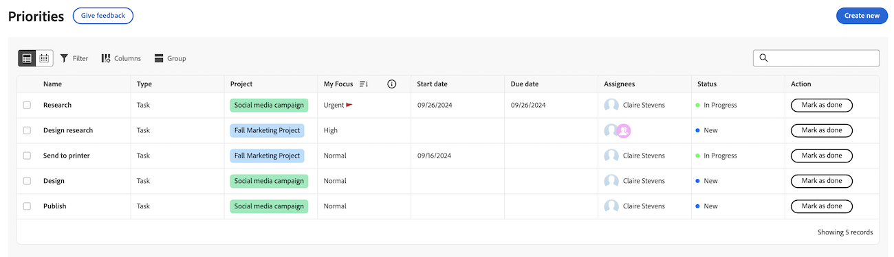

# Get started with [!DNL Priorities]

Priorities is a streamlined, intuitive experience tailored for task owners. Priorities will be rolled out in phases, starting with the worklist.

With Priorities, you can enjoy

* Manage and prioritize daily tasks: Organize your day or week with consolidated navigation for better clarity
* Greater productivity: Access project context and perform tasks quicker with fewer clicks
* Personalized features: Benefit from features uniquely designed for task owners

## Find and organize your work

In Priorities, you can filter and group your work to help you manage deadlines and prioritize your what is important to you. You can also quickly identify Urgent work with the My Focus column.

### Find your work with filters

Find your most important work with filters. You can use a natural language to find work with the Smart filter, or
You can use the Standard filter to find tasks and issues assigned to you:

<table>
  <tbody>
   <tr>
   <th>Filter</th>
   <th>Description</th>
   </tr>
    <tr>
      <td>Working on</td>
      <td>Displays items that you are currently working on</td>
    </tr>
    <tr>
      <td>Ready to start</td>
      <td>Displays items with 
      <ul>
      <li>No incomplete predecessors or task constraints</li>
      
and

      <li>The Planned Start Date is in the past or up to two weeks in the future</li>
      </ul>
      </td>
    </tr>
    <tr>
      <td>Not ready</td>
      <td>Displays items that have
       <ul>
      <li>Incomplete predecessors or task constraints that prevent the item from being worked on</li>
      
or

      <li>The Planned Start Date more than two weeks in the future</li>
      </ul>
       </td>
    </tr>
    <tr>
      <td>Requested</td>
      <td>Displays issues that you have not started work on</td>
    </tr>
      <td>Done</td>
      <td>Displays work completed within the last two weeks. This filter option does not include approvals.</td>
    </tr>
    <tr>
    <td>Project</td>
    <td>Displays projects that contain tasks or issues you've been assigned to</td>
    </tr>
    <tr>
    <td>Due date</td>
    <td>Displays work by Planned Completion Date</td>
    </tr>
    <tr>
    <td>Status</td>
    <td>Displays tasks or issues in new, in progress, and complete statuses</td>
    </tr>
     <tr>
    <td>My Focus</td>
    <td>Displays tasks or issues in that have assigned focus levels. Focus levels are assigned and managed by the individual user.</td>
    </tr>
  </tbody>
</table>

### Organize your work with Groups

After you have filtered your work, you can group items based on

* My Focus
* Week due
* Status
* Project

For more information, see [Filter and group your work in Priorities](/help/quicksilver/workfront-basics/priorities/filter-group-work-priorities.md).

### Prioritize important work items with My Focus

My Focus is a column in the worklist that helps you to prioritize your work. The My Focus value is personal and does not impact project, task, or issue data. You can use the following focus levels:
 
* Urgent 
* High  
* Normal (default)
* Low

Once you have assigned focus levels to your work items, you can sort the column to surface urgent items at the top of your worklist.

For more information, see [Prioritize important work items](/help/quicksilver/workfront-basics/priorities/prioritize-work-items.md).

### Use the Calendar view

The Calendar view will provide a visual representation of your tasks and issues. You will be able to choose between a day, week, or month view. You will also be able to filter items in a similar way to the worklist.

## Work on tasks and issues

In Priorities, you can update work items to keep your work item details current, log time to track your work hours accurately, upload assets without having to navigate to a project, and add quick links for easy access to frequently used resources.

>[!NOTE]
>
>Light, Review, Contributor, and Requestor licenses have limited access to Priorities. For more information about how these license types can interact with tasks and issues, see 
>
>* [Access to objects and areas by for new licenses](/help/quicksilver/administration-and-setup/add-users/how-access-levels-work/access-to-objects-areas-license-types.md)
>* [Functionality available for each object type for new access levels](/help/quicksilver/administration-and-setup/add-users/how-access-levels-work/functionality-available-for-objects.md) 
>* [Access to objects and areas by license type](/help/quicksilver/administration-and-setup/add-users/access-levels-and-object-permissions/access-to-objects-and-areas-by-license-type.md) 
>* [Functionality available for each object type](/help/quicksilver/administration-and-setup/add-users/access-levels-and-object-permissions/functionality-available-for-each-object-type.md) 

### Add and view updates

Add an update on a task or issue to communicate your progress to others.

The Updates section shows system updates, and up to 200 of the most recent updates users made within the past 90 days.

For more information, see [Add and view comments in Priorities](/help/quicksilver/workfront-basics/priorities/add-view-updates-priorities.md).

### Log time

You can log time for work items to indicate the number of hours you spend working on them. You can also log time that is not related to work, like vacation, sick time, or time you spend in meetings. The time you log displays in your timesheet.

For more information, see [Log time in Priorities](/help/quicksilver/workfront-basics/priorities/log-time-priorities.md).

### Upload files

Upload files directly to the task or issue's Documents area without having to navigate to a Project. When you upload a file from Priorities, you can

* Select an existing folder
* Upload the file with an update stream comment
* Add additional files
* Import files from connected document integrations

For more information, see [Upload files in Priorities](/help/quicksilver/workfront-basics/priorities/upload-files-in-priorities.md).

### Add quick links

You can embed frequently used links in the work item's details page. Quick links allow you to quickly visit or copy the link. 

For more information, see [Add and manage quick links in Priorities](/help/quicksilver/workfront-basics/priorities/quick-links-priorities.md).

### View documents

The Documents tab allows you to view all files related to a work item. You will be able to filter documents by name, file type, or person, and sort by name and upload date.

You will also be able to open the document or proof.

### Review and approve assets

From the Documents tab on a task or issue, you can

* Create a simple or advanced proofs
* Launch the proofing viewer to leave comments and make decisions

## Use [!DNL Catch me up] to see what you missed

Use the [!DNL Catch me up] feature to see what you missed. Catch me up will summarize updates, uploaded documents, approvals, and other notable changes about your projects within the following time frames: 24 hours, 3 days, 7 days. 

For more information, see [Catch up on work in Priorities](/help/quicksilver/workfront-basics/priorities/catch-me-up.md).

<!--need new screen for prod-->

## View real-time updates on the Details page

You can view real-time updates on the Details page of a task or issue. You can also see if others are viewing the page at the same time as you with real-time presence indicators. 

## Considerations

* Workfront Administrators cannot customize priorities through the Layout Template at this time.
* Accessing tasks in Priorities is across tabs. We plan to add additional tabs, like Documents, Subtasks, Approvals, etc, in the future. Let us know you need these items by submitting feedback using the **Give Feedback** button.
