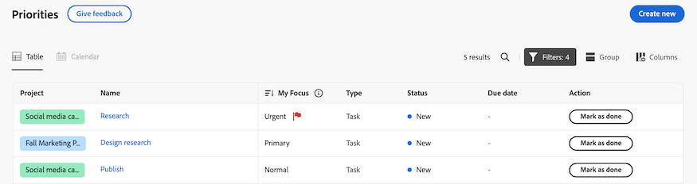
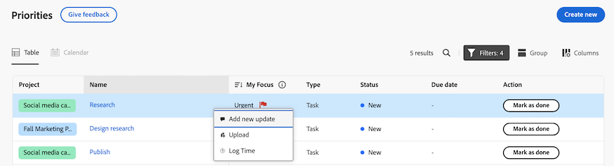
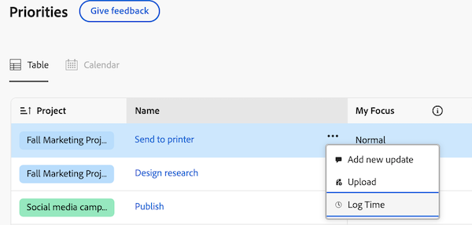
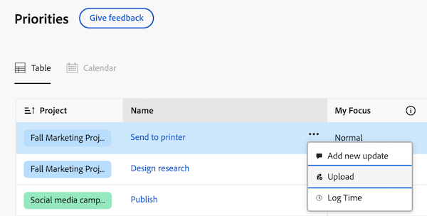
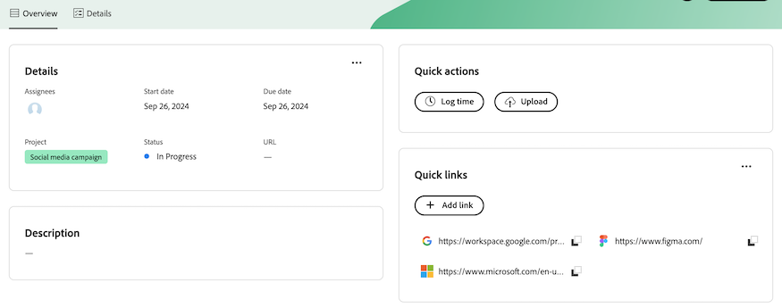
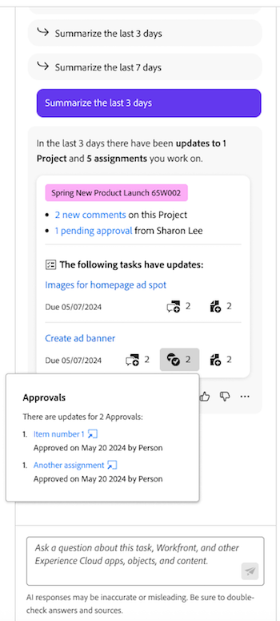

# Get started with Priorities

Priorities is a streamlined, intuitive experience tailored for individual contributors /task owners. Priorities will be rolled out in phases, starting with the worklist.

With Priorities, you can enjoy

* Clearer priorities: Organize your day or week with consolidated navigation for better clarity
* Greater productivity: Access project and task contexts and perform actions with fewer clicks
* Personalized features: Benefit from features uniquely designed for individual contributors

## Find and organize your work

Still need intro

### Find your work with filters

Find you most important work with filters. You can filter tasks and issues assigned to you in the following ways:

<table>
  <tbody>
   <tr>
   <th>Filter</th>
   <th>Description</th>
   </tr>
    <tr>
      <td>Working on</td>
      <td>Displays items that you are currently working on</td>
    </tr>
    <tr>
      <td>Ready to start</td>
      <td>Displays items with 
      <ul>
      <li>No incomplete predecessors or task constraints</li>
      
and

      <li>The Planned Start Date is in the past or up to two weeks in the future</li>
      </ul>
      </td>
    </tr>
    <tr>
      <td>Not ready</td>
      <td>Displays items that have
       <ul>
      <li>Incomplete predecessors or task constraints that prevent the item from being worked on</li>
      
or

      <li>The Planned Start Date more than two weeks in the future</li>
      </ul>
       </td>
    </tr>
    <tr>
      <td>Requested</td>
      <td>Displays issues that you have not started work on</td>
    </tr>
      <td>Done</td>
      <td>Displays work completed within the last two weeks. This filter option does not include approvals.</td>
    </tr>
    <tr>
    <td>Project</td>
    <td>Displays projects that contains tasks or issues you've been assigned to</td>
    </tr>
    <tr>
    <td>Due date</td>
    <td>Displays work by Planned Completion Date</td>
    </tr>
    <tr>
    <td>Status</td>
    <td>Displays tasks or issues in new, in progress, and complete statuses</td>
    </tr>
  </tbody>
</table>

### Organize your work with Groups

After you have filtered your work, you can group items based on

* None
* Week due
* Status
* Project

<!--For more information, see [Find and organize your work in Priorities]().-->

### Prioritize important work items with My Focus

My Focus is a column in the worklist that helps you to prioritize your work. The My Focus value is personal and does not impact project, task, or issue data. You can use the following focus levels:
 
* Urgent 
* Primary 
* Secondary 
* Normal (default)

Once you have assigned focus levels to your work items, you can sort the column to surface urgent items at the top of your worklist.

<!--For more information, see [Prioritize important work items with My Focus]().-->

### Use the Calendar view [!BADGE Coming soon]{type=Informative}

The Calendar view will provide a visual representation of your tasks and issues. You will be able to choose between a day, week, or month view. You will also be able to filter items in a similar way to the worklist.

## Work on tasks and issues

In Priorities, you can update work items to keep your work item details current, log time to track your work hours accurately, upload assets without having to navigate to a project, and add quick links for easy access to frequently used resources.

### Add and view updates

Add an update on an task or issue to communicate your progress to others.

The Updates section shows system updates, and up to 200 of the most recent updates users made within the past 90 days.

<!--For more information, see [Add and view updates in Priorities]().-->

### Log time

You can log time for work items to indicate the number of hours you spend working on them. You can also log time that is not related to work, like vacation, sick time, or time you spend in meetings. The time you log displays in your timesheet.

<!--For more information, see [Log time in Priorities]().-->

### Upload files

Upload files directly to the task or issue's Documents area without having to navigate to a Project. When you upload a file from Priorities, you can

* Select an existing folder
* Upload the file with an update stream comment
* Add additional files
* Import files from connected document integrations

<!--For more information, see [Upload files in Priorities]().-->

### View documents [!BADGE Coming soon]{type=Informative}

The Documents tab will allow you to view all files related to a work item. You will be able to filter documents by name, file type, or person, and sort by name and upload date.

You will also be able to open the document or proof.

### Add quick links

You can embed frequently used links in the work item's details page. Quick links allow you to quickly visit or copy the link. 

<!--For more information, see [Add and manage quick links in Priorities]().-->

### Review and approve assets [!BADGE Coming soon]{type=Informative}

The ability to review and approve assets is on the Priorities roadmap.

For now, we recommend using the Awaiting My Approval and All Approvals widgets in New Home. 

For more information, see [Add, edit, or remove widgets in New Home](/help/quicksilver/workfront-basics/using-home/new-home/add-edit-remove-widgets-in-new-home.md).

## Use Catch me up to see what you missed [!BADGE Coming soon]{type=Informative}

Use the Catch me up feature to see what you missed. Catch me up will summarize updates, uploaded documents, approvals, and other notable changes about your projects within the following time frames: 24 hours, 3 days, 7 days. 

