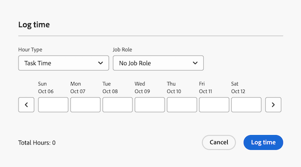

# Log time in Priorities

You can log time for work items in Adobe Workfront to indicate the number of hours you spend working on them. The time you log displays in your timesheet.

## Access requirements

+++ Expand to view access requirements for the functionality in this article.

You must have the following access to perform the steps in this article and log Project Specific hours:

<table style="table-layout:auto"> 
 <col> 
 <col> 
 <tbody> 
  <tr> 
   <td role="rowheader">Adobe Workfront plan</td> 
   <td> 
Any
 </td> 
  </tr> 
  <tr> 
   <td role="rowheader">Adobe Workfront license</td> 
   <td> 
New: 

   
Light or higher to log hours on a task or issue

   
Current: 
   
Work or higher to log hours on a task or issue
 </td> 
  </tr> 
  <tr> 
   <td role="rowheader">Access level configurations</td> 
   <td> 
Edit access to the type of work item you log time for 
 
For example, you need Edit access to Issues, to log time for issues
 </td> 
  </tr> 
  <tr> 
   <td role="rowheader">Object permissions</td> 
   <td> 
Contribute or higher permissions on the work item you log time for that includes permissions to Log Hours
 </td> 
  </tr> 
 </tbody> 
</table>

For more detail about the information in this table, see [Access requirements in Workfront documentation](/help/quicksilver/administration-and-setup/add-users/access-levels-and-object-permissions/access-level-requirements-in-documentation.md).

+++

## Log time in the worklist

You can log time directly from the worklist:

{{step1-to-priorities}}

1. Hover over the name, then click **Log time**.

1. In the **Hour Type** drop-down menu, select the appropriate hour type. Hour types are available depending on what has been defined at the system, project, and user levels, as described in Define hour types and availability.

1. (Conditional) If your Workfront or group administrator has enabled the Assign job roles to hour entries manually setting, select a job role from the drop-down menu. The role specified when you are assigned to the work item displays by default. If you are not assigned a role on the object, your Primary Role displays as the default. If you do not have a Primary Role assigned, No Job role displays.

1. Enter the time you want to log, then click **Log time**.

    

## Log time in a work item

You can log time in an individual work item:

{{step1-to-priorities}}

1. Click on a work item name to open the Overview page.
1. In the **Quick actions** section, click **Log time**. 
1. In the **Hour Type** drop-down menu, select the appropriate hour type. Hour types are available depending on what has been defined at the system, project, and user levels, as described in Define hour types and availability.
1. (Conditional) If your Workfront or group administrator has enabled the Assign job roles to hour entries manually setting, select a job role from the drop-down menu. The role specified when you are assigned to the work item displays by default. If you are not assigned a role on the object, your Primary Role displays as the default. If you do not have a Primary Role assigned, No Job role displays.

1. Enter the time you want to log, then click **Log time**.

    

