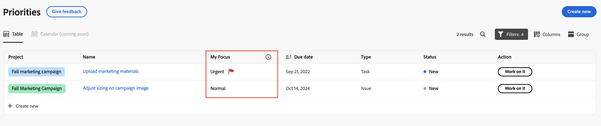

# Prioritize important work items

You can use the My Focus column to prioritize your work. The My Focus column is a personal value and does not impact the priority set on the task or issue.

## Prioritize your work with the My Focus column

{{step1-to-priorities}}

1. Locate the work item that you want to focus on. 
1. In the **My Focus** column, choose one of the following focus levels:

    | Focus     | Description |
    |-----------|-------------|
    | **Urgent** |  Urgent is for work items that require immediate attention. Urgent work items should be prioritized above all others and addressed as soon as possible. |
    | **High**  |   High is for important work items that you plan to address after Urgent work is complete.        |
    | **Normal**  | Normal is for routine work items that you will work on after Urgent and High-priority items are complete. This is the default for tasks and issues.        |
    | **Low**    |  Low is for work items that do not need immediate attention and can be deferred until all higher-priority work items are done.    |

    

    >[!TIP]
    >
    >You can Filter and Group your work by your focus levels.
