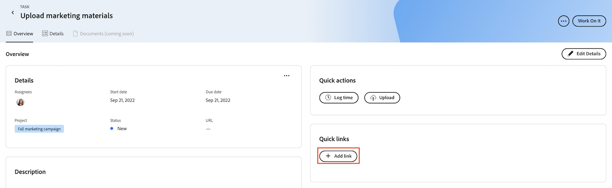
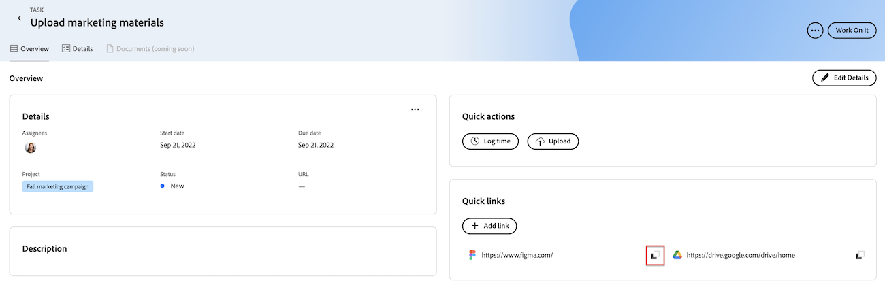
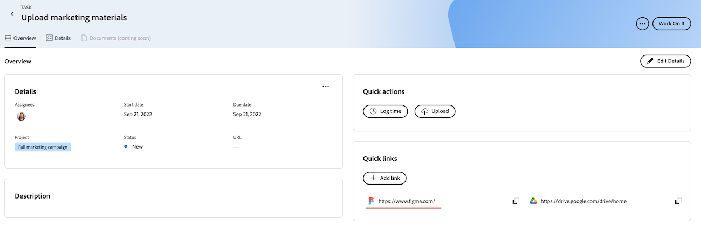
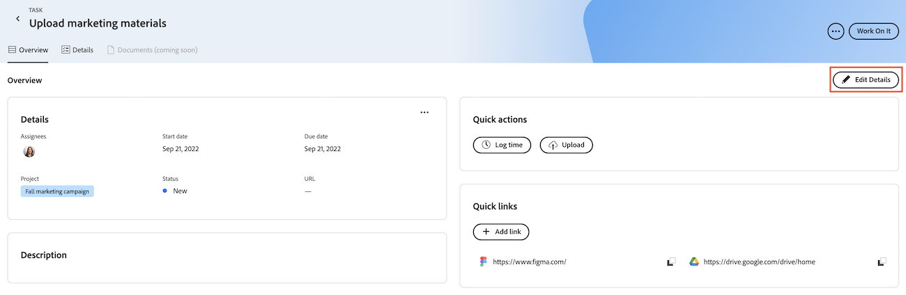

# Add and manage quick links in Priorities

You can save links that you visit often in a task or issue and access from the Overview tab in Priorities. 

## Access requirements

+++ Expand to view access requirements for the functionality in this article.

You must have the following access to perform the steps in this article:

<table style="table-layout:auto"> 
 <col> 
 </col> 
 <col> 
 </col> 
 <tbody> 
  <tr> 
   <td role="rowheader"><strong>Adobe Workfront plan</strong></td> 
   <td> 
Any
 </td> 
  </tr> 
  <tr> 
   <td role="rowheader"><strong>Adobe Workfront license*</strong></td> 
   <td> 
   
Current: Request or higher for issues; Work or higher for tasks

   
New: Contributor or higher or issues; Light or higher for tasks
 
   </td> 
  </tr> 
  <tr> 
   <td role="rowheader"><strong>Access level configurations</strong></td> 
   <td> 
View or Edit access for the object the update is on
</td> 
  </tr> 
  <tr> 
   <td role="rowheader"><strong>Object permissions</strong></td> 
   <td> 
View access to the object
</td> 
  </tr> 
 </tbody> 
</table>

*For more information, see [Access requirements in Workfront documentation](/help/quicksilver/administration-and-setup/add-users/access-levels-and-object-permissions/access-level-requirements-in-documentation.md).

+++

## Add quick links in Priorities

{{step1-to-priorities}}

1. Click on a work item name to open the Overview page.
1. In the **Quick links** section, click **Add link**. 
1. Paste the URL in the **Add link** box.
1. Click **Save**.

## Copy a quick link to your clipboard

{{step1-to-priorities}}

1. Click on a work item name to open the Overview page.
1. In the **Quick links** section, find the link you want to copy.
1. Click the Copy icon .

## Open a quick link

{{step1-to-priorities}}

1. Click on a work item name to open the Overview page.
1. In the **Quick links** section, find the link you want to open.
1. Click on the link. The link opens in a new tab.

## Delete quick links

{{step1-to-priorities}}

1. Click on a work item name to open the Overview page.
1. Click **Edit Details** in the top-right corner of the screen.
    
1. Find the link that you want to remove, then click the Delete icon . 